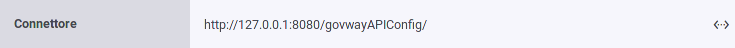
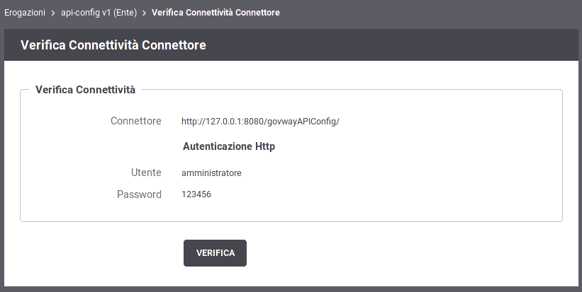
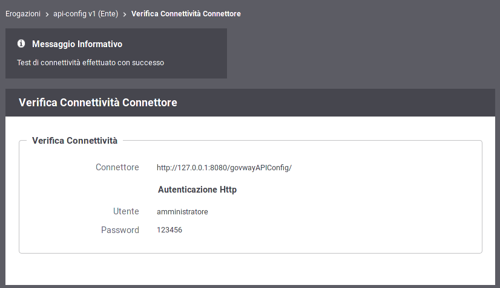
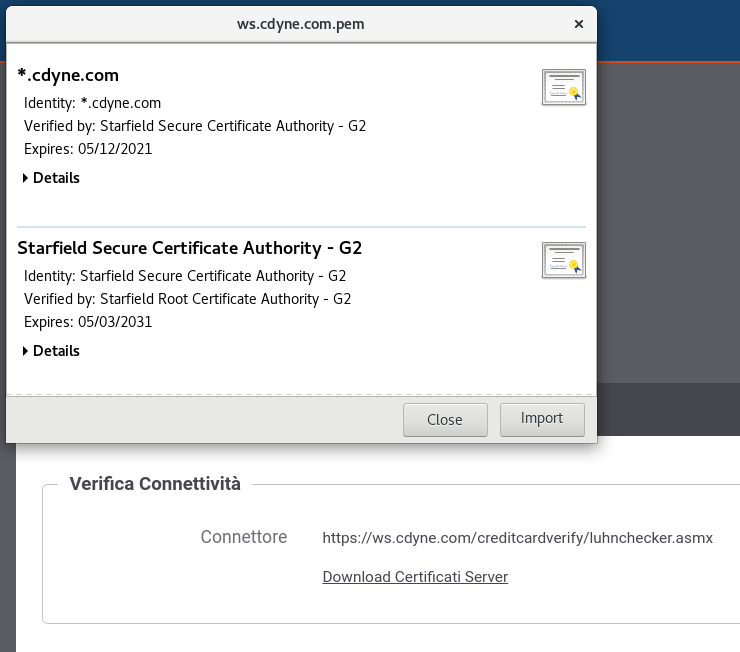

.. _verificaConnettivitaConnettore:

Verifica Connettività Connettore
~~~~~~~~~~~~~~~~~~~~~~~~~~~~~~~~

I contesti in cui l'interfaccia visualizza il valore di un connettore comprendono anche uno strumento per verificare la raggiungibilità dell'indirizzo impostato (:numref:`pulsanteVerificaConnettore`).

    Pulsante per la verifica del connettore

Dopo aver premuto il pulsante si accede ad una schermata che riepiloga le proprietà del connettore e comprende il pulsante *Verifica* per procedere con la verifica (:numref:`VerificaConnettore`).

    Verifica del connettore

Dopo aver premuto il pulsante *Verifica* viene presentato l'esito della verifica di raggiungibilità (:numref:`EsitoVerificaConnettore`).

    Esito Verifica del connettore

In presenza di un endpoint https, è possibile effettuare il download dei certificati ritornati dal server cliccando sul link 'Download Certificati Server'. Il formato del file scaricato è un PEM contenente tutti i certificati ritornati dal server.

    Download Certificati Server
