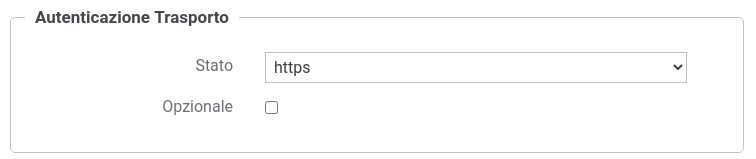
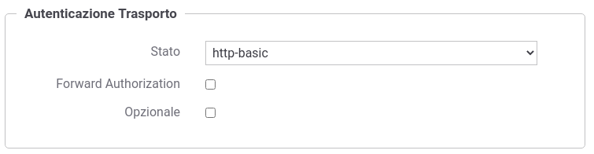
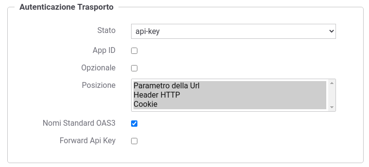
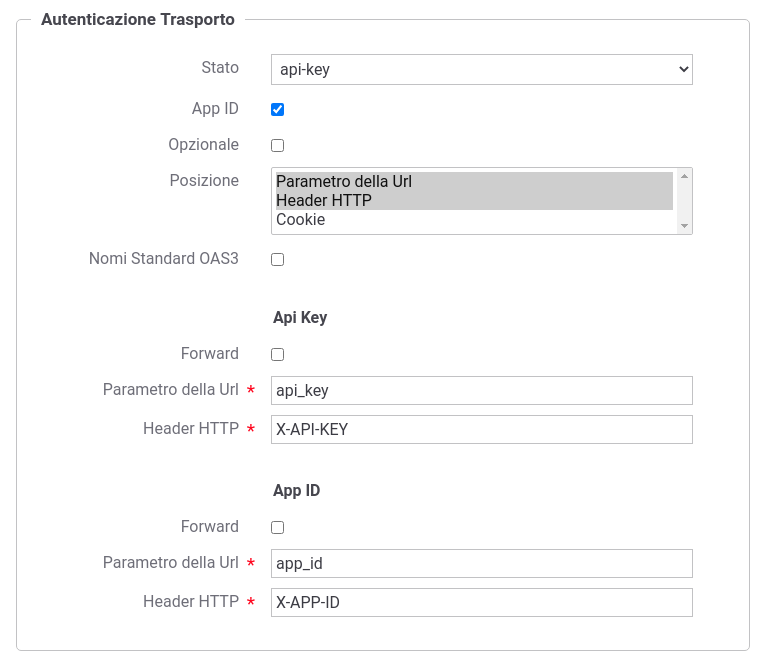
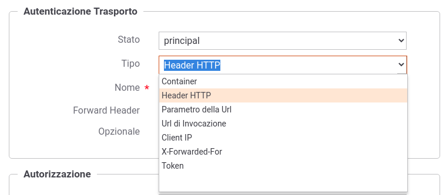
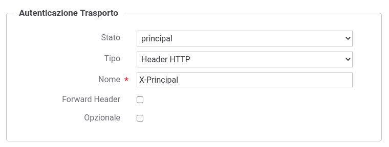

.. _apiGwAutenticazione:

Autenticazione Trasporto
^^^^^^^^^^^^^^^^^^^^^^^^

In questa sezione è possibile configurare il meccanismo di
autenticazione richiesto per l'accesso al servizio. 

.. figure:: ../../_figure_console/Autenticazione.png
    :scale: 100%
    :align: center
    :name: autenticazione

    Configurazione dell’autenticazione del servizio

Come mostrato in :numref:`autenticazione` la configurazione dell'autenticazione deve essere effettuata attraverso la selezione di un tipo di autenticazione tra quelli disponibili:

**- disabilitato**

Nessuna autenticazione.

**- https** 

(:numref:`controlloAccessiAutenticazioneHttps`)
La richiesta deve possedere un certificato client X509. La presenza del certificato client nella richiesta è obbligatoria a meno che non sia abilitato il flag *Opzionale*. Per maggiori informazioni sulla configurazione necessaria affinchè il certificato client sia ricevuto dal gateway si faccia riferimento alla sezione :ref:`install_ssl_server` della 'Guida di Installazione'.

Se è presente un certificato client, il gateway cercherà di identificare un applicativo o un soggetto a cui è stato associato il certificato come credenziale di accesso (per ulteriori dettagli si rimanda alle sezioni :ref:`soggetto` e :ref:`applicativo`); l'identificazione non è obbligatoria ma nel caso avvenga con successo l'applicativo o il soggetto verrà registrato nei log e potrà essere utilizzato anche ai fini di autorizzazione puntuale e per ruoli (:ref:`apiGwAutorizzazione`).
	
.. _controlloAccessiAutenticazioneHttps:

    Configurazione Autenticazione 'https'

**- http-basic**

(:numref:`controlloAccessiAutenticazioneHttpBasic`)
La richiesta deve possedere un header http "Authorization" che veicola credenziali Basic (username e password) come indicato nel rfc2617#section-2 (https://tools.ietf.org/html/rfc2617#section-2). 
La presenza dell'header "Authorization Basic" nella richiesta è obbligatoria a meno che non sia abilitato il flag *Opzionale*. 

Abilitando l'ulteriore opzione *Forward Authorization* è possibile propagare all'endpoint di destinazione l'header http "Authorization" che altrimenti verrà consumata.

Le credenziali devono corrispondere ad un applicativo o un soggetto registrato nel gateway (per ulteriori dettagli si rimanda alle sezioni :ref:`soggetto` e :ref:`applicativo`). 
	
.. _controlloAccessiAutenticazioneHttpBasic:

    Configurazione Autenticazione 'http-basic'

**- api-key**

(:numref:`controlloAccessiAutenticazioneApiKey`)
La richiesta deve possedere una chiave di identificazione 'Api Key' veicolata in un header http, un parametro della url o un cookie come indicato nella specifica 'OAS3 API Keys' (https://swagger.io/docs/specification/authentication/api-keys/).
È possibile abilitare anche la modalità 'App ID' che prevede oltre all'ApiKey un identificatore dell'applicazione; modalità denominata 'Multiple API Keys' nella specifica 'OAS3 API Keys'. 
La presenza di una 'Api Key', e se attivata di una 'App ID', nella richiesta è obbligatoria a meno che non sia abilitato il flag *Opzionale*. 

Abilitando le ulteriori opzioni *Forward* è possibile propagare all'endpoint di destinazione la chiave di identificazione ricevuta che altrimenti verrà consumata.

Le credenziali devono corrispondere ad un applicativo o un soggetto registrato nel gateway (per ulteriori dettagli si rimanda alle sezioni :ref:`soggetto` e :ref:`applicativo`). 

La configurazione consente anche di indicare dove il gateway debba ricercare la chiave di accesso tra header http, parametro della url e cookie, permettendone anche di personalizzare i nomi che per default sono quelli indicati nella specifica OAS3 (:numref:`controlloAccessiAutenticazioneApiKey2`). 
	
.. _controlloAccessiAutenticazioneApiKey:

    Configurazione Autenticazione 'api-key'

.. _controlloAccessiAutenticazioneApiKey2:

    Configurazione Autenticazione 'api-key' con personalizzazione della posizione e dei nomi

**- principal**
	
(:numref:`controlloAccessiAutenticazionePrincipal`)
La richiesta deve possedere il "principal" che identifica il chiamante. La modalità con cui il gateway può ottenere il principale deve essere scelta tra le seguenti opzioni:

.. _controlloAccessiAutenticazionePrincipal2:

    Configurazione Tipo di Autenticazione 'principal'

- *Container*: il principal viene fornito direttamente dal container sul quale è in esecuzione il gateway (per maggiori dettagli si faccia riferimento alla sezione :ref:`AvanzataAuthPrincipal`).

- *Header HTTP*: il principal viene estratto dallo specifico header http che viene indicato successivamente. È inoltre possibile attivare l'opzione *Forward Header* per far sì che il gateway propaghi il dato di autenticazione.

- *Parametro della Url*: il principal viene estratto da un parametro della query string il cui nome viene indicato successivamente. È inoltre possibile attivare l'opzione *Forward Parametro Url* per far sì che il gateway propaghi il dato di autenticazione.

- *Url di Invocazione*: il principal viene estratto direttamente dalla URL di invocazione tramite l'espressione regolare che viene fornita successivamente (l'espressione deve avere un match con l'intera url).

- *Client IP*: il principal utilizzato è l'indirizzo IP di provenienza.

- *X-Forwarded-For*: il principal viene estratto dall'header http utilizzato per il mantenimento dell’IP di origine nel caso di nodi intermedi (es. X-Forwarded-For).

- *Token*: opzione presente solamente se è stata attivata, al passo precedente, l'autenticazione del token. Il principal viene letto da uno dei claim presenti nel token.

Il flag *Opzionale* consente di non rendere bloccante il superamento dell'autenticazione nel caso la richiesta non possiede il principal atteso.

Se è presente un principal, il gateway cercherà di identificare un applicativo o un soggetto a cui è stato associato il principal come credenziale di accesso (per ulteriori dettagli si rimanda alle sezioni :ref:`soggetto` e :ref:`applicativo`); l'identificazione non è obbligatoria ma nel caso avvenga con successo l'applicativo o il soggetto verrà registrato nei log e potrà essere utilizzato anche ai fini di autorizzazione puntuale e per ruoli (:ref:`apiGwAutorizzazione`).

.. _controlloAccessiAutenticazionePrincipal:

    Configurazione Autenticazione 'principal'

**- plugin** 
	
Metodo di autenticazione fornito tramite personalizzazioni di GovWay.

