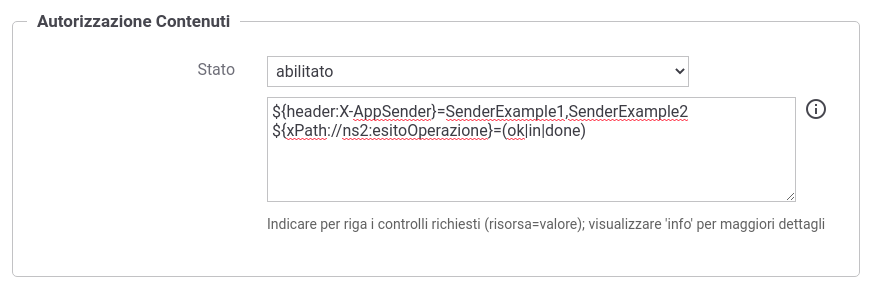

.. _apiGwAutorizzazioneContenuti:

Autorizzazione Contenuti
^^^^^^^^^^^^^^^^^^^^^^^^

L'autorizzazione dei contenuti è un ulteriore meccanismo per il controllo degli
accessi tramite il quale è possibile specificare regole di autorizzazione che verificano aspetti della richiesta quali ad esempio gli header http, l'url di invocazione, parti del messaggio etc.

Una volta abilitata l'autorizzazione per contenuto si possono configuare una serie di controlli di autorizzazione nella forma (risorsa=valore).

Una risorsa identifica un header, una parte dell'url o del messaggio, un claim del token o un principal etc.
Per identificare una risorsa sono utilizzabili le seguenti espressioni dinamiche:

- ${header:NAME}: valore presente nell'header http che possiede il nome 'NAME'
- ${query:NAME}: valore associato al parametro della url con nome 'NAME'
- ${urlRegExp:EXPR}: espressione regolare applicata sulla url di invocazione (l'espressione deve avere un match con l'intera url)
- ${xPath:EXPR}: espressione XPath applicata su un messaggio XML
- ${jsonPath:EXPR}: espressione JSONPath applicata su un messaggio JSON
- ${tokenInfo:FIELD}: permette di accedere ai claim di un token; il valore 'FIELD' fornito deve rappresentare un field valido all'interno della classe 'org.openspcoop2.pdd.core.token.InformazioniToken' (es. per ottenere il valore del claim 'sub' usare ${tokenInfo:sub})
- ${tokenClient:FIELD}: identità dell'applicativo client identificato tramite il clientId presente nel token; il valore 'FIELD' fornito deve rappresentare un field valido all'interno della classe 'org.openspcoop2.core.id.IDServizioApplicativo' (es. per ottenere il nome dell'applicativo usare ${tokenClient:nome})
- ${aa:FIELD} : permette di accedere agli attributi recuperati tramite Attribute Authority; il valore 'FIELD' fornito deve rappresentare un field valido all'interno della classe 'org.openspcoop2.pdd.core.token.attribute_authority.InformazioniAttributi' (es. per ottenere il valore dell'attributo 'attr1' usare ${aa:attributes[attr1]}, se configurata solamente 1 A.A., altrimenti usare ${aa:attributes[nomeAttributeAuthority][attr1]} )
- ${transportContext:FIELD}: permette di accedere ai dati della richiesta http; il valore 'FIELD' fornito deve rappresentare un field valido all'interno della classe 'org.openspcoop2.utils.transport.http.HttpServletTransportRequestContext' (es. per il principal usare ${transportContext:credential.principal})
- ${busta:FIELD}: permette di utilizzare informazioni generiche del profilo; il valore 'FIELD' fornito deve rappresentare un field valido all'interno della classe 'org.openspcoop2.protocol.sdk.Busta' (es. per il mittente usare ${busta:mittente})
- ${property:NAME}: utilizzabile solamente su erogazioni, permette di riferire informazioni specifiche del profilo presenti nella traccia (es. identificativo SDI). Il valore 'NAME' indica il nome della proprietà da utilizzare
- ${securityToken:FIELD}: permette di accedere ai certificati e ai security token presenti nella richiesta; il valore 'FIELD' fornito deve rappresentare un field valido all'interno della classe 'org.openspcoop2.protocol.sdk.SecurityToken' (es. per accedere al CN del certificato presente nel token 'Authorization' usare ${securityToken:authorization.certificate.subject.info(CN)})
- ${config:NAME}: valore della proprietà configurata sull'API che possiede il nome 'NAME'
- ${clientApplicationConfig:NAME}: valore della proprietà configurata nell'applicativo fruitore che possiede il nome 'NAME'
- ${clientOrganizationConfig:NAME}: valore della proprietà configurata nel soggetto fruitore che possiede il nome 'NAME'
- ${providerOrganizationConfig:NAME}: valore della proprietà configurata nel soggetto erogatore che possiede il nome 'NAME'
- ${tokenClientApplicationConfig:NAME}: permette di accedere alla proprietà, configurata nell'applicativo client identificato tramite il clientId presente nel token, con nome 'NAME'
- ${tokenClientOrganizationConfig:NAME}: permette di accedere alla proprietà, configurata nel soggetto proprietario dell'applicativo client identificato tramite il clientId presente nel token, con nome 'NAME'
- ${dynamicConfig:FIELD}: permette di accedere alle proprietà degli attori coinvolti nella richiesta (api, applicativi, soggetti); il valore 'FIELD' fornito deve rappresentare un field valido all'interno della classe 'org.openspcoop2.pdd.core.dynamic.DynamicConfig'; maggiori informazioni sulla funzionalità sono disponibili nella sezione ':ref:`avanzate_dynamic_config`'.
- ${system:NAME}: valore associato alla proprietà di sistema, indicata nella configurazione generale, con nome 'NAME'
- ${env:NAME}: valore associato alla variabile di sistema con nome 'NAME'
- ${java:NAME}: valore associato alla variabile java con nome 'NAME'
- ${envj:NAME}: valore associato alla variabile di sistema o java con nome 'NAME'; la variabile viene cercata prima come variabile di sistema e se non presente come variabile della jvm

Ogni valore atteso per una risorsa può essere fornito in una delle seguenti modalità:

- ${anyValue} : indica qualsiasi valore non nullo.
- ${undefined} : la risorsa indicata non deve esistere o non deve essere valorizzata.
- ${regExpMatch:EXPR} : la regola è soddisfatta se il valore della risorsa ha un match completo rispetto all'espressione regolare EXPR indicata. È possibile utilizzare anche la versione ${regExpNotMatch:EXPR} che consente di attuare una negazione della condizione.
- ${regExpFind:EXPR} : simile alla precedente regola, il match dell'espressione regolare può avvenire anche su una sottostringa del valore della risorsa. Come per la precedente esiste anche la versione ${regExpNotFind:EXPR}.
- valore : indica esattamente il valore (case sensitive) che deve possedere la risorsa; il valore può essere definito come costante o contenere parti dinamiche risolte a runtime dal Gateway nella forma descritta precedentemente per le risorse.
- valore1,..,valoreN : è possibile elencare differenti valori ammissibili; come per la precedente opzione il valore può contenere parti dinamiche.
- ${ignoreCase:valore} o ${ignoreCase:valore1,...,valoreN} : simile alle precedenti regole consente di attuare una verifica case insensitive.
- ${not:valore} o ${not:valore1,...,valoreN} : simile alle precedenti regole consente di indicare esattamente i valori (case sensitive) che non deve possedere la risorsa. È possibile utilizzarla anche in combinazione con il controllo case-insensitive: ${not:${ignoreCase:valore}} o ${not:${ignoreCase:valore1,...,valoreN}}

.. _controlloAccessiAutorizzazioneContenuti:

 Configurazione Autorizzazione Contenuti

Di seguito alcuni esempi:

- ${header:X-Prova}=test : viene verificato che l'header 'X-Prova' possieda il valore 'test'
- ${header:X-Prova}=test,test2,test3 : viene verificato che l'header 'X-Prova' possieda il valore 'test' o 'test2' o 'test3'
- ${transportContext:credential.principal}=${header:X-SSO} : viene verificato che l'identità principal del chiamante corrisponda al valore fornito nell'header 'X-SSO'
- ${transportContext:credential.principal}=prefix${header:X-SSO}suffix : simile alla precedente regola, dove l'identità principal viene controntata con il valore presente nell'header concatenato da un prefisso e da un suffisso statico.
- ${xPath:EXPR}=${regExpMatch:[0-9]} : viene estratto il contenuto dalla richiesta xml tramite l'espressione XPath EXPR e verificato che sia corrispondente ad una cifra decimale attraverso l'espressione regolare '[0-9]'
- ${jsonPath:EXPR}=${transportContext:credential.principal} : viene estratto il contenuto dalla richiesta json tramite l'espressione jsonPath EXPR e verificato che sia uguale all'identità principal del chiamante
- ${context:CLIENT_IP_REMOTE_ADDRESS}=10.114.44.3,10.114.44.4,10.114.44.5 : viene verificato che l'indirizzo ip del client sia tra gli indirizzi ip elencati.
- ${context:CLIENT_IP_TRANSPORT_ADDRESS}=${regExpMatch:10\.114\.44\..*|10\.114\.43\..*} : viene verificato che l'indirizzo ip del client sia nella sottorete 10.114.44.0/255 o 10.114.43.0/255; l'indirizzo ip viene estratto dagli header http utilizzati per il mantenimento dell’IP di origine nel caso di nodi intermedi (es. X-Forwarded-For).
- ${transportContext:credential.certificateChain.certificate.subject.info(CN)}=EsempioEnte1,EsempioEnte2 : viene verificato che il CN del certificato TLS client corrisponda a uno dei due valori tra EsempioEnte1 e EsempioEnte2.
- ${securityToken:integrity.certificate.subject.info(ORGANIZATION_IDENTIFIER)}=${regExpMatch:CF:IT-.+} : il valore del campo 'Organization Identifier' (2.5.4.97) del DN del certificato presente nel token di sicurezza ModI 'Agid-JWT-Signature' deve iniziare onc 'CF:IT-'.
- ${securityToken:channel.certificate.hasExtendedKeyUsage(CLIENT_AUTH)}=true : il certificato TLS client deve possedere il purpose (ExtendedKeyUsage) 'client auth' (1.3.6.1.5.5.7.3.2).
- ${securityToken:authorization.certificate.hasKeyUsage(DIGITAL_SIGNATURE)}=true : il certificato presente nel token di sicurezza ModI 'Authorization' deve possedere la key usage per la firma digitale.

