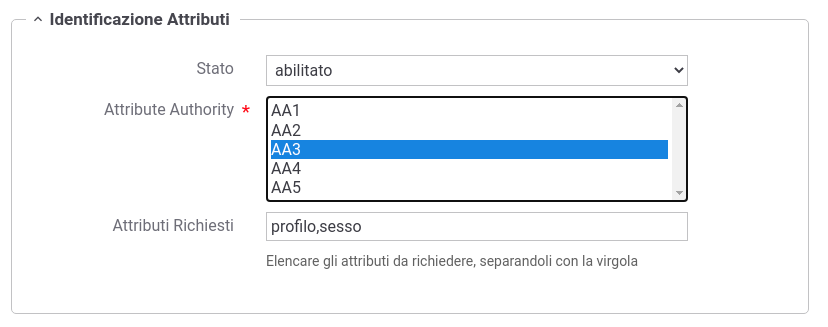
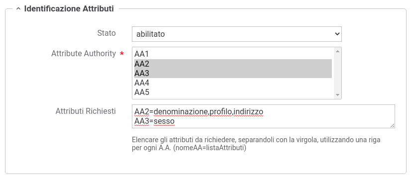

.. _apiGwIdentificazioneAttributi:

Identificazione Attributi
^^^^^^^^^^^^^^^^^^^^^^^^^^

Questa sezione consente di abilitare l'interrogazione di una o più :ref:`aa` al fine di recuperare gli attributi qualificati del soggetto identificato su GovWay tramite i meccanismi di autenticazione precedentemente descritti nelle sezioni ':ref:`apiGwGestioneToken`' e ':ref:`apiGwAutenticazione`'.

.. note::
   La sezione viene visualizzata solamente se è stata registrata almeno una :ref:`aa`.

Gli attributi recuperati saranno inseriti nel contesto della richiesta e potranno essere utilizzati per definire politiche di controllo degli accessi basate sugli attributi tramite i meccanismi di autorizzazione descritti nelle successive sezioni (':ref:`xacml`', ':ref:`tokenClaims`' e ':ref:`apiGwAutorizzazioneContenuti`'.

Il form di configurazione appare come quello illustrato in :numref:`controlloAccessiAAFig`. 

 Configurazione Identificazione Attributi tramite una singola AA

Una volta abilitata la funzionalità, se viene selezionata un'unica :ref:`aa` sarà possibile indicare quali attributi qualificati debbano essere recuperati indicandoli nel campo '*Attributi Richiesti*', separandoli con la virgola, come riportato nell'esempio in :numref:`controlloAccessiAAFig`.

Se invece vengono selezionate molteplici AA, gli attributi da richiedere devono essere indicati tramite una riga per ogni A.A. (nomeAA=listaAttributi) come in :numref:`controlloAccessiAA2Fig`. 

 Configurazione Identificazione Attributi tramite multiple AA

