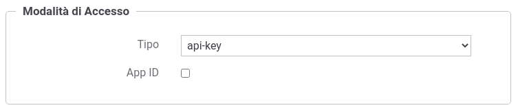
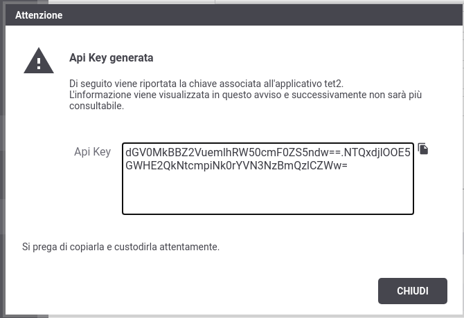
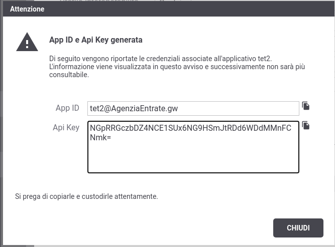

.. _modalitaAccessoApiKey:

Credenziali 'api-key'
^^^^^^^^^^^^^^^^^^^^^^^^

Agli applicativi ed ai soggetti registrati nel gateway, identificabili con credenziali 'api-key' deve essere associato una chiave di identificazione univoca 'Api Key' come descritto nella specifica 'OAS3 API Keys' (https://swagger.io/docs/specification/authentication/api-keys/). 

La credenziale può inoltre essere composta da un'ulteriore informazione riguardante l'identificatore dell'applicativo 'App ID'; modalità denominata 'Multiple API Keys' nella specifica 'OAS3 API Keys'. 

L'associazione di credenziali 'api-key' ad un applicativo o soggetto comporta solamente l'indicazione se deve essere generato anche un 'App ID' o meno (:numref:`authApiKeyFig`).

La generazione della 'Api Key' e dell'eventuale 'App ID' è automatica e viene visualizzata non appena si completa la registrazione dell'applicativo o del soggetto. Nella figura :numref:`authApiKeyFig2` viene riportato un avviso di generazione di una credenziale senza 'App ID', mentre nella figura :numref:`authApiKeyFig4` è stato generato anche l'identificatore dell'applicativo.

 Credenziali 'api-key'

 Avviso di copia delle credenziali 'api-key'

 Avviso di copia delle credenziali 'api-key' (con App ID)

.. note::
    La chiave di identificazione generata e assegnata all'applicativo o al soggetto viene visualizzata solamente nell'avviso visualizzato in seguito alla creazione (:numref:`authApiKeyFig2`) e successivamente non è più consultabile. 

    Nel caso di smarrimento della chiave è necessario procedere con la generazione di una nuova chiave (:numref:`authApiKeyFig3`).

    .. figure:: ../../../_figure_console/AuthApiKey3.png
     :scale: 100%
     :align: center
     :name: authApiKeyFig3

     Aggiornamento delle credenziali 'api-key'

