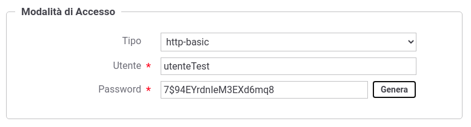

.. _modalitaAccessoHttpBasic:

Credenziali 'http-basic'
^^^^^^^^^^^^^^^^^^^^^^^^

Agli applicativi ed ai soggetti registrati nel gateway, identificabili con credenziali 'http-basic', deve essere associato un identificativo utente univoco e una password (:numref:`authBasicFig`). 
La password può essere generata tramite l'apposito pulsante.

 Credenziali di tipo HTTP-Basic

.. note::
    La password generata e assegnata all'applicativo o al soggetto viene visualizzata solamente nell'avviso visualizzato in seguito alla creazione (:numref:`authBasicFig2`) e successivamente non è più consultabile. 

    .. figure:: ../../../_figure_console/AuthBasic2.png
     :scale: 100%
     :align: center
     :name: authBasicFig2

     Avviso di copia delle credenziali HTTP-Basic

    Nel caso di smarrimento della password è necessario procedere con la generazione di una nuova password (:numref:`authBasicFig3`).

    .. figure:: ../../../_figure_console/AuthBasic3.png
     :scale: 100%
     :align: center
     :name: authBasicFig3

     Aggiornamento delle credenziali HTTP-Basic

