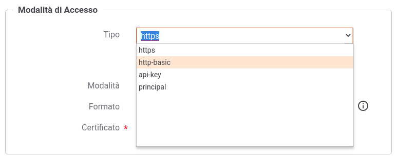

.. _modalitaAccesso:

Modalità di Accesso
^^^^^^^^^^^^^^^^^^^

Agli applicativi ed ai soggetti registrati nel gateway (come indicato nelle sezioni :ref:`soggetto` e :ref:`applicativo`) devono essere assegnate delle credenziali in modo che il gateway possa effettuare:

	- *autenticazione*: nel caso in cui il controllo degli accessi sia stato configurato con autenticazione 'http-basic' o 'api-key' (:ref:`apiGwAutenticazione`)

	- *identificazione*: l'identificazione non è obbligatoria per le autenticazioni differenti da 'http-basic' e 'api-key', ma nel caso avvenga con successo l'applicativo o il soggetto verrà registrato nei log e potrà essere ricercato tramite gli strumenti di monitoraggio

	- *autorizzazione*: se un applicativo o un soggetto viene identificato, può essere autorizzato puntualmente nel controllo degli accessi tramite l'autorizzazione per richiedente (:ref:`apiGwAutorizzazione`).

    Configurazione della Modalità di Accesso

Come mostrato in :numref:`sceltaCredenziali` l'assegnazione delle credenziali deve essere effettuata attraverso la selezione di un tipo di autenticazione tra quelli disponibili:

	- *https*: richiede la registrazione di un certificato client X509

	- *http-basic*: deve essere definito un username univoco e deve essere generata una password

	- *apikey*: richiede la generazione di una chiave di identificazione univoca

	- *principal*: deve essere assegnato un identificatore univoco

.. toctree::
   :maxdepth: 2

   https
   httpbasic
   apikey
   principal
