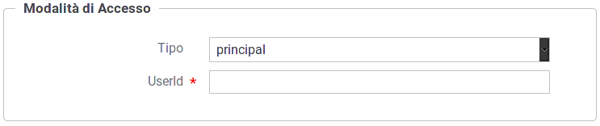

.. _modalitaAccessoPrincipal:

Credenziali 'principal'
^^^^^^^^^^^^^^^^^^^^^^^^

Agli applicativi ed ai soggetti registrati nel gateway, identificabili con credenziali 'principal', deve essere associato un identificativo univoco (:numref:`authPrincipalFig`).

 Credenziali Principal
