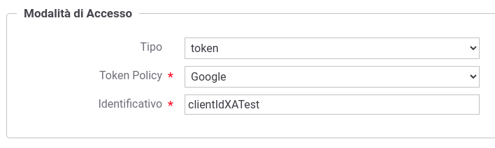

.. _modalitaAccessoToken:

Credenziali 'token'
^^^^^^^^^^^^^^^^^^^^^^^^

Il tipo di credenziale *token* è associabile solamente agli applicativi.

Consente durante il processo di :ref:`apiGwGestioneToken` di identificare un applicativo registrato con la medesima :ref:`tokenValidazionePolicy` utilizzata nell'autenticazione e contenente come identificatore univoco il valore presente nel claim 'clientId' all'interno del token (:numref:`authTokenFig`).

 Credenziali Token
