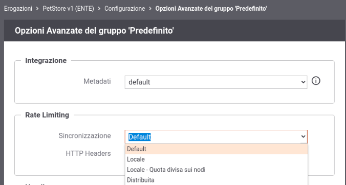

.. _headerGWRateLimitingCluster:

Rate Limiting in presenza di un cluster di nodi
~~~~~~~~~~~~~~~~~~~~~~~~~~~~~~~~~~~~~~~~~~~~~~~~~~

In presenza di una installazione con più nodi gateway attivi, GowWay per default effettua il conteggio delle metriche utilizzate dalle policy di rate limiting indipendentemente su ogni singolo nodo del cluster. Questa soluzione è certamente la più efficiente, ma presenta dei limiti evidenti se è necessaria una contabilità precisa del numero di accessi consentiti globalmente da parte dell'intero cluster, in quanto si potrebbe riscontrare la violazione di una policy solamente su alcuni nodi e non su altri a seconda di come avvenga la distribuizione delle richieste sui singoli nodi.

In alcuni casi specifici questa soluzione può comunque essere adottata, appoggiandosi alla collaborazione dei load balancer. Ad esempio, nel caso si voglia adottare una politica che limiti il numero di richieste per ogni client fruitore, è possibile utilizzare sui load balancer una politica di sticky session in modo che le richieste dello stesso client siano gestite sempre dalla stessa istanza GovWay, così da ottenere il rispetto puntuale dei limiti impostati. Se invece si volesse adottare una politica che limiti il numero di richieste verso una specifica API, indipendentemente dal client che le effettui, è possibile utilizzare un bilanciamento del carico di tipo 'round robin' per l'endpoint corrispondente a quella API. Le richieste sarebbero così distribuite equamente tra i nodi consentendo di applicare correttamente la policy semplicemente suddividendo la quota per il numero di nodi attivi.

Ma già se si volessero attuare entrambe queste politiche simultaneamente, le politiche di load balancing richieste risulterebbero tra loro incompatibili, e si dovrebbe pertanto passare a modalità di calcolo delle metriche distribuite tra i diversi nodi del cluster. Visto che tali modalità hanno un certo impatto prestazionale, è sempre necessaria un'attenta analisi preliminare per individuare la configurazione più indicata per la propria specifica situazione.

GovWay consente di modificare la modalità di gestione di default delle policy di rate limiting sia globalmente che puntualmente rispetto alla singola erogazione o fruizione.

Per modificare la modalità di default è possibile intervenire nella sezione *Rate Limiting* presente nella maschera di configurazione del *Controllo del Traffico* (sezione :ref:`configurazioneRateLimiting`). Per modificare la modalità di gestione su una singola erogazione o fruizione è richiesto invece l'accesso alla govwayConsole in modalità *avanzata* (sezione :ref:`modalitaAvanzata`). Nel seguito viene documentato come modificare la configurazione per una singola erogazione o fruizione, analoghe modalità potranno essere utilizzate per intervenire a livello globale.

Dopo aver selezionato una specifica erogazione o fruizione, accedendo alla sezione :ref:`configSpecifica` in modalità avanzata compare la sezione *Opzioni Avanzate*. All'interno di tale sezione è possibile agire sulla configurazione della voce *Sincronizzazione* nella sezione *Rate Limiting* (:numref:`configurazioneSincronizzazioneRateLimitingDefault`).

    Sincronizzazione del Rate Limiting in un cluster di nodi

Le modalità di gestione delle policy attivabili su GovWay sono le seguenti:

- *Locale*: ogni nodo effettua il proprio conteggio;

- *Locale - quota divisa sui nodi*: gestione delle policy tramite bilanciamento del carico, come descritto nella sezione :ref:`headerGWRateLimitingCluster_quotaDivisaSuiNodi`.

- *Distribuita*: il conteggio viene attuato tramite un archivio dati distribuito, come descritto nella sezione :ref:`headerGWRateLimitingCluster_distribuita`;

- *Default*: viene utilizzata la gestione indicata nel file di proprietà "govway.properties" che nella configurazione di default del prodotto è equivalente alla voce 'Locale'.

.. toctree::
   :maxdepth: 2

   quotaDivisaSuiNodi
   distribuita

