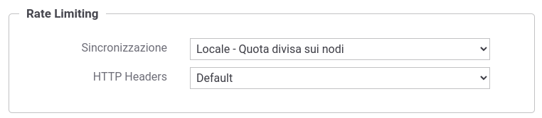

.. _headerGWRateLimitingCluster_quotaDivisaSuiNodi:

Sincronizzazione Locale con quota divisa tra i nodi
~~~~~~~~~~~~~~~~~~~~~~~~~~~~~~~~~~~~~~~~~~~~~~~~~~~~

Questa modalità di gestione delle policy di rate limiting fornisce una possibile soluzione nei casi in cui sia possibile distribuire equamente tra i nodi tutte le richieste relative alla policy che si intende attuare.

**Prerequisito**: la presenza di un load balancer che distribuisca in maniera uniforme tra i singoli nodi del cluster le richieste relative ad ogni singola policy.

In questo caso è possibile attuare correttamente la policy di rate limiting semplicemente suddividendo la quota configurata per il numero di nodi attivi. 

La modalità di sincronizzazione '*Locale - quota divisa sui nodi*' attiva la registrazione automatica dei singoli nodi del cluster al proprio avvio e la loro cancellazione durante lo shutdown, in modo da permettere ad ogni nodo di conoscere l'effettivo numero di nodi attivi ai fini del corretto calcolo della quota da applicare su ogni singolo nodo (:numref:`configurazioneSincronizzazioneRateLimitingLocaleQuotaDivisa`).

    Sincronizzazione Locale con quota divisa sui nodi del cluster 

*Vantaggi*

Questa modalità assicura le stesse prestazioni della sincronizzazione *Locale* attiva per default sul prodotto.

*Svantaggi*

1. Dipendenza dal Load Balancer

  La soluzione richiede la collaborazione del load balancer, ad esempio con una politica 'round robin' sulle richieste in arrivo sull'endpoint di una specifica API per politiche che richiedono di limitare il numero di richieste per quella API.
 
2. Applicabilità limitata

  La soluzione è banalmente applicabile solo nei casi in cui GovWay gestisca un'unica API e il rate limiting vada applicato esclusivamente al numero di richieste verso quella API, indipendentemente dal client che le stia generando. Nei casi in cui siano gestite più API, la politica di gestione 'round robin' sul bilanciatore dovrà essere gestita separatamente per l'endpoint di ogni API interessata, mentre la soluzione non risulta più applicabile se il conteggio debba tener conto del client richiedente (es. 1000 richieste max al minuto per API, 10 richieste max al minuto per ogni client). In tal caso il bilanciamento dovrebbe avvenire per ogni client fruitore, operazione molto complessa da gestire sui load balancer.
  
  Inoltre questa modalità è applicabile solamente con metriche che prevedono di contare il numero di richieste in una finestra temporale. Non è quindi applicabile per le metriche: "Numero Richieste Simultanee", "Occupazione Banda", "Tempo Medio Risposta" e "Tempo Complessivo Risposta".

2. Header "\*-Remaining"

  La modalità prevede di suddividere la quota per il numero di nodi e ciò rende difficile calcolare il valore esatto del numero di richieste ancora disponibili nella finestra temporale in corso. Nel resto di questa sezione verranno fornite indicazioni sulle tecniche di approssimazione dei valori ritornati negli header "\*-Remaining".

*Header "\*-Remaining"*

Il valore del numero di richieste ancora disponibili nella finestra temporale in corso verrà calcolato tramite una tecnica di approssimazione che consiste nel moltiplicare la quota rimasta su un nodo per il numero di nodi attivi.

Di seguito viene mostrato un flusso di richieste di esempio, supponendo di avere un cluster formato da 2 nodi, e una policy di rate limiting impostata con una metrica che prevede 11 richieste al minuto.

   ::

      Quota configurata: 11
      Nodi attivi: 2
      Quota effettiva = 11/2 = 5
      
      Invocazione 1 (nodo1): X-RateLimit-Remaining (4*2 = 8)
      Invocazione 2 (nodo2): X-RateLimit-Remaining (4*2 = 8)
      Invocazione 3 (nodo1): X-RateLimit-Remaining (3*2 = 6)
      Invocazione 4 (nodo2): X-RateLimit-Remaining (3*2 = 6)
      Invocazione 5 (nodo1): X-RateLimit-Remaining (2*2 = 4)
      Invocazione 6 (nodo2): X-RateLimit-Remaining (2*2 = 4)
      Invocazione 7 (nodo1): X-RateLimit-Remaining (1*2 = 2)
      Invocazione 8 (nodo2): X-RateLimit-Remaining (1*2 = 2)
      Invocazione 9 (nodo1): X-RateLimit-Remaining (0*2 = ['remaining.zeroValue' ? 0 : 1]) 
      Invocazione 10(nodo2): X-RateLimit-Remaining (0*2 = ['remaining.zeroValue' ? 0 : 1])
      Invocazione 11(nodo1): 409
      Invocazione 12(nodo2): 409

Vi sono alcuni aspetti dell'approssimazione che sono configurabili agendo sul file *<directory-lavoro>/govway_local.properties*

- Quota effettiva: come mostrato nell'esempio la quota configurata viene suddivisa sui nodi attivi. L'arrotondamento del valore ottenuto può essere configurato per difetto o per eccesso. Con un arrotondamento per difetto, se la divisione non consente di avere un numero maggiore di 0 viene associato il valore 1 ad ogni nodo. Per default è attivo un arrotondamento per difetto.

   ::

      # Quota effettiva
      org.openspcoop2.pdd.controlloTraffico.gestorePolicy.inMemory.LOCAL_DIVIDED_BY_NODES.limit.roundingDown=true

- Header "\*-Limit": nell'header è possibile indicare la quota configurata o la quota effettiva (ottenuta dal calcolo per difetto o eccesso) moltipicata per il numero di nodi. Nell'esempio sopra riportato nel primo caso verrebbe ritornato il valore 11, mentre nel secondo 10. Per default viene ritornata la quota configurata.

   ::

      # Quota normalizzata
      org.openspcoop2.pdd.controlloTraffico.gestorePolicy.inMemory.LOCAL_DIVIDED_BY_NODES.limit.normalizedQuota=false

- Remaning 0 o 1: è possibile configurare quale valore restituire nel caso sia rimasta solamente 1 invocazione a disposizione (per default viene ritornato il valore 1):

	- valore 1, viene correttamente rispettato il contratto con il client; ad esempio, nel caso di 2 nodi, con quota N, alla N-1 esima invocazione il client si vede restituire correttamente un remaining=1; lo svantaggio di questa soluzione è che il client riceverà un errore 409 senza mai aver ricevuto una risposta con remaining=0;

	- restituendo 0 il client ottiene un remaining=0 alla pensultima invocazione e potrebbe quindi decidere di non fare ulteriori invocazioni evitando di ricevere un errore 409. Lo svantaggio di questa soluzione è che il client, se rispetta le indicazioni dell'header, effettuerà N-1 invocazioni rispetto alle N consentite dalla propria policy.

   ::

      # Remaining zeroValue
      org.openspcoop2.pdd.controlloTraffico.gestorePolicy.inMemory.LOCAL_DIVIDED_BY_NODES.remaining.zeroValue=false
