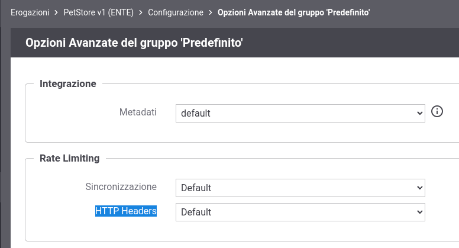
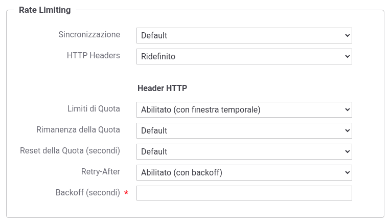

.. _headerGWRateLimitingConfig:

Personalizzazione degli Header HTTP restituiti al client
~~~~~~~~~~~~~~~~~~~~~~~~~~~~~~~~~~~~~~~~~~~~~~~~~~~~~~~~~~

Per personalizzare gli header http restituiti al client è richiesto l'accesso alla govwayConsole in modalità *avanzata* (sezione :ref:`modalitaAvanzata`).

A partire dall'erogazione o fruizione di una API, accedendo alla sezione :ref:`configSpecifica` in modalità avanzata compare una sezione precedentemente non documentata denominata *Opzioni Avanzate*. All'interno di tale sezione è possibile agire sulla configurazione della voce *HTTP Headers* nella sezione *Rate Limiting* per personalizzare la generazione degli header http (:numref:`configurazioneHeaderRateLimitingDefault`).

    Configurazione Header HTTP per il Rate Limiting

Le configurazioni attuabili sono:

- *Default*: vengono generati tutti gli header HTTP descritti nella sezione :ref:`headerGWRateLimitingHeader`. Il valore degli header '\*-Limit' non contiene l'indicazione della finestra temporale;

- *Disabilitato*: gli header HTTP relativi al RateLimiting non vengono generati;

- *Ridefinito*: consente di personalizzare gli header HTTP restituiti.

La maschera di configurazione fornirà le seguenti ulteriori voci nel caso venga selezionata la ridefinizione degli header HTTP (:numref:`configurazioneHeaderRateLimitingRidefinito`):

- *Limiti di Quota*: consente di personalizzare la generazione degli header '\*-Limit':

	- *Default*: il valore conterrà solamente il numero massimo di richieste effettuabili nella finestra temporale;

	- *Abilitato (senza finestra temporale)*: equivalente alla voce 'Default';

	- *Abilitato (con finestra temporale)*: oltre al numero massimo di richieste, viene anche riportata la finestra temporale e le ulteriori finestre delle policy attive che possiedono una medesima metrica ma sono meno restrittive (esempio: X-RateLimit-Limit: 10, 10;w=60, 1000;w=3600);

	- *Disabilitato*: gli header '\*-Limit' non verranno generati.

- *Rimanenza della Quota*:

	- *Default*: il valore conterrà il numero di richieste ancora effettuabili nella finestra temporale in corso;

	- *Abilitato*: equivalente alla voce 'Default';

	- *Disabilitato*: gli header '\*-Remaining' non verranno generati.

- *Reset della Quota (secondi)*:

	- *Default*: il valore conterrà il numero di secondi mancanti alla prossima finestra temporale;

	- *Abilitato*: equivalente alla voce 'Default';

	- *Disabilitato*: gli header '\*-Reset' non verranno generati.

- *Retry-After*:

	- *Default*: l'header viene valorizzato sommando al numero di secondi mancante alla prossima finestra temporale un tempo di backoff rappresentato da un numero random di secondi tra 0 e 60;

	- *Abilitato (con backoff)*: equivalente alla voce 'Default', dove però viene consentito ridefinire il numero random di secondi;
	
	- *Abilitato (senza backoff)*: l'header viene valorizzato solamente con il numero di secondi mancante alla prossima finestra temporale;

	- *Disabilitato*: l'header non viene generato.

    Configurazione ridefinita per gli Header HTTP del Rate Limiting

Oltre a personalizzare la gestione degli header http puntualmente su una erogazione o fruizione è possibile attuare una configurazione, identica a quanto già precedentemente descritto, a livello globale di GovWay agendo nella sezione *Rate Limiting* presente nella maschera di configurazione del *Controllo del Traffico* (sezione :ref:`configurazioneRateLimiting`).

