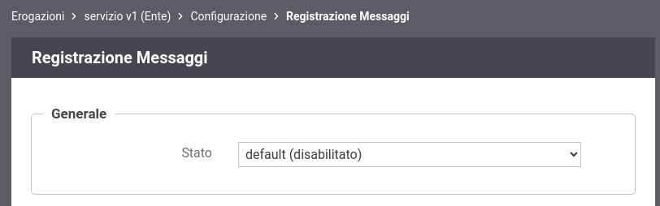

.. _configSpecificaRegistrazioneMessaggi:

Registrazione Messaggi
~~~~~~~~~~~~~~~~~~~~~~

La funzionalità consente di abilitare il salvataggio dei contenuti dei messaggi della richiesta e della risposta transitati su GovWay.

È possibile definire un criterio di registrazione dei messaggi differenziando tra Richiesta e Risposta e abilitando/disabilitando solo la comunicazione desiderata tra:

-  *Ingresso*: il messaggio di richiesta o risposta nel momento in cui giunge sul gateway e quindi prima che venga sottoposto al processo di elaborazione previsto.

-  *Uscita*: il messaggio di richiesta o risposta nel momento in cui esce dal gateway, per raggiungere il nodo successivo del flusso, e quindi dopo che è stato sottoposto al processo di elaborazione previsto.

Per ciascuno dei messaggi, su cui è stata abilitata la registrazione, è possibile scegliere gli elementi da registrare tra:

-  *Headers*: vengono salvati gli header di trasporto (HTTP Headers) associati al messaggio;

-  *Payload*: viene salvato il corpo del messaggio (HTTP Payload).

In :numref:`regMessaggiFig` viene mostrata la pagina di configurazione.

    Personalizzazione della registrazione dei messaggi a livello di erogazione o fruizione

Se a livello di erogazione o fruizione non viene attuata una configurazione specifica, la funzionalità di registrazione dei messaggi eredita la configurazione attuata a livello globale e descritta nella sezione :ref:`tracciamento`.

In :numref:`regMessaggiDefaultFig` viene mostrata la pagina di configurazione prima di procedere con una personalizzazione a livello di erogazione o fruizione.

    Configurazione di default della registrazione dei messaggi a livello di erogazione o fruizione

Infine nella sezione :ref:`configSpecificaRegistrazioneMessaggi_whiteBlackList` viene descritto come configurare il prodotto, sia a livello globale che puntuale sulla specifica erogazione o fruizione, per definire delle blackList o delle whiteList rispetto agli header HTTP da registrare.

.. toctree::
   :maxdepth: 2

   whiteBlackList
