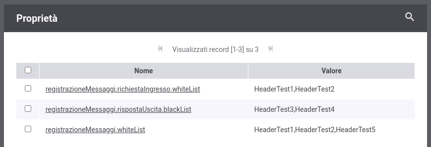

.. _configSpecificaRegistrazioneMessaggi_whiteBlackList:

Definizione di 'white-list' o 'black-list' per gli header HTTP da registrare
~~~~~~~~~~~~~~~~~~~~~~~~~~~~~~~~~~~~~~~~~~~~~~~~~~~~~~~~~~~~~~~~~~~~~~~~~~~~~

È possibile configurare il prodotto, sia a livello globale che puntuale sulla specifica erogazione o fruizione, per definire delle blackList o delle whiteList rispetto agli header HTTP da registrare.

.. note::
    In caso di configurazione errata dove vengono definite entrambe le liste, la 'white-list' ha priorità sulla 'black-list'.

Sulla singola erogazione o fruizione è possibile attuare la configurazione registrando le seguenti :ref:`configProprieta` specifiche per il flusso desiderato, definendo una lista di header http separati da virgola:

- *registrazioneMessaggi.richiestaIngresso.whiteList* o *registrazioneMessaggi.richiestaIngresso.blackList*: consente di definire una lista per le richieste in ingresso;

- *registrazioneMessaggi.richiestaUscita.whiteList* o *registrazioneMessaggi.richiestaUscita.blackList*: configurazione per le richieste in uscita;

- *registrazioneMessaggi.rispostaIngresso.whiteList* o *registrazioneMessaggi.rispostaIngresso.blackList*: consente di definire una lista per le risposte in ingresso;

- *registrazioneMessaggi.rispostaUscita.whiteList* o *registrazioneMessaggi.rispostaUscita.blackList*: configurazione per le risposte in uscita.

Sempre a livello di singola erogazione o fruizione è possibile attuare una configurazione che vale per qualsiasi flusso, registrando la seguente :ref:`configProprieta`:

- *registrazioneMessaggi.whiteList* o *registrazioneMessaggi.blackList*

    Personalizzazione degli header HTTP a livello di erogazione o fruizione

È inoltre possibile effettuare una configurazione simile a livello globale che verrà presa in esame solamente se per un flusso non esiste una configurazione specifica sull'erogazione o fruizione.

Per attuare la configurazione si deve agire sul file <directory-lavoro>/govway_local.properties registrando le seguenti proprietà:

- 'white-list'; flussi specifici per le erogazioni:

   ::

      org.openspcoop2.pdd.logger.dump.header.erogazioni.richiesta-ingresso.whiteList=HDR1,...,HDRN
      org.openspcoop2.pdd.logger.dump.header.erogazioni.richiesta-uscita.whiteList=HDR1,...,HDRN
      org.openspcoop2.pdd.logger.dump.header.erogazioni.risposta-ingresso.whiteList=HDR1,...,HDRN
      org.openspcoop2.pdd.logger.dump.header.erogazioni.risposta-uscita.whiteList=HDR1,...,HDRN

- 'black-list'; flussi specifici per le erogazioni:

   ::

      org.openspcoop2.pdd.logger.dump.header.erogazioni.richiesta-ingresso.blackList=HDR1,...,HDRN
      org.openspcoop2.pdd.logger.dump.header.erogazioni.richiesta-uscita.blackList=HDR1,...,HDRN
      org.openspcoop2.pdd.logger.dump.header.erogazioni.risposta-ingresso.blackList=HDR1,...,HDRN
      org.openspcoop2.pdd.logger.dump.header.erogazioni.risposta-uscita.blackList=HDR1,...,HDRN

- 'white-list'; flussi specifici per le fruizioni:

   ::

      org.openspcoop2.pdd.logger.dump.header.fruizioni.richiesta-ingresso.whiteList=HDR1,...,HDRN
      org.openspcoop2.pdd.logger.dump.header.fruizioni.richiesta-uscita.whiteList=HDR1,...,HDRN
      org.openspcoop2.pdd.logger.dump.header.fruizioni.risposta-ingresso.whiteList=HDR1,...,HDRN
      org.openspcoop2.pdd.logger.dump.header.fruizioni.risposta-uscita.whiteList=HDR1,...,HDRN

- 'black-list'; flussi specifici per le fruizioni:

   ::

      org.openspcoop2.pdd.logger.dump.header.fruizioni.richiesta-ingresso.blackList=HDR1,...,HDRN
      org.openspcoop2.pdd.logger.dump.header.fruizioni.richiesta-uscita.blackList=HDR1,...,HDRN
      org.openspcoop2.pdd.logger.dump.header.fruizioni.risposta-ingresso.blackList=HDR1,...,HDRN
      org.openspcoop2.pdd.logger.dump.header.fruizioni.risposta-uscita.blackList=HDR1,...,HDRN

- 'white-list'; qualsiasi flusso per le erogazioni:

   ::

      org.openspcoop2.pdd.logger.dump.header.erogazioni.whiteList=HDR1,...,HDRN

- 'black-list'; qualsiasi flusso per le erogazioni:

   ::

      org.openspcoop2.pdd.logger.dump.header.erogazioni.blackList=HDR1,...,HDRN

- 'white-list'; qualsiasi flusso per le fruizioni:

   ::

      org.openspcoop2.pdd.logger.dump.header.fruizioni.whiteList=HDR1,...,HDRN

- 'black-list'; qualsiasi flusso per le fruizioni:

   ::

      org.openspcoop2.pdd.logger.dump.header.fruizioni.blackList=HDR1,...,HDRN

- 'white-list'; qualsiasi flusso valido sia per le fruizioni che per le erogazioni:

   ::

      org.openspcoop2.pdd.logger.dump.header.whiteList

- 'black-list'; qualsiasi flusso valido sia per le fruizioni che per le erogazioni:

   ::

      org.openspcoop2.pdd.logger.dump.header.blackList

