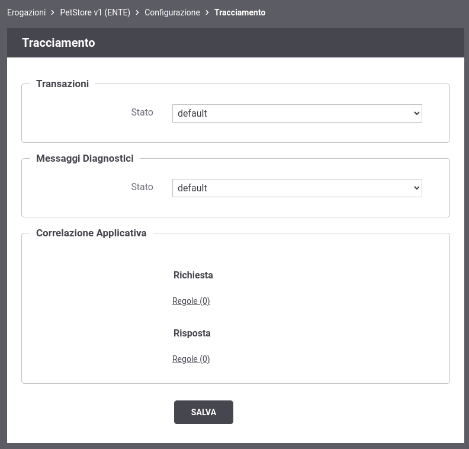

.. _tracciamentoErogazione:

Tracciamento
~~~~~~~~~~~~

Il tracciamento è la funzionalità del gateway che comporta la
registrazione dei dati relativi alle comunicazioni in transito
riguardanti i servizi erogati e fruiti.

In questa sezione è possibile personalizzare la configurazione di
default del tracciamento definita in accordo a quanto descritto in sezione :ref:`tracciamento`. Le
personalizzazioni inserite in questo contesto avranno validità per le
sole comunicazioni riguardanti la specifica erogazione/fruizione (:numref:`tracciamentoErogazioneFig`).

    Tracciamento per la singola erogazione/fruizione

Le sezioni presenti nella pagina sono:

-  *Transazioni*: l'utente ha l'opzione per mantenere il
   default definito nella sezione di configurazione generale (sezione :ref:`tracciamento` e dettaglio in :ref:`tracciamentoTransazioni`) oppure
   ridefinirlo.

-  *Messaggi Diagnostici*: l'utente ha l'opzione per mantenere il
   default definito nella sezione di configurazione generale (sezione :ref:`tracciamento`) oppure
   ridefinire il criterio per la sola memorizzazione su Database.

-  *Correlazione Applicativa*: consente di impostare delle regole per
   estrarre dai messaggi in transito, codici, riferimenti, o altri
   contenuti al fine di arricchire i dati tracciamento generati dal
   gateway (sezione :ref:`correlazione`).
