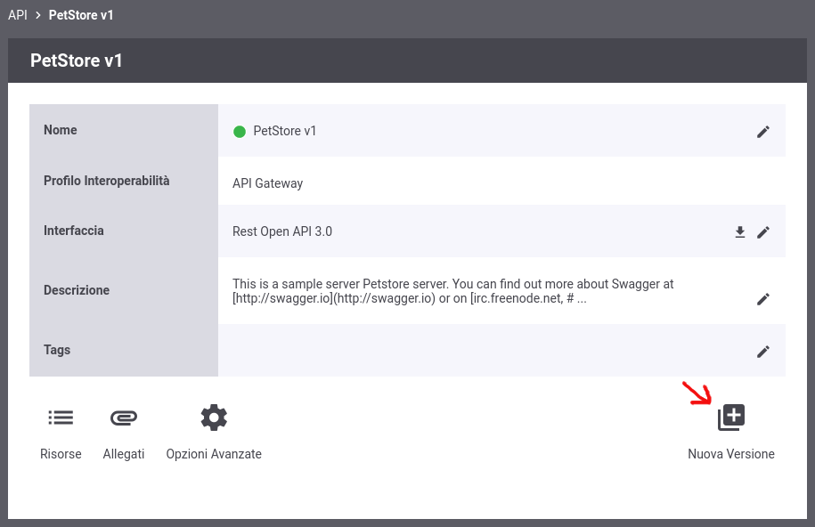
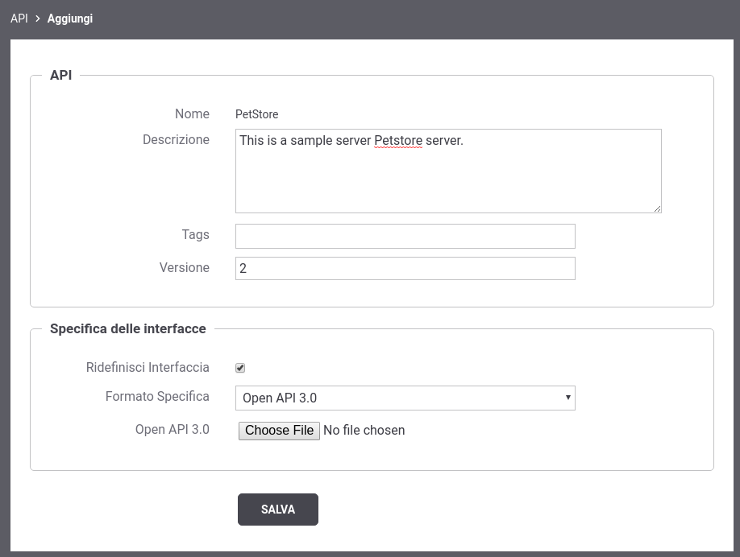
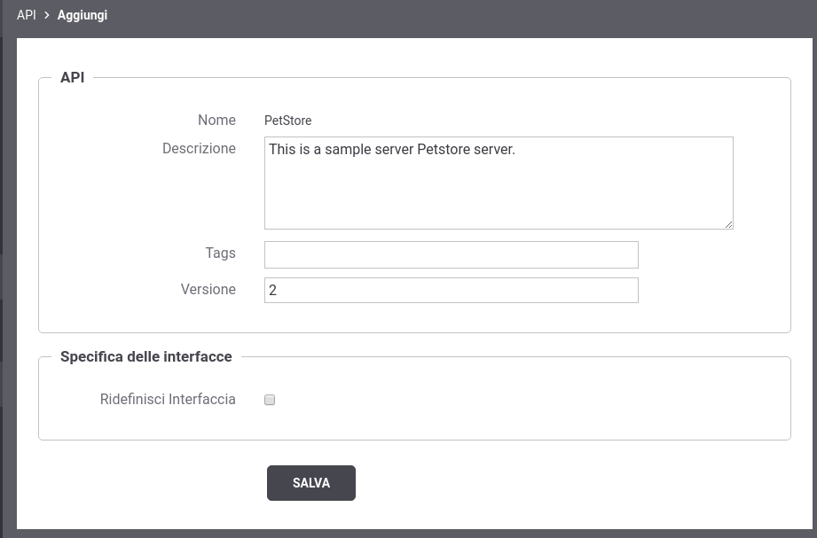
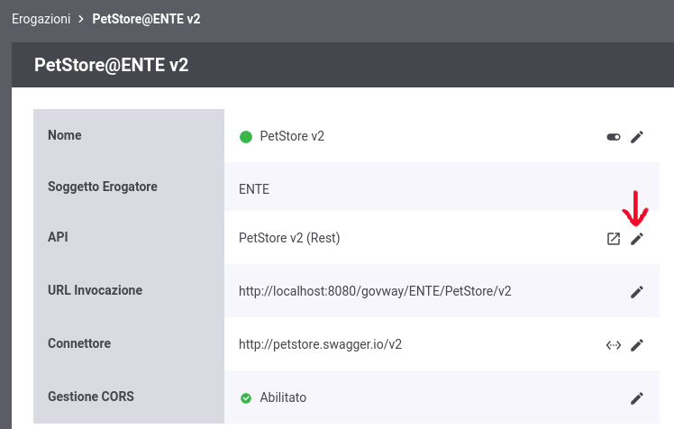
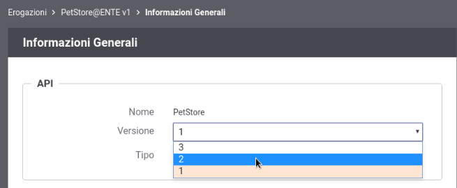
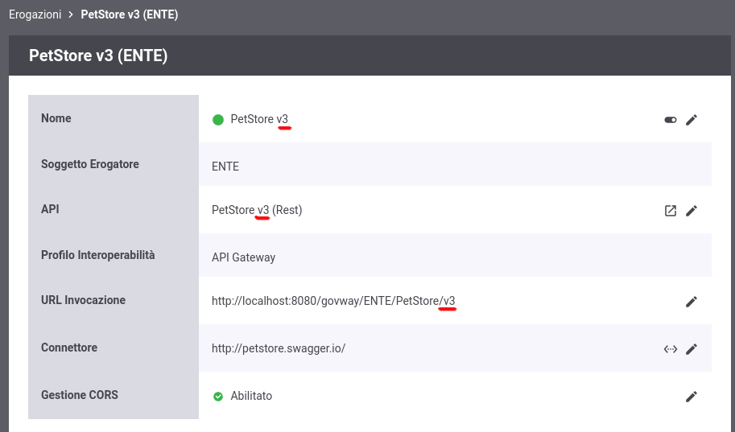

.. _versionamentoAPI:

Versionamento delle API
-----------------------

Come descritto nelle precedenti sezioni, ogni API possiede una versione. È possibile registrare una nuova versione dell'API cliccando sul pulsante 'Nuova Versione' presente nel dettaglio di una API (:numref:`nuovaVersioneApi`).

    Nuova Versione di una API

La maschera di creazione della nuova versione non permette ne di modificare il nome dell'API ne di scendere di versione.
Vengono ereditati dall'API precedente le altre caratteristiche quali il tipo di API tra SOAP e REST, i tags, la descrizione, il soggetto referente etc.

Se l'opzione 'Ridefinisci Interfaccia' è abilitata, viene richiesta una nuova specifica dell'interfaccia dell'API. Terminando la creazione della nuova API verranno creati automaticamente i servizi e le azioni su SOAP o le risorse su REST definiti nella nuova interfaccia (:numref:`nuovaVersioneApiRidefinizioneInterfacciaAbilitata`).

    Nuova Versione di una API tramite ridefinizione dell'intervaccia

In alternativa, se l'opzione 'Ridefinisci Interfaccia' viene disabilitata, non viene richiesta una nuova specifica di interfaccia e la nuova versione dell'API conterrà la medesima specifica della precendente versione con i medesimi servizi e azioni su SOAP o risorse su REST  (:numref:`nuovaVersioneApiRidefinizioneInterfacciaDisabilitata`).

    Nuova API che eredita la specifica di interfaccia dalla versione precedente

Una volta creata una nuova versione dell'API, è possibile effettuare l'upgrade verso la nuova versione direttamente nell'erogazione e/o nella fruizione che implementa l'API. Infatti se esiste più di una versione di una medesima API è possibile modificarne la versione implementata nell'erogazione o nella fruizione tramite il bottone 'modifica' evidenziato nella figura :numref:`nuovaVersioneApiInErogazione`.

    Upgrade di versione dell'API implementata in una erogazione

Accedendo alla modifica è possibile scegliere la versione implementata dell'API, tra le versioni disponibili, come mostrato nella figura :numref:`switchNuovaVersioneApiInErogazione`.

    Scelta della versione dell'API implementata in una erogazione

La modifica della versione dell'API implementata dall'erogazione, comporta automaticamente anche la modifica della versione dell'erogazione stessa. Questo si riflette nell'url di invocazione che viene automaticamente aggiornata rispetto alla nuova versione come evidenziato nella figura :numref:`versioneErogazioneModificata`. 

    Modifica della versione si riflette sia sull'erogazione che sulla url di invocazione

.. note::

	Se viene scelta una versione dell'API per la quale esiste già una medesima versione dell'erogazione, il cambio di versione dell'API non si rifletterà sulla versione dell'erogazione e sulla url di invocazione ma solamente sui messaggi scambiati e sulle azioni (soap) o risorse (rest) che l'erogazione espone.

Per maggiori dettagli sul versionamento differente tra erogazione/fruizione ed API e di conseguenza su come questo si riflette nella url di invocazione si rimanda alla sezione :ref:`versionamentoAPI_advanced`
