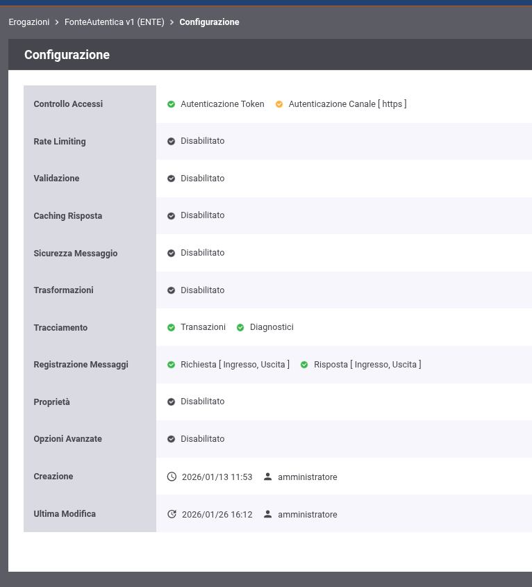
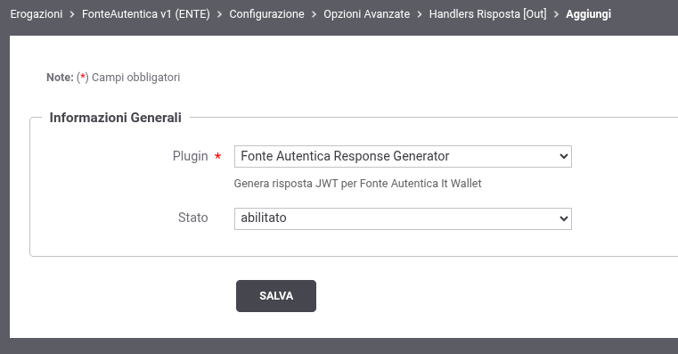
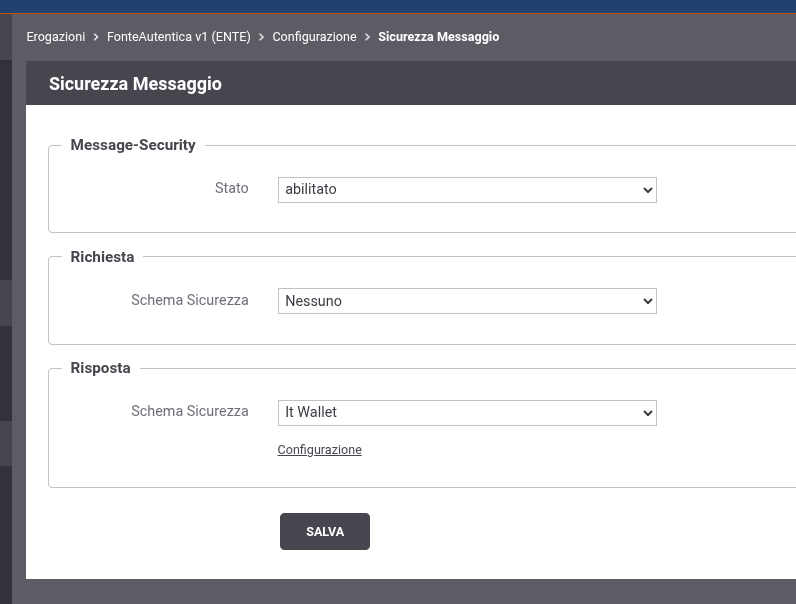
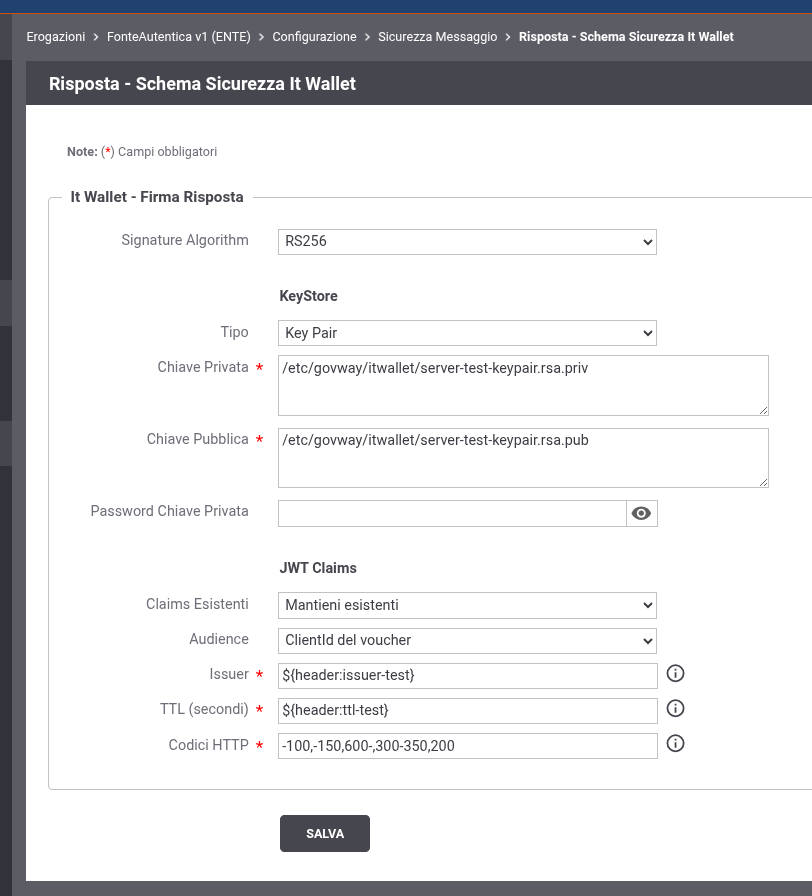

.. _itwalletConfigurazione:

Configurazione
==============

Per configurare GovWay come Fonte Autentica IT-Wallet è necessario:

1. Configurare l'handler per la gestione degli errori sull'erogazione
2. Configurare la sicurezza messaggio per la firma JWT della risposta sull'erogazione

    Panoramica configurazione erogazione Fonte Autentica

Configurazione Handler
~~~~~~~~~~~~~~~~~~~~~~

Per gestire correttamente i codici di errore previsti dalle specifiche IT-Wallet, è necessario attivare un handler dedicato.

Gli errori gestiti da GovWay sono:

- **invalid_token** (401): Token PDND non presente o non valido
- **not_found** (404): Risorsa richiesta non esistente
- **server_error** (500): Errore interno durante l'elaborazione

Per attivare l'handler, accedere alla sezione *Opzioni Avanzate* dell'erogazione (sezione :ref:`configOpzioniAvanzate`), quindi nella sotto-sezione *Handlers per la Risposta* cliccare su *Out* e aggiungere l'handler **Fonte Autentica Response Generator**.

    Configurazione handler IT-Wallet

Configurazione Sicurezza Messaggio
~~~~~~~~~~~~~~~~~~~~~~~~~~~~~~~~~~

La firma JWT della risposta si configura nella sezione *Sicurezza Messaggio* dell'erogazione.

1. Accedere al dettaglio dell'erogazione
2. Entrare in *Configura → Sicurezza Messaggio*
3. Selezionare *Stato: abilitato*
4. In *Risposta* selezionare lo schema sicurezza **It Wallet**
5. Cliccare su *Configurazione* per accedere ai parametri

    Selezione template IT Wallet

Parametri di configurazione
^^^^^^^^^^^^^^^^^^^^^^^^^^^

Il template IT Wallet presenta i seguenti parametri (:numref:`itWalletConfigCompletaFig`):

**Signature Algorithm**: Algoritmo di firma (es. RS256, ES256)

**KeyStore**: Configurazione del keystore contenente la chiave privata per la firma:

- *Tipo*: Tipo di keystore (JKS, PKCS12, JWK, Key Pair)
- *Chiave Privata / File*: Path o contenuto della chiave privata
- *Chiave Pubblica*: Path o contenuto della chiave pubblica (solo per Key Pair)
- *Password*: Password del keystore o della chiave privata

**JWT Claims**: Configurazione dei claims da inserire nel JWT firmato:

.. table:: Parametri JWT Claims
   :widths: 25 75

   ======================== =============================================
   Parametro                Descrizione
   ======================== =============================================
   Claims Esistenti         Comportamento per claims già presenti nel
                            JSON del backend:

                            - *Mantieni esistenti*: preserva i valori originali
                            - *Sovrascrivi*: usa i valori configurati
                            - *Rifiuta con errore*: genera errore 500
   Audience                 Valore del claim ``aud``:

                            - *ClientId del voucher*: usa il clientId usato nella negoziazione con la PDND
                            - *Configurazione manuale*: valore custom
   Issuer                   Valore del claim ``iss``
   TTL (secondi)            Time-To-Live del token. Determina ``exp = iat + TTL``
   Codici HTTP              Codici di risposta del backend per cui firmare
   ======================== =============================================

.. note::
    I campi *Audience* (in modalità manuale), *Issuer* e *TTL* supportano valori dinamici che vengono sostituiti a runtime con i valori presi dalla transazione di GovWay:

    - ``${header:<nome-header>}``: valore di un header HTTP della richiesta
    - ``${tokenInfo:<claim>}``: valore di un claim del token PDND (es. ``${tokenInfo:sub}``)
    - ``${query:<nome-parametro>}``: valore di un parametro query string

    Configurazione completa It Wallet

Codici HTTP per la Firma
^^^^^^^^^^^^^^^^^^^^^^^^

Il parametro *Codici HTTP* permette di specificare per quali codici di risposta del backend la risposta deve essere firmata come JWT.

La sintassi supportata è:

- Singolo codice: ``200``
- Range: ``300-400`` (include 300 e 400)
- Range aperto a sinistra: ``-100`` (equivale a 0-100)
- Range aperto a destra: ``600-`` (equivale a 600 e superiori)
- Combinazioni: ``200,300-350,-100,-150,600-``

Per i codici non inclusi nella configurazione, la risposta del backend viene restituita così come ricevuta, senza alcuna trasformazione in JWT.
