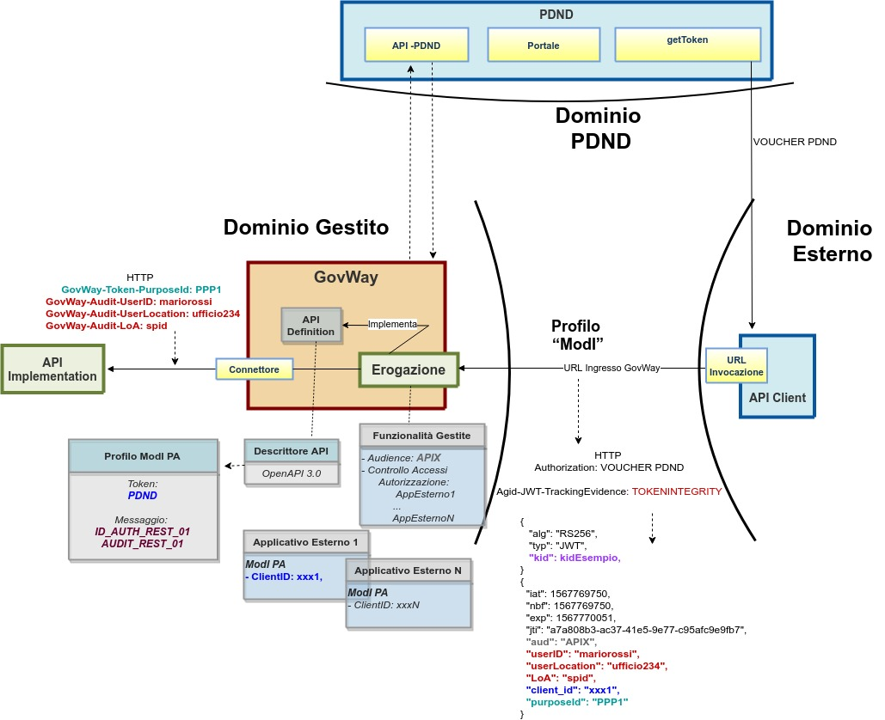

.. _modipa_infoUtente_audit01_erogazione:

Erogazione AUDIT_REST_01
~~~~~~~~~~~~~~~~~~~~~~~~~~~~~~~~~~~~~~~~

Nella figura ':numref:`ErogazioneModIPA_PDND_IDAuth01_AuditRest01`' viene raffigurato lo scenario di erogazione in cui le richieste provenienti dal dominio esterno contengono il token di sicurezza 'Agid-JWT-TrackingEvidence' e il trust avviene tramite la PDND.

    Erogazione con Profilo di Interoperabilità 'ModI', pattern 'AUDIT_REST_01': trust tramite PDND

Per default, le informazioni di audit vengono aggiunte alla traccia ModI e inoltrate al backend attraverso gli header http 'GovWay-Audit-UserID', 'GovWay-Audit-UserLocation' e 'GovWay-Audit-LoA'. Nella sezione ':ref:`modipa_infoUtente_audit01_schema_custom`' è possibile personalizzare questi aspetti.

Nella sezione "Informazioni di Audit" è possibile indicare se nel token 'Agid-JWT-TrackingEvidence' il claim 'aud' deve essere atteso valorizzato con lo stesso audience utilizzato per gli altri token di sicurezza o con uno differente come mostrato nella figura :numref:`modipa_api_infoUtente_auditRest01_dynamic_audit_erogazione`

  Erogazione - personalizzazione dell'Audience all'interno del token 'Agid-JWT-TrackingEvidence'
