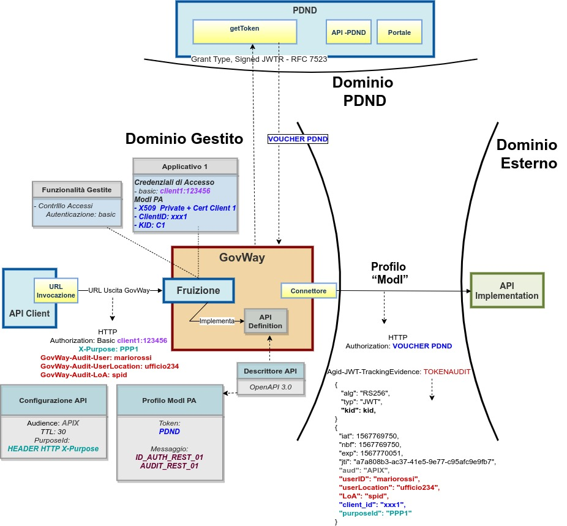
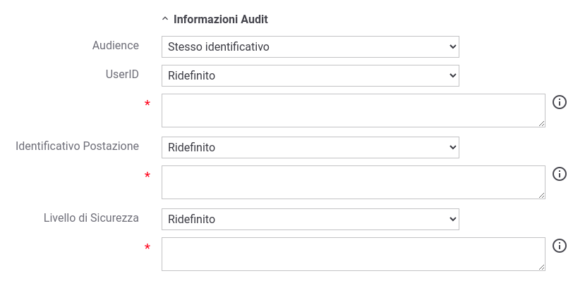
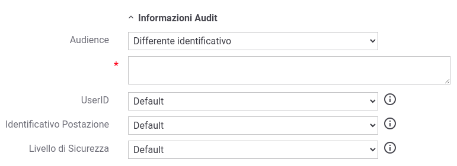

.. _modipa_infoUtente_audit01_fruizione:

Fruizione AUDIT_REST_01
~~~~~~~~~~~~~~~~~~~~~~~~

Le richieste che provengono dagli applicativi interni del dominio e sono dirette verso altre amministrazioni verranno arricchite del token di sicurezza 'Agid-JWT-TrackingEvidence' contenente le informazioni di audit.

Nella figura ':numref:`FruizioneModIPA-PDND-IDAuth01-AuditRest01`' viene raffigurato lo scenario di fruizione in cui il trust avviene tramite la PDND e viene prodotto il token 'Agid-JWT-TrackingEvidence' previsto dal pattern 'AUDIT_REST_01'.

    Fruizione con Profilo di Interoperabilità 'ModI', pattern 'AUDIT_REST_01': trust tramite PDND

Come mostrato nella figura :numref:`FruizioneModIPA-PDND-IDAuth01-AuditRest01` le informazioni di audit sono per default attese nella richiesta pervenuta a GovWay sotto forma di header http o parametro della url:

- userID, un identificativo univoco dell'utente deve essere indicato nella richiesta di fruizione all'interno dell'header http 'GovWay-Audit-User' o nel parametro della url con nome 'govway_audit_user';

- userLocation, un identificativo univoco della postazione dell'utente deve essere indicata nell'header http 'GovWay-Audit-UserLocation' o nel parametro della url con nome 'govway_audit_user_location';

- LoA, livello di sicurezza adottato nel processo di autenticazione dell'utente può essere indicato nell'header http 'GovWay-Audit-LoA' o nel parametro della url con nome 'govway_audit_loa'. Questa informazione non è richiesta obbligatoriamente.

Il comportamento di default, per l'acquisizione dei valori utilizzati per le tre informazioni, può essere personalizzato accedendo nella sezione "ModI" di una fruizione, e modificando le voci "Informazioni di Audit" (:numref:`modipa_api_infoUtente_auditRest01_dynamic`) indicando un valore statico o utilizzando le proprietà dinamiche descritte nella sezione :ref:`valoriDinamici`.

  Fruizione - personalizzazione dell'acquisizione delle Informazioni UserID, UserLocation e LoA

Nella sezione "Informazioni di Audit" è inoltre possibile indicare se nel token 'Agid-JWT-TrackingEvidence' il claim 'aud' deve essere valorizzato con lo stesso audience utilizzato per gli altri token di sicurezza o se fornire un valore differente come mostrato nella figura :numref:`modipa_api_infoUtente_auditRest01_dynamic_audit`

  Fruizione - personalizzazione dell'Audience all'interno del token 'Agid-JWT-TrackingEvidence'
