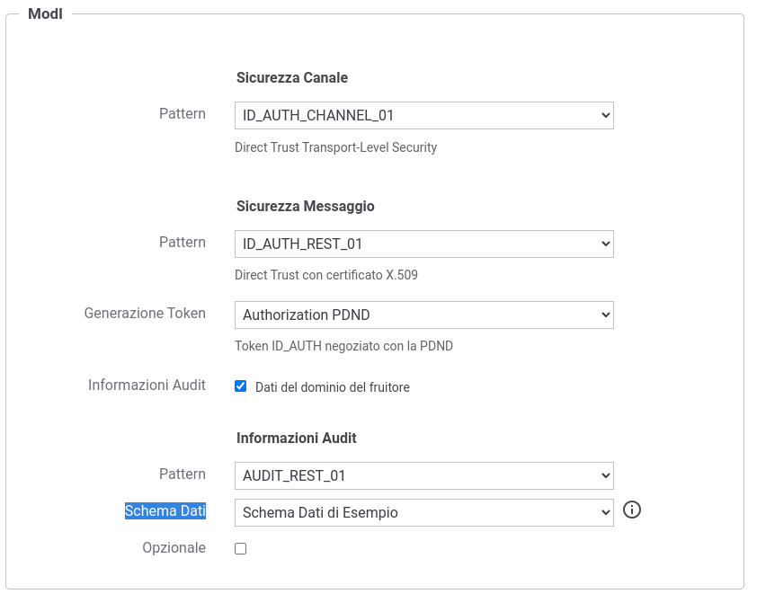

.. _modipa_infoUtente_audit01_schema_custom:

Informazioni personalizzate da includere nel token di AUDIT_REST_01
~~~~~~~~~~~~~~~~~~~~~~~~~~~~~~~~~~~~~~~~~~~~~~~~~~~~~~~~~~~~~~~~~~~~~~~

L'insieme di informazioni proposte dalle Linee Guida e le modalità di identificazione dei valori da associare a tali informazioni, all'interno del token di audit, vengono definite tramite la configurazione presente nel file <directory-lavoro>/modipa_local.properties. 

La configurazione consente inoltre di definire insiemi alternativi a quello di default proposto dalle Linee Guida.

Ad ogni insieme di dati, concordati tra fruitore ed erogatore, deve essere associato un identificativo univoco interno al file di proprietà (IDPROP) da aggiungere all'elenco, separato da virgola, presente nella proprietà '*org.openspcoop2.protocol.modipa.sicurezzaMessaggio.audit.pattern*' che inizialmente presenta solamente lo schema 'default' che definisce le informazioni suggerite dalle Linee Guida (userID, userLocation e LoA):

   ::

      # Ogni insieme di dati concordati tra fruitore ed erogatore viene identificato da una keyword da aggiungere alla seguente proprietà (elenco separato da virgola):
      org.openspcoop2.protocol.modipa.sicurezzaMessaggio.audit.pattern=default,<IDPROP>

Di seguito vengono descritte le configurazioni attuabili su un insieme di dati da inserire nel token di audit. 

Le proprietà seguenti associano un identificativo univoco e una label all'insieme di dati, label che verrà proposta nella maschera di configurazione delle informazioni di audit in una API (:numref:`modipa_api_infoUtente_auditRest01_schemaAlternativo`).

   ::

      org.openspcoop2.protocol.modipa.sicurezzaMessaggio.audit.pattern.<IDPROP>.nome=Schema-Dati-Esempio
      org.openspcoop2.protocol.modipa.sicurezzaMessaggio.audit.pattern.<IDPROP>.label=Schema Dati di Esempio

  Informazioni Audit personalizzato

Tramite la proprietà '*org.openspcoop2.protocol.modipa.sicurezzaMessaggio.audit.pattern.<IDPROP>.claims*' devono essere elencati i claim concordati tra erogatore e fruitore. Ogni claim viene identificato da un identificativo univoco interno al file di proprietà (IDCLAIM-X) per l'insieme di dati (IDPROP).

   ::

      org.openspcoop2.protocol.modipa.sicurezzaMessaggio.audit.pattern.<IDPROP>.claims=<IDCLAIM-1>,...,<IDCLAIM-N>

Ogni singolo claim è personalizzabile nei seguenti aspetti:

- Un identificativo univoco e una label da associare al claim rispettivamente tramite le proprietà '*org.openspcoop2.protocol.modipa.sicurezzaMessaggio.audit.pattern.<IDPROP>.claims.<IDCLAIM-X>.nome*' e '*org.openspcoop2.protocol.modipa.sicurezzaMessaggio.audit.pattern.<IDPROP>.claims.<IDCLAIM-X>.label*'.

- L'indicazione se il claim è obbligatorio all'interno del token di audit tramite la proprietà '*org.openspcoop2.protocol.modipa.sicurezzaMessaggio.audit.pattern.<IDPROP>.claims.<IDCLAIM-X>.required*'.

- L'indicazione se il claim veicola un valore riutilizzabile su differenti chiamate tramite la proprietà '*org.openspcoop2.protocol.modipa.sicurezzaMessaggio.audit.pattern.<IDPROP>.claims.<IDCLAIM-X>.cacheable*'. In caso di proprietà non definita per default il valore del claim sarà processato come riutilizzabile.

  .. note::
	
       L'intero token di audit verrà salvato in cache e riutilizzato su differenti chiamate solo se tutti i claim inseriti all'interno del token risultano configurati come riutilizzabili.

- L'indicazione se il claim è una stringa json o un tipo primitivo attraverso la proprietà '*org.openspcoop2.protocol.modipa.sicurezzaMessaggio.audit.pattern.<IDPROP>.claims.<IDCLAIM-X>.stringType*'.

- Una descrizione sintetica dell'informazione rappresentata dal claim che verrà fornita tra i criteri informativi dello schema nella maschera di configurazione dell'API (proprietà '*org.openspcoop2.protocol.modipa.sicurezzaMessaggio.audit.pattern.<IDPROP>.claims.<IDCLAIM-X>.info*').

- Una lista di regole, separate dalla virgola, che verranno utilizzate in ordine per individuare il valore del claim da inserire all'interno del token. Le regole possono essere definite tramite valori statici o contenere informazioni dinamiche risolte a runtime e descritte nella sezione ':ref:`valoriDinamici`' (proprietà '*org.openspcoop2.protocol.modipa.sicurezzaMessaggio.audit.pattern.<IDPROP>.claims.<IDCLAIM-X>.rule*'). 

- Per ogni regola definita nella precedente proprietà deve essere fornita una descrizione sintetica che verrà visualizzata tra i criteri informativi nella maschera di configurazione della fruizione (proprietà '*org.openspcoop2.protocol.modipa.sicurezzaMessaggio.audit.pattern.<IDPROP>.claims.<IDCLAIM-X>.rule.info*'). 

- L'informazione di un claim di audit può essere propagato verso il backend di una erogazione se viene definito il nome di un header http tramite la proprietà '*org.openspcoop2.protocol.modipa.sicurezzaMessaggio.audit.pattern.<IDPROP>.claims.<IDCLAIM-X>.forwardBackend*'. Per non propagare alcun header associare un valore vuoto alla proprietà.

- Il valore di un claim di audit viene aggiunto alla traccia ModI se abilito nella proprietà '*org.openspcoop2.protocol.modipa.sicurezzaMessaggio.audit.pattern.<IDPROP>.claims.<IDCLAIM-X>.trace*').

- Opzionalmente è inoltre possibile definire per ogni claim le seguenti proprietà che definiscono dei criteri di validazione del valore:

	- espressione regolare (proprietà '*org.openspcoop2.protocol.modipa.sicurezzaMessaggio.audit.pattern.<IDPROP>.claims.<IDCLAIM-X>.regexp*')
	- lista di valori ammessi (proprietà '*org.openspcoop2.protocol.modipa.sicurezzaMessaggio.audit.pattern.<IDPROP>.claims.<IDCLAIM-X>.enum*')
	- lunghezza minima di caratteri (proprietà '*org.openspcoop2.protocol.modipa.sicurezzaMessaggio.audit.pattern.<IDPROP>.claims.<IDCLAIM-X>.minLength*')
	- lunghezza massima di caratteri (proprietà '*org.openspcoop2.protocol.modipa.sicurezzaMessaggio.audit.pattern.<IDPROP>.claims.<IDCLAIM-X>.maxLength*')

Di seguito viene fornito un esempio di configurazione in cui i valori riportati sono quelli utilizzati per la definizine del claim 'userID' descritto dalle Linee Guida.

   ::

      org.openspcoop2.protocol.modipa.sicurezzaMessaggio.audit.pattern.default.claims.<IDCLAIM-X>.nome=userID
      org.openspcoop2.protocol.modipa.sicurezzaMessaggio.audit.pattern.default.claims.<IDCLAIM-X>.label=UserID
      org.openspcoop2.protocol.modipa.sicurezzaMessaggio.audit.pattern.default.claims.<IDCLAIM-X>.required=true
      org.openspcoop2.protocol.modipa.sicurezzaMessaggio.audit.pattern.default.claims.<IDCLAIM-X>.stringType=true
      org.openspcoop2.protocol.modipa.sicurezzaMessaggio.audit.pattern.default.claims.<IDCLAIM-X>.info=Identificativo univoco dell'utente interno al dominio del fruitore che ha determinato l'esigenza della richiesta di accesso all'e-service dell'erogatore
      org.openspcoop2.protocol.modipa.sicurezzaMessaggio.audit.pattern.default.claims.<IDCLAIM-X>.rule=${header:GovWay-Audit-User},${query:govway_audit_user}
      org.openspcoop2.protocol.modipa.sicurezzaMessaggio.audit.pattern.default.claims.<IDCLAIM-X>.rule.info=Header http 'GovWay-Audit-User',Parametro della url 'govway_audit_user'
      org.openspcoop2.protocol.modipa.sicurezzaMessaggio.audit.pattern.default.claims.<IDCLAIM-X>.forwardBackend=GovWay-Audit-UserID
      org.openspcoop2.protocol.modipa.sicurezzaMessaggio.audit.pattern.default.claims.<IDCLAIM-X>.trace=true

Un altro esempio mostra l'utilizzo dei criteri di validazione per definire un claim il cui valore deve essere composto solamente da lettere e numeri e formato esattamente da 3 caratteri. 

   ::

      org.openspcoop2.protocol.modipa.sicurezzaMessaggio.audit.pattern.default.claims.<IDCLAIM-X>.nome=esempioValidazione
      org.openspcoop2.protocol.modipa.sicurezzaMessaggio.audit.pattern.default.claims.<IDCLAIM-X>.label=EsempioValidazione
      org.openspcoop2.protocol.modipa.sicurezzaMessaggio.audit.pattern.default.claims.<IDCLAIM-X>.required=true
      org.openspcoop2.protocol.modipa.sicurezzaMessaggio.audit.pattern.default.claims.<IDCLAIM-X>.stringType=true
      org.openspcoop2.protocol.modipa.sicurezzaMessaggio.audit.pattern.default.claims.<IDCLAIM-X>.regexp=^[A-Za-z0-9]+$
      org.openspcoop2.protocol.modipa.sicurezzaMessaggio.audit.pattern.default.claims.<IDCLAIM-X>.minLength=3
      org.openspcoop2.protocol.modipa.sicurezzaMessaggio.audit.pattern.default.claims.<IDCLAIM-X>.maxLength=3
      org.openspcoop2.protocol.modipa.sicurezzaMessaggio.audit.pattern.default.claims.<IDCLAIM-X>.info=Un esempio di validazione tramite regexp e min/max length
      org.openspcoop2.protocol.modipa.sicurezzaMessaggio.audit.pattern.default.claims.<IDCLAIM-X>.rule=${header:GovWay-Audit-Esempio}
      org.openspcoop2.protocol.modipa.sicurezzaMessaggio.audit.pattern.default.claims.<IDCLAIM-X>.rule.info=Header http 'GovWay-Audit-Esempio'
      org.openspcoop2.protocol.modipa.sicurezzaMessaggio.audit.pattern.default.claims.<IDCLAIM-X>.forwardBackend=GovWay-Audit-Esempio
      org.openspcoop2.protocol.modipa.sicurezzaMessaggio.audit.pattern.default.claims.<IDCLAIM-X>.trace=true

Infine l'ultimo esempio mostra l'utilizzo dei criteri di validazione per definire un claim i cui valori vengono definiti da una enumeration.

   ::

      org.openspcoop2.protocol.modipa.sicurezzaMessaggio.audit.pattern.default.claims.<IDCLAIM-X>.nome=esempioValidazioneByEnum
      org.openspcoop2.protocol.modipa.sicurezzaMessaggio.audit.pattern.default.claims.<IDCLAIM-X>.label=EsempioValidazioneByEnum
      org.openspcoop2.protocol.modipa.sicurezzaMessaggio.audit.pattern.default.claims.<IDCLAIM-X>.required=true
      org.openspcoop2.protocol.modipa.sicurezzaMessaggio.audit.pattern.default.claims.<IDCLAIM-X>.stringType=true
      org.openspcoop2.protocol.modipa.sicurezzaMessaggio.audit.pattern.default.claims.<IDCLAIM-X>.enum=CREATE,UPDATE,DELETE
      org.openspcoop2.protocol.modipa.sicurezzaMessaggio.audit.pattern.default.claims.<IDCLAIM-X>.info=Un esempio di validazione tramite enum
      org.openspcoop2.protocol.modipa.sicurezzaMessaggio.audit.pattern.default.claims.<IDCLAIM-X>.rule=${header:GovWay-Audit-Esempio}
      org.openspcoop2.protocol.modipa.sicurezzaMessaggio.audit.pattern.default.claims.<IDCLAIM-X>.rule.info=Header http 'GovWay-Audit-Esempio'
      org.openspcoop2.protocol.modipa.sicurezzaMessaggio.audit.pattern.default.claims.<IDCLAIM-X>.forwardBackend=GovWay-Audit-Esempio
      org.openspcoop2.protocol.modipa.sicurezzaMessaggio.audit.pattern.default.claims.<IDCLAIM-X>.trace=true

