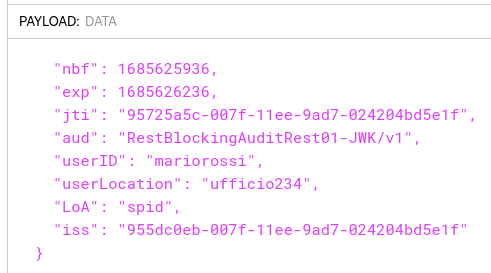

.. _modipa_infoUtente_audit01_schema:

Informazioni UserID, UserLocation e LoA incluse nel token di AUDIT_REST_01
~~~~~~~~~~~~~~~~~~~~~~~~~~~~~~~~~~~~~~~~~~~~~~~~~~~~~~~~~~~~~~~~~~~~~~~~~~~~

Il pattern AUDIT_REST nelle sue varie declinazioni consente all'erogatore di identificare la specifica provenienza di ogni singola richiesta di accesso ai dati effettuta dal fruitore. 

Le Linee Guida indicano che l'erogatore e il fruitore devono individuare i claim da includere nel JWT di audit 'Agid-JWT-TrackingEvidence' e suggeriscono i seguenti dati che dovranno essere presenti nel token generato dal fruitore, per ogni richiesta effettuata:

- userID, un identificativo univoco dell'utente interno al dominio del fruitore che ha determinato l'esigenza della request di accesso all'e-service dell'erogatore;

- userLocation, un identificativo univoco della postazione interna al dominio del fruitore da cui è avviata l'esigenza della request di accesso all'e-service dell'erogatore;

- LoA, livello di sicurezza o di garanzia adottato nel processo di autenticazione informatica nel dominio del fruitore.

Nella figura :numref:`api_modipaInfoUtente_auditRest01_example_fig` viene riportato un esempio del payload relativo al token di sicurezza 'ModI' di una API REST, contenente le informazioni aggiuntive sull'utente che ha effettuato la richiesta.

  Payload del Token di Audit con pattern "AUDIT_REST_01"

Nella configurazione built-in del prodotto, le informazioni da inserire nel token di audit vengono richieste all'applicativo fruitore che invoca una fruizione tramite header http o parametri della url come descritto nella sezione ':ref:`modipa_infoUtente_audit01_fruizione`'.

Le informazioni di audit vengono aggiunte, per default, alla traccia ModI e un'erogazione le inoltre al backend attraverso header http come descritto nella sezione ':ref:`modipa_infoUtente_audit01_erogazione`'.

Nella sezione ':ref:`modipa_infoUtente_audit01_schema_custom`' vengono fornite le informazioni utili sia a modificare le configurazioni dei claim userID, userLocation, LoA che a definire un insieme di claim alternativo a quello di default.

.. toctree::
        :maxdepth: 2

	config
