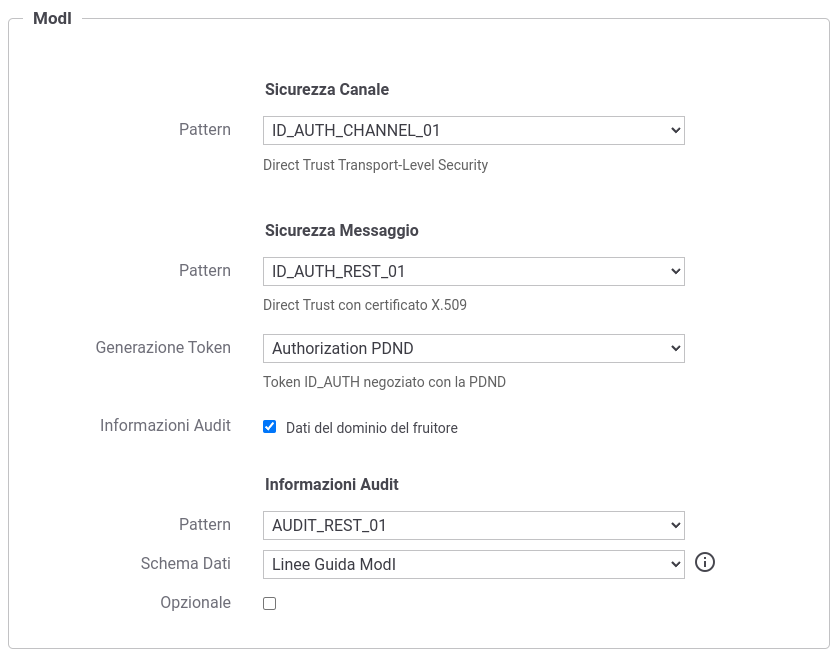
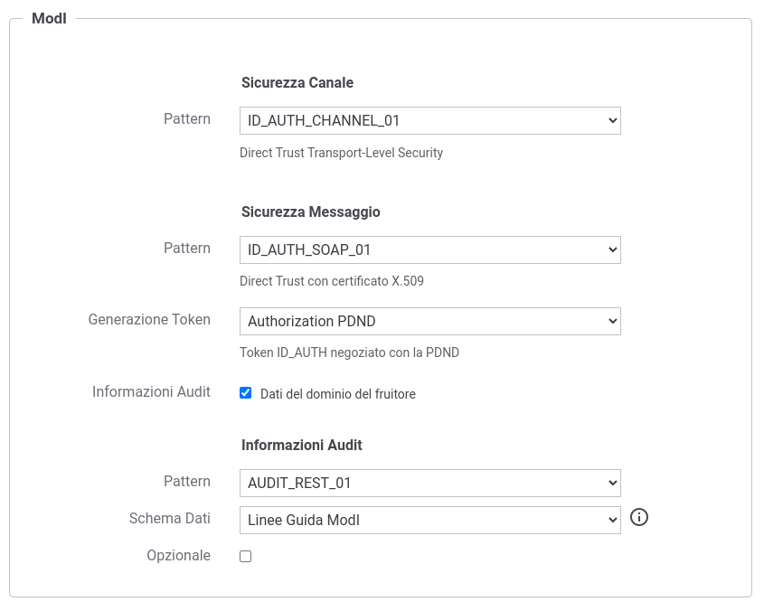

.. _modipa_infoUtente_audit01:

AUDIT_REST_01 - Inoltro dati tracciati nel dominio del Fruitore
~~~~~~~~~~~~~~~~~~~~~~~~~~~~~~~~~~~~~~~~~~~~~~~~~~~~~~~~~~~~~~~~

Questa funzionalità consente di estendere uno qualunque dei pattern di sicurezza ':ref:`modipa_sicurezzaMessaggio_ida01`', ':ref:`modipa_sicurezzaMessaggio_ida02`' e ':ref:`modipa_sicurezzaMessaggio_ida03`' attraverso un nuovo token aggiuntivo adibito a contenere informazioni utili all'erogatore a identificare la specifica provenienza di ogni singola richiesta di accesso ai dati effettuta dal fruitore come descritto nella sezione ':ref:`modipa_infoUtente_audit`.

L'attivazione di questa funzionalità avviene a livello della relativa API, nella sezione "ModI", elemento "Sicurezza Messaggio", selezionando la voce "Informazioni Audit" (:numref:`api_modipaInfoUtente_auditRest01_fig`).

  Pattern di sicurezza messaggio "ID_AUTH" + Informazioni Audit "AUDIT_REST_01" su API REST

.. note::
    Nel caso venga disabilitata la generazione della sicurezza messaggio sulla richiesta, la funzionalità 'Informazioni Audit' non sarà più attivabile.

Il pattern è utilizzabile anche su API SOAP come mostrato nella figura :numref:`api_modipaInfoUtente_auditRest01_soap_fig`.

  Pattern di sicurezza messaggio "ID_AUTH" + Informazioni Audit "AUDIT_REST_01" su API SOAP

Il token di audit per default è considerato obbligatorio, ed è possibile renderlo opzionale attivando il campo con nome 'Opzionale' presente nella sezione 'Informazioni Audit'.

La voce 'Generazione Token' consente di definire il criterio di trust:
	
- 'Authorization PDND' (o 'Authorization OAuth'): un criterio di trust realizzato tramite il materiale crittografico depositato sulla PDND;
- 'Authorization ModI': un trust diretto fruitore-erogatore attraverso l'utilizzo di certificati X509. 

Nella sezione ':ref:`modipa_infoUtente_audit01_schema`' vengono descritti l'insieme dei dati di default configurati built-in nel prodotto (UserID, UserLocation e LoA) mentre nella sezione ':ref:`modipa_infoUtente_audit01_schema_custom`' vengono fornite le informazioni utili a definire un insieme di claim alternativo a quello di default.

Nelle sezioni successive vengono forniti i dettagli di configurazione necessari ad utilizzare il pattern di AUDIT negli scenari di fruizione o erogazione di un servizio. 

.. toctree::
   :maxdepth: 2

    Definizione dei claim da includere nel token di audit <audit_schema/index>
    Passi per la configurazione di una fruizione <audit_fruizione>
    Passi per la configurazione di una erogazione <audit_erogazione>
