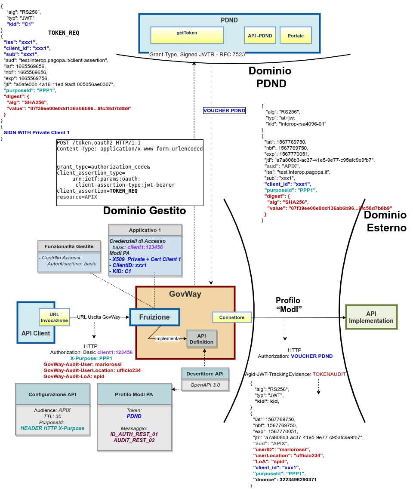
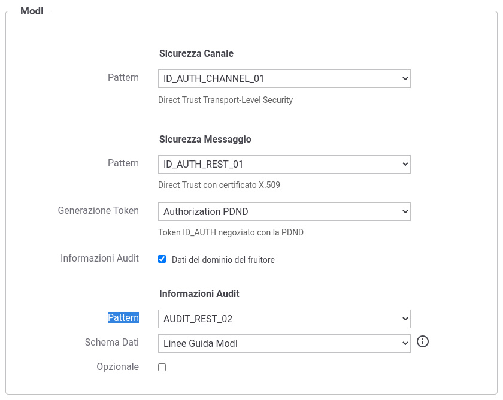

.. _modipa_infoUtente_audit02:

AUDIT_REST_02 - Inoltro dati tracciati nel dominio del Fruitore con correlazione
~~~~~~~~~~~~~~~~~~~~~~~~~~~~~~~~~~~~~~~~~~~~~~~~~~~~~~~~~~~~~~~~~~~~~~~~~~~~~~~~~

Il pattern 'AUDIT_REST_02' estende il pattern 'AUDIT_REST_012' aggiungendo la correlazione tra il token di autenticazione e il token di audit. Il pattern richiede un trust realizzato tramite il materiale crittografico depositato sulla PDND.

Nella figura ':numref:`ModIPA-PDND-IDAuth01-AuditRest02`' viene raffigurato lo scenario.

    Profilo di Interoperabilità 'ModI', pattern 'AUDIT_REST_02': trust tramite PDND

L'attivazione del pattern 'AUDIT_REST_02' rispetto a quanto descritto nella sezione ':ref:`modipa_infoUtente_audit01`' differisce solamente a livello API, nella sezione "ModI - Informazioni Audit" (:numref:`api_modipaInfoUtente_auditRest02_fig`).

  Pattern di sicurezza messaggio "ID_AUTH" + Informazioni Audit "AUDIT_REST_02"
