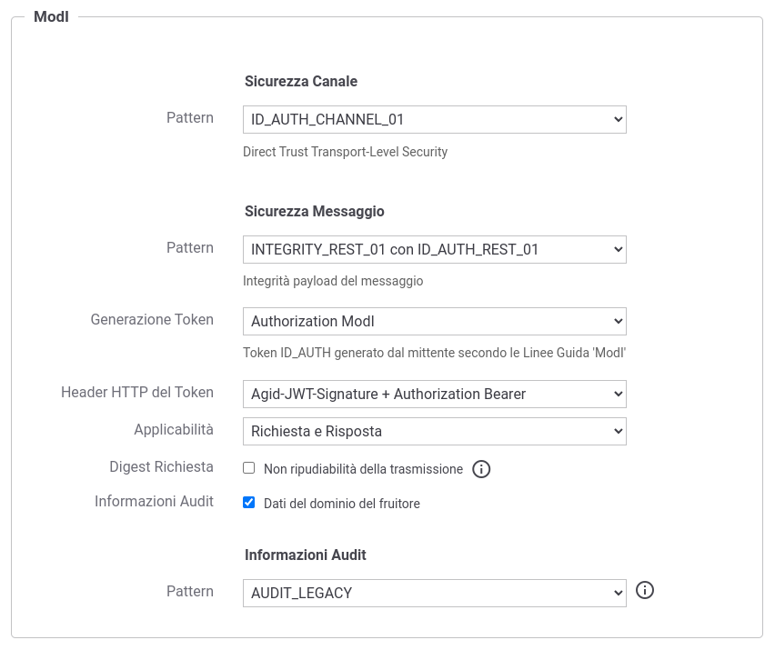
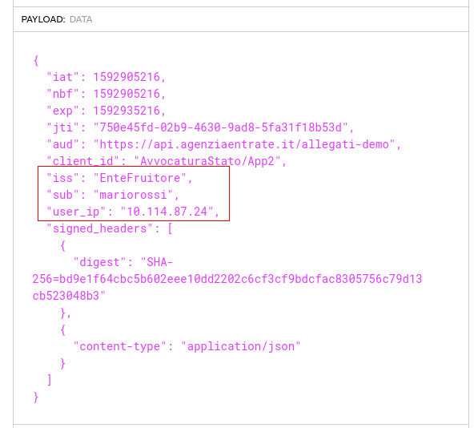
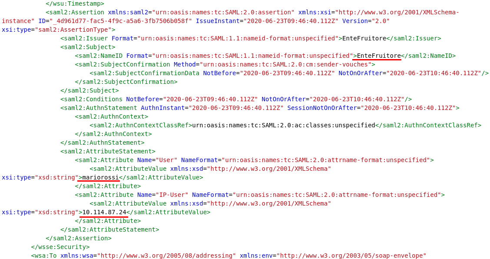
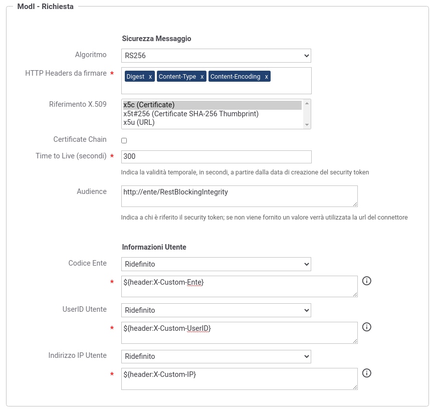

.. _modipa_infoUtente_legacy:

AUDIT_LEGACY
~~~~~~~~~~~~~~~~~~~

Questa funzionalità consente di estendere il pattern ':ref:`modipa_sicurezzaMessaggio_ida03`' aggiungendo all'interno del token di sicurezza le informazioni sull'utente che ha effettuato la richiesta.

.. note::
    La sigla che identifica il pattern di sicurezza messaggio varia a seconda se l'API sia di tipo REST, per cui la sigla corrisponde a *INTEGRITY_REST_01*, o SOAP dove viene utilizzata la sigla *INTEGRITY_SOAP_01*.

L'attivazione di questa funzionalità avviene a livello della relativa API, nella sezione "ModI", elemento "Sicurezza Messaggio", selezionando la voce "Informazioni Audit" (:numref:`api_modipaInfoUtente_fig`).

  Pattern di sicurezza messaggio "INTEGRITY" + Informazioni Audit "AUDIT_LEGACY"

.. note::
    Poichè la funzionalità è un'estensione del pattern ':ref:`modipa_sicurezzaMessaggio_ida03`', il pattern 'AUDIT_LEGACY' all'interno della sezione 'Informazioni Audit' compare solamente se è stato selezionato uno dei pattern "INTEGRITY\_\*".

.. note::
    Nel caso venga disabilitata la generazione della sicurezza messaggio sulla richiesta, la funzionalità 'Informazioni Audit' non sarà più attivabile.

Le informazioni aggiuntive presenti all'interno del token riguardano:

- UserID Utente: identificativo univoco dell'utente all'interno del dominio rappresentato dal 'Codice Ente';

- Indirizzo IP Utente: identifica la postazione da cui l'utente ha effettuato la richiesta;

- Codice Ente: dominio di appartenenza dell'utente.

Nella figura :numref:`api_modipaInfoUtente_exampleRest_fig` viene riportato un esempio del payload relativo al token di sicurezza 'ModI' di una API REST, contenente le informazioni aggiuntive sull'utente che ha effettuato la richiesta.

  Payload del Token di Sicurezza REST con pattern "INTEGRITY_REST_01" + Informazioni Audit "AUDIT_LEGACY"

Nella figura :numref:`api_modipaInfoUtente_exampleSoap_fig` viene riportato un esempio relativo al token di sicurezza 'ModI' per una API SOAP. Le informazioni aggiuntive sull'utente che ha effettuato la richiesta sono incluse in una Asserziona SAML.

  Payload del Token di Sicurezza SOAP con pattern "INTEGRITY_SOAP_01" + Informazioni Audit "AUDIT_LEGACY"

**Fruizione**

In una fruizione, le informazioni aggiuntive che vengono aggiunte nel token, sono per default attese nella richiesta pervenuta a GovWay sotto forma di header http o parametro della url:

- UserID Utente: l'identificativo dell'utente deve essere indicato nella richiesta di fruizione all'interno dell'header http 'GovWay-CS-User' o del parametro della url con nome 'govway_cs_user';

- Indirizzo IP Utente: la postazione dell'utente deve essere indicata nell'header http 'GovWay-CS-IPUser' o del parametro della url con nome 'govway_cs_ipuser';

- Codice Ente: per default questa informazione assume il valore del soggetto registrato su GovWay, di dominio interno, per il quale si sta effettuando la richiesta di fruizione dell'API.

Il comportamento di default, per l'acquisizione dei valori utilizzati per le tre informazioni aggiuntive, può essere personalizzato accedendo nella sezione "ModI" di una fruizione, e modificando le voci "Informazioni Utente" (:numref:`api_modipaInfoUtente_dynamic_fig`) indicando un valore statico o utilizzando le proprietà dinamiche descritte nella sezione :ref:`valoriDinamici`.

  Personalizzazione dell'acquisizione delle Informazioni Utente
