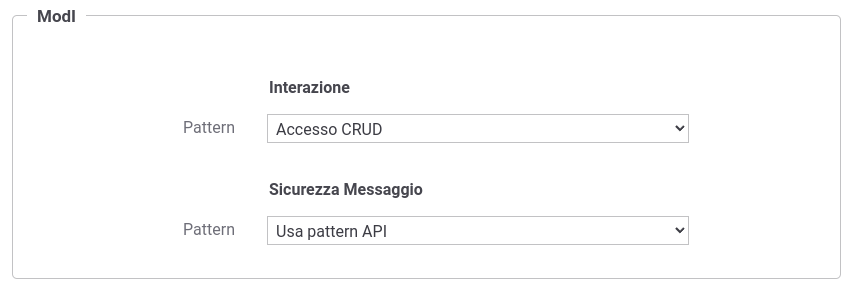

.. _modipa_sicurezza_avanzate_azioni:

Attivazione di pattern di sicurezza messaggio differenti per la singola operazione
---------------------------------------------------------------------------------------

Nella maschera di gestione di un'operazione di una API, all'interno della sezione 'ModI', per default viene fornita una sicurezza messaggio ereditata da quanto indicato sull'API stessa tramite l'opzione 'Usa pattern API' (:numref:`modipa_sicurezza_azione_default`).

 Pattern ModI dell'operazione ereditati dall'API

Selezionando la voce 'Ridefinito' nel campo 'Pattern' della sicurezza messaggio è possibile ridefinire il pattern utilizzato rispetto a quello definito complessivamente sull'API:

- selezionando l'opzione '-' è possibile indicare di non applicare alcun pattern di sicurezza per l'operazione (:numref:`modipa_sicurezza_azione_ridefinito_none`);

   .. figure:: ../../../_figure_console/modipa_sicurezza_azione_ridefinito_none.png
    :scale: 50%
    :align: center
    :name: modipa_sicurezza_azione_ridefinito_none

    Pattern ModI dell'operazione ridefiniti: sicurezza messaggio disabilitata

- selezionando un qualsiasi altro pattern di sicurezza messaggio è possibile applicare un pattern differente per l'operazione (:numref:`modipa_sicurezza_azione_ridefinito_pattern`);

   .. figure:: ../../../_figure_console/modipa_sicurezza_azione_ridefinito_pattern.png
    :scale: 50%
    :align: center
    :name: modipa_sicurezza_azione_ridefinito_pattern

    Pattern ModI dell'operazione ridefiniti
