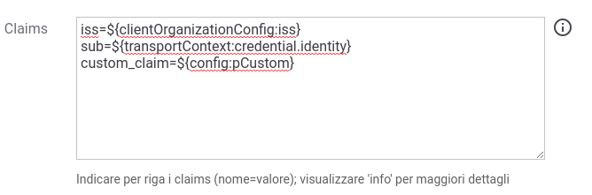

.. _modipa_sicurezza_avanzate_claims:

Payload Claims del token JWT
----------------------------

Il pattern di sicurezza, su API di tipo REST, produrrà la generazione di un token JWT firmato inserito all'interno dell'header HTTP previsto dalle *Linee Guida AGID di Interoperabilità*. 
Nel payload del JWT vengono generati i claim di default previsti dal prodotto come quelli temporali (iat, nbf, exp), l'identificativo unico della richiesta (jti), e altri claims che consentono di individuare gli attori (sub, iss, client_id, aud). 

Altri claims possono essere aggiunti al payload JWT definendoli nel campo 'Claims' tra i criteri di configurazione 'ModI' della richiesta, in una fruizione, o della risposta, in una erogazione. Vanno indicati per riga nella forma 'nome=valore' come mostrato nella figura :numref:`modipa_sicurezza_claims_custom`. Il valore può essere definito come costante o contenere parti dinamiche, definite tramite una sintassi proprietaria di GovWay, che verranno risolte a runtime dal Gateway  (per maggiori dettagli :ref:`valoriDinamici`). Ulteriori modalità per aggiungere claim proprietari vengono descritti nella sezione :ref:`avanzate_generazione_claims`.

    Claims aggiuntivi inseriti nel Payload JWT

.. note::
      Non è consentito indicare i claims 'iat, nbf, exp, jti'. In una richiesta non è inoltre consentito indicare ne il claim 'aud' ne il claim 'client_id' (quest'ultimo prevede un caso eccezionale con il valore ${notGenerate} descritto in seguito). In una risposta, invece, non è consentito indicare il claim 'request_digest'. 

Di seguito vengono forniti i valori di default inseriti da GovWay nel payload jwt per quanto concerne i claims che individuano gli attori, differenziando tra il token di richiesta generato da una fruizione e il token di risposta generato da una erogazione. Per ogni claim viene anche indicato come modificare il valore di default associato.

- 'aud': indica a chi è riferito il security token

	- fruizione: il valore da inserire nel payload JWT può essere indicato tra i criteri di configurazione 'ModI', nella sezione richiesta. Se non viene fornito un valore verrà utilizzata la url del connettore.
	- erogazione: viene utilizzato il primo valore che ha un match in ordine con i seguenti criteri:

		- claim 'aud' indicato nel campo 'Claims' tra  i criteri di configurazione 'ModI' della risposta;
		- valore configurato nel campo 'Identificativo Client' dell'applicativo mittente identificato;
		- valore presente nel claim 'client_id' del payload JWT ricevuto nella richiesta;
		- valore presente nel claim 'sub' del payload JWT ricevuto nella richiesta;
		- valore 'anonymous'

- 'iss': identificativo del soggetto che ha rilasciato (e firmato) il token; viene utilizzato il primo valore che ha un match in ordine con i seguenti criteri:

	- claim 'iss' indicato nel campo 'Claims' tra i criteri di configurazione 'ModI' della richiesta, in una fruizione, o della risposta, in una erogazione;
	- identificativo del soggetto fruitore in una fruizione o l'identificativo del soggetto erogatore in una erogazione

- 'sub': identificativo del mittente a cui è riferito il token; viene utilizzato il primo valore che ha un match in ordine con i seguenti criteri:

	- claim 'sub' indicato nel campo 'Claims' tra i criteri di configurazione 'ModI' della richiesta, in una fruizione, o della risposta, in una erogazione;
	- in una fruzione l'identificativo varia a seconda della modalità di keystore:
	
		- nel caso di keystore di firma associato all'applicativo mittente viene utilizzato l'identificativo dell'applicativo;
		- nel caso di keystore definito nella fruizione viene utilizzato l'identificativo e la versione dell'API fruita;

	- in una erogazione viene utilizzato l'identificativo e la versione dell'API implementata.

- 'client_id': identificativo dell'applicazione client che ha ottenuto il token; viene utilizzato il primo valore che ha un match in ordine con i seguenti criteri:

	- fruizione che richiede un keystore associato all'applicativo mittente:

		- valore configurato nel campo 'Identificativo Client' dell'applicativo mittente identificato;
		- identificativo dell'applicativo mittente

	- fruizione che richiede un keystore associato alla fruizione:

		- identificativo e versione dell'API fruita

	- erogazione: 

		- claim 'client_id' indicato nel campo 'Claims' tra  i criteri di configurazione 'ModI' della risposta;
		- identificativo e versione dell'API implementata

.. note::
      È possibile utilizzare la keyword '${notGenerate}' come valore dei claims 'iss', 'sub' o 'client_id', indicati nel campo 'Claims' tra i criteri di configurazione 'ModI', per non far generare il claim all'interno del jwt payload.
