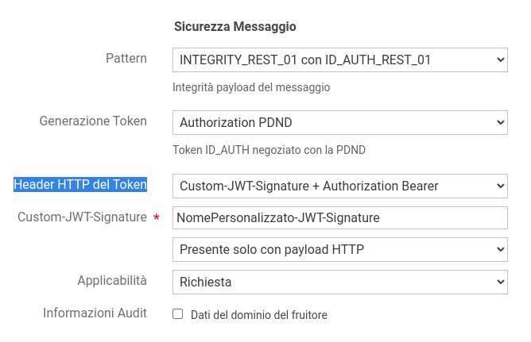

.. _modipa_sicurezza_avanzate_custom_signature:

Personalizzazione del Token 'JWT-Signature'
--------------------------------------------

Le *Linee Guida AGID di Interoperabilità* (LG) definisce un pattern di sicurezza per garantire l'integrità, su API di tipo REST, che utilizza un token JWT firmato inserito all'interno dell'header HTTP 'Agid-JWT-Signature'.

Come è stato descritto nella sezione :ref:`modipa_sicurezza_avanzate_header` è possibile configurare la generazione di un token personalizzato per l'integrità attraverso la voce 'Header HTTP del Token' selezionando una delle seguenti opzioni: 

- 'Custom-JWT-Signature + Authorization Bearer'
- 'Custom-JWT-Signature + Authorization Bearer anche nella risposta'
- 'Custom-JWT-Signature'

    Attivazione di un token Custom-JWT-Signature per l'integrità della richiesta

Se viene selezionata una gestione personalizzata, tutta la parte relativa alla gestione dell'integrità (calcolo/verifica Digest, gestione claim 'signed_header') non viene effettuata built-in e viene delegata a livello applicativo. In fase di fruizione è possibile aggiungere all'interno del token personalizzato i claim ricevuti dall'applicativo client (dettagli forniti nella sezione :ref:`modipa_sicurezza_avanzate_claims`). In fase di erogazione è possibile far arrivare all'applicativo il token completo (sezione :ref:`modipa_sicurezza_avanzate_sbustamento`) o i singoli claim (securityToken descritto in :ref:`valoriDinamici`) in modo da consentirgli di attuare il processo di validazione personalizzato. 

L'attivazione di un token personalizzato per l'integrità comporta la configurazione della voce 'Custom-JWT-Signature' nei seguenti aspetti:

- deve essere indicato il nome dell'header HTTP su cui viene veicolato il token personalizzato;

- deve essere scelto se generare il token solamente in presenza di un payload http (comportamento di default) o sempre per qualsiasi risorsa.
