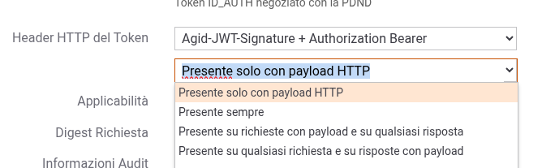

.. _modipa_sicurezza_avanzate_empty_payload_signature:

Generazione del Token 'JWT-Signature' per payload http vuoti
------------------------------------------------------------

Le *Linee Guida AGID di Interoperabilità* (LG) definisce un pattern di sicurezza per garantire l'integrità del payload, su API di tipo REST, utilizzando un token JWT firmato inserito all'interno dell'header HTTP 'Agid-JWT-Signature'.

Rimane ambigua la gestione in assenza di payload se il pattern si applichi o meno. Si tratta di valutare se, per una richiesta o risposta http priva di payload, il payload vada inteso come assente o come presente ma vuoto come discusso nell'issue `198 <https://github.com/AgID/specifiche-tecniche-DPR-160-2010/issues/198/>`_

La gestione da applicare può essere configurata sulla singola API, nella sezione ModI, tramite la seconda opzione presente nel campo 'Header HTTP del Token' come mostrato in :numref:`modipa_digest_payload_vuoti`. Le opzioni possibili sono le seguenti:

- 'Presente solo con payload HTTP'
- 'Presente sempre'
- 'Presente su richieste con payload e su qualsiasi risposta'
- 'Presente su qualsiasi richiesta e su risposte con payload'

Il comportamento di default rimane quello di non generare il token di integrità con payload vuoto (opzione: "Presente solo con payload HTTP") per garantire la retrocompatibilità.

    Gestione del token 'JWT-Signature' in presenza di messaggi http privi di payload

.. note::

	**Firma di header http indipendenti dal payload**

        Le fruizioni o le erogazioni configurate, tramite la voce 'HTTP Headers da firmare', per firmare header HTTP indipendenti dal contenuto del payload (diverse quindi dagli header standard quali Content-Type, Content-Encoding, Digest), genereranno comunque l’header Agid-JWT-Signature anche in assenza di payload. In tali casi, il token includerà nel claim signed_headers gli ulteriori header configurati per la firma.
