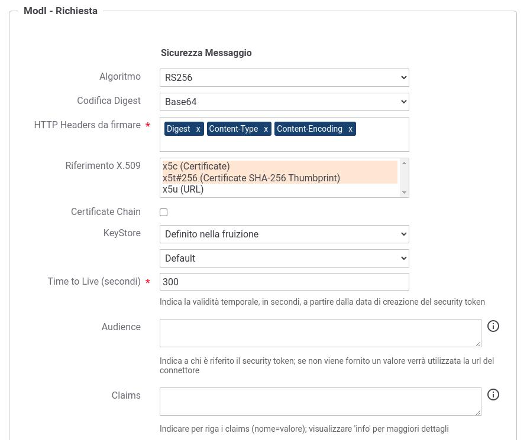

.. _modipa_sicurezza_avanzate_fruizione_keystore:

Keystore di firma definito nella fruizione
------------------------------------------------------------

È possibile attivare un differente scenario di fruizione rispetto a quello di default, descritto nella sezione :ref:`modipa_idar01_fruizione`, che prevede l'associazione del keystore di firma all'applicativo mittente.

In questo nuovo scenario il keystore di firma viene associato alla fruizione e consente quindi a tutti gli applicativi che indirizzano la fruizione di uscire verso il dominio esterno tramite un'unica identità rappresentata dal certificato presente nel keystore. Lo scenario è utilizzabile in quei contesti in cui l'Ente si presenta al dominio esterno sempre tramite un'unica identità ma al suo interno applica un'autorizzazione puntuale identificando il singolo applicativo chiamante.

 Fruizione con Profilo di Interoperabilità 'ModI'; keystore definito nella fruizione

Per attuare la configurazione è necessario agire nella sezione "ModI - Richiesta":

- KeyStore: deve essere selezionata la voce 'Definito nella fruizione' e successivamente vanno configurati i riferimenti al keystore da utilizzare per la firma:

	- utilizzando il keystore di default (riferimenti descritti in :ref:`modipa_passiPreliminari_keystore`) non vengono richiesti ulteriori parametri (:numref:`modipa_fruizione_keystore_default`);
	- ridefinendo il keystore dovranno essere indicati i seguenti parametri (:numref:`modipa_fruizione_keystore_ridefinito`):

    		+ *Modalità*: il keystore può essere fornito tramite differenti modalità

			- 'File System': deve essere fornito il *Path* assoluto su file system del keystore;

			- 'Archivio': viene effettuato l'upload del keystore;

			- 'HSM': consente di selezionare uno dei tipi di keystore PKCS11 registrati (':ref:`pkcs11`');

		+ *Tipo*: il formato del keystore (jks, pkcs12, tipi di keystore PKCS11 registrati);
    		+ *Password*: la password per l'accesso al keystore;
   		+ *Alias Chiave Privata*: l'alias con cui è riferita la chiave privata nel keystore;
   		+ *Password Chiave Privata*: la password della chiave privata

 Configurazione fruizione 'ModI' con keystore di default configurato nella fruizione

 Configurazione fruizione 'ModI' con keystore ridefinito nella fruizione

Per API REST in cui è stata selezionata la voce 'Riferimento X.509' nella sezione "ModI - Richiesta" dovrà essere obbligatoriamente anche indicata anche la URL che riferisce un certificato (o certificate chain) X.509 corrispondente alla chiave firmataria del security token (:numref:`modipa_fruizione_keystore_x5u`). La url indicata verrà inserita nel token di sicurezza all'interno del claim "x5u".

 Configurazione fruizione 'ModI' con keystore configurato nella fruizione; url del claim 'x5u'

Nella sezione "ModI - Risposta" se viene abilitata la 'Verifica Audience' nel token di sicurezza della risposta deve essere obbligatoriamente indicato il valore atteso (:numref:`modipa_fruizione_keystore_audience_risposta`).

