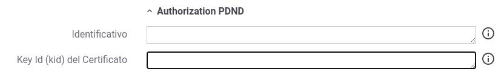
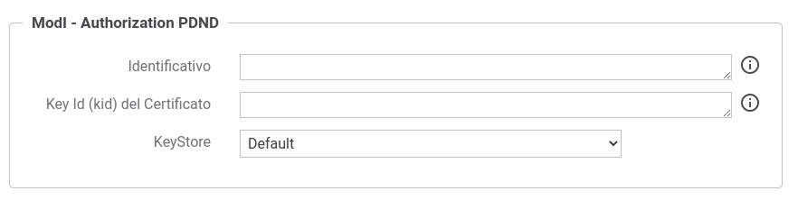
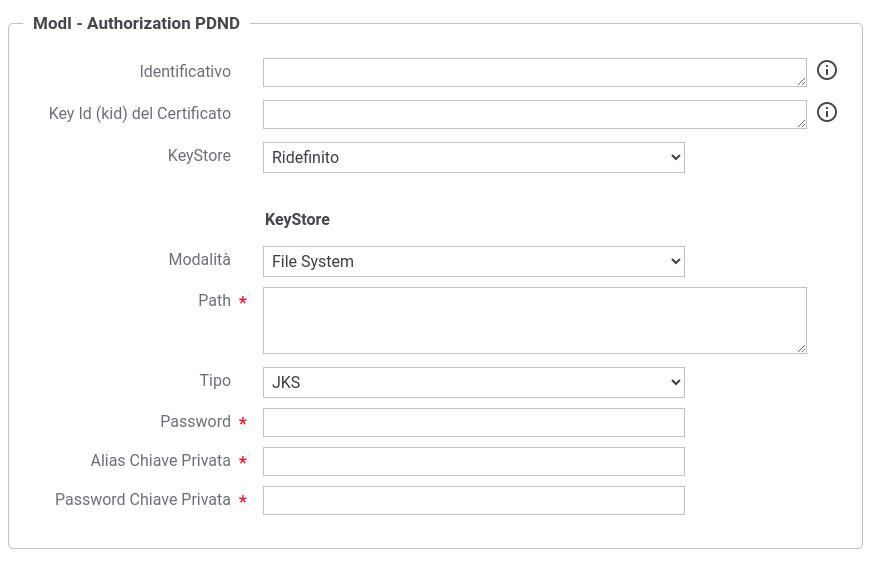

.. _modipa_sicurezza_avanzate_fruizione_pdnd:

Parametri PDND (Keystore, KID e clientId) definiti nella fruizione
-------------------------------------------------------------------

Nella sezione :ref:`modipa_pdnd_fruizione` è stata descritta la possibilità di definire una token policy di negoziazione verso la PDND in cui i parametri relativi al keystore di firma, il KID e il clientId vengono definiti tramite l'opzione 'Definito nella fruizione ModI'. Questa opzione prevede che nella fruizione siano stati definiti i parametri referenziati, la cui configurazione varia a seconda se è previsto anche un token di sicurezza 'INTEGRITY' o meno.

*API con pattern 'INTEGRITY'*

Per quanto concerne il keystore di firma, deve essere definito all'interno della fruizione come descritto nella sezione :ref:`modipa_sicurezza_avanzate_fruizione_keystore`. In aggiunta dovranno essere configurati i parametri 'Key Id (kid) del Certificato' e 'Identificativo' all'interno della sotto-sezione 'Authorization PDND' come mostrato nella figura :numref:`modipa_fruizione_keystore_pdnd_dati_sicurezza_messaggio`.

.. note::

	La configurazione della sezione 'Authorization PDND' è disponibile solamente se al connettore è stata associata una token policy di negoziazione PDND e nella sezione 'ModI - Richiesta' è stato indicato un keystore 'Definito nella fruizione'.

 Dati PDND indicati nella fruizione di una API che richiede anche pattern 'INTEGRITY'

*API senza pattern 'INTEGRITY'*

I parametri 'Key Id (kid) del Certificato' e 'Identificativo' devono essere indicati all'interno della sezione 'Authorization PDND' come mostrato nelle figure :numref:`modipa_fruizione_keystore_pdnd_dati_oatuh_default` e :numref:`modipa_fruizione_keystore_pdnd_dati_oatuh_ridefinito`.
Nella sezione deve inoltre anche essere definito il keystore da utilizzare per la firma dell'asserzione JWT inviata alla PDND:

- utilizzando il keystore di default (riferimenti descritti in :ref:`modipa_passiPreliminari`) non vengono richiesti ulteriori parametri (:numref:`modipa_fruizione_keystore_pdnd_dati_oatuh_default`);
- ridefinendo il keystore dovranno essere indicati i seguenti parametri (:numref:`modipa_fruizione_keystore_pdnd_dati_oatuh_ridefinito`):

	+ *Modalità*: il keystore può essere fornito tramite differenti modalità

		- 'File System': deve essere fornito il *Path* assoluto su file system del keystore;

		- 'Archivio': viene effettuato l'upload del keystore;

		- 'HSM': consente di selezionare uno dei tipi di keystore PKCS11 registrati (':ref:`pkcs11`');

	+ *Tipo*: il formato del keystore (jks, pkcs12, tipi di keystore PKCS11 registrati);
	+ *Password*: la password per l'accesso al keystore;
	+ *Alias Chiave Privata*: l'alias con cui è riferita la chiave privata nel keystore;
	+ *Password Chiave Privata*: la password della chiave privata

.. note::

	La configurazione della sezione 'Authorization PDND' è disponibile solamente se al connettore è stata associata una token policy di negoziazione PDND.

 Dati PDND indicati nella fruizione; utilizzo del keystore di default

 Dati PDND indicati nella fruizione; ridefinizione del keystore di firma
