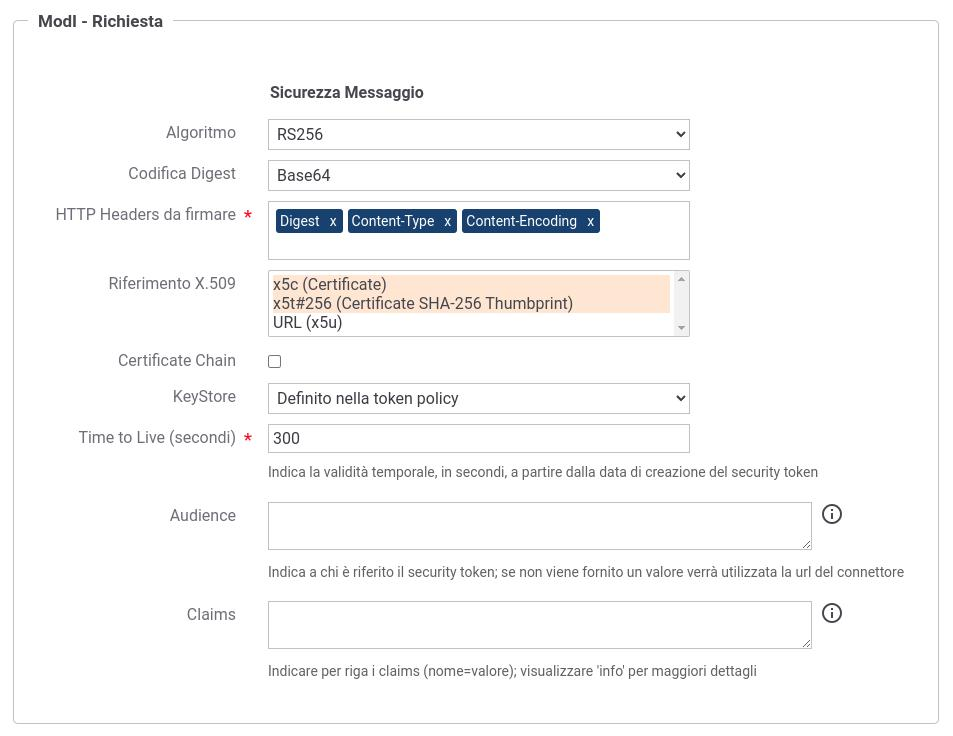

.. _modipa_sicurezza_avanzate_fruizione_token_policy_keystore:

Keystore di firma definito nella token policy
------------------------------------------------------------

Nello scenario descritto in questa sezione il keystore di firma viene definito all'interno di una token Policy. Lo scenario è utilizzabile in quei contesti in cui l'Ente si presenta al dominio esterno sempre tramite un'unica identità indipendentemente dall'API fruita.

Per attuare la configurazione è necessario agire nella sezione "ModI - Richiesta" alla voce 'KeyStore' indicando: 'Definito nella token policy'

 Configurazione fruizione 'ModI' con indicazione di utilizzare il keystore definito nella token policy

