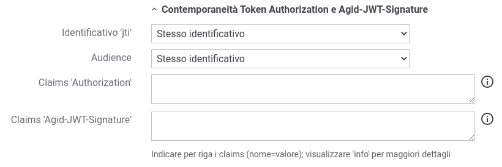
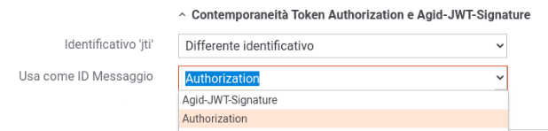
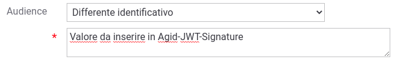
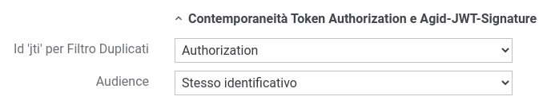
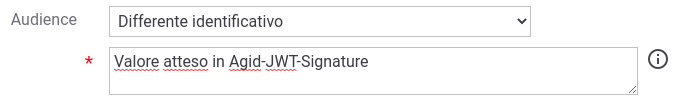

.. _modipa_sicurezza_avanzate_header_contemporaneita_fruizione:

Configurazione contemporaneità degli header in una Fruizione
------------------------------------------------------------------------------------------------

La configurazione differisce a seconda se il token di sicurezza deve essere generato (Richiesta) o validato (Risposta). Di seguito vengono descritte le opzioni di configurazione possibili per le due fasi.

Richiesta
^^^^^^^^^^^^^^

Di seguito vengono descritti i parametri di configurazione riguardanti la generazione dei due token nel flusso di richiesta.

    Maschera ModI per la configurazione della fruizione in presenza dei due header nella richiesta

- Identificativo 'jti': la configurazione di default prevede la valorizzazone dl claim 'jti', presente all'interno dei token di sicurezza portati dai due header, con il medesimo identificativo. Il parametro consente di impostare la generazione di un identificativo differente e di indicare al gateway quale dei due identificativi dovrà associare alla traccia come 'ID del Messaggio' tramite la voce 'Usa come ID Messaggio' (:numref:`scelta_jti_as_id_messaggio`). L'identificativo indicato sarà utilizzabile come criterio di ricerca puntuale tramite la funzionalità disponibile con la console e le API di monitoraggio. L'identificativo 'jti' presente nell'altro header verrà comunque associato alla traccia ma non sarà direttamente utilizzabile come criterio di ricerca per individuare la transazione in un secondo momento.

    Selezione del claim 'jti' da utilizzare come ID del Messaggio

- Audience: la configurazione di default prevede la valorizzazione del claim 'aud', presente all'interno dei token di sicurezza portati dai due header, con il medesimo identificativo. Il parametro consente di impostare la generazione di un identificativo differente indicando l'audience da impostare nel token dell'header Agid-JWT-Signature come mostrato nella figura :numref:`scelta_aud_integrity`.

    Configurazione del claim 'aud' da utilizzare nel token dell'header Agid-JWT-Signature

- Claims 'Authorization' e 'Agid-JWT-Signature': consente di modificare i valori di default associati ai claim standard e/o di definirne altri solamente all'interno del token dell'header indicato. Per maggiori dettagli sulle configurazioni disponibili si rimanda alla sezione :ref:`modipa_sicurezza_avanzate_claims`.

Risposta
^^^^^^^^^^^^^^

Di seguito vengono descritti i parametri di configurazione riguardanti la validazione dei due token nel flusso di risposta.

    Maschera ModI per la configurazione della fruizione in presenza dei due header nella risposta

- Id 'jti' per Filtro Duplicati: consente di indicare da quale header estrarre l'identificativo 'jti' da associare alla traccia come 'ID del Messaggio' (default: Agid-JWT-Signature). L'identificativo indicato verrà utilizzato per la funzionalità di filtro delle richieste duplicate. Inoltre l'identificativo indicato sarà utilizzabile come criterio di ricerca puntuale tramite la funzionalità disponibile con la console e le API di monitoraggio. L'identificativo 'jti' presente nell'altro header verrà comunque associato alla traccia ma non sarà direttamente utilizzabile come criterio di ricerca per individuare la transazione in un secondo momento.

- Audience: la configurazione di default si attende un valore del claim 'aud', presente all'interno dei token di sicurezza portati dai due header, con il medesimo identificativo. Il parametro consente di impostare la generazione di un identificativo differente indicando l'audience atteso nell'header Agid-JWT-Signature come mostrato nella figura :numref:`validazione_aud_integrity`.

    Valore atteso per il claim 'aud' nel token dell'header Agid-JWT-Signature

