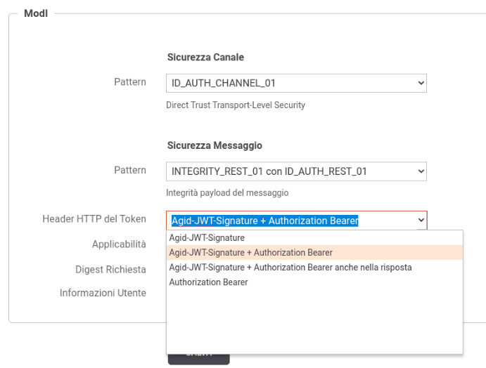

.. _modipa_sicurezza_avanzate_header:

Header HTTP del token JWT
--------------------------

Il pattern di sicurezza, su API di tipo REST, produrrà la generazione di un token JWT firmato inserito all'interno dell'header HTTP previsto dalle *Linee Guida AGID di Interoperabilità* (LG) dove vengono definiti gli header HTTP 'Authorization' (Bearer) da usare per l'auenticazione e l'header HTTP 'Agid-JWT-Signature' per l'integrità.

La configurazione di default degli header prodotti varia a seconda del pattern di sicurezza selezionato:

- :ref:`modipa_idar01`: header HTTP 'Authorization'.

- :ref:`modipa_idar02`: header HTTP 'Authorization'.

- :ref:`modipa_idar03`: nel flusso di richiesta vengono prodotti entrambi gli header, mentre nel flusso di risposta solamente l'header HTTP 'Agid-JWT-Signature'.

La voce 'Header HTTP del Token' consente di modificare la configurazione di default e variare sia il nome che l'eventuale contemporaneità dei 2 header principalmente per due motivi:

- per consentire la retrocompatibilità con il pattern IDAR03, previsto nelle linee guida della versione 'bozza' (https://docs.italia.it/italia/piano-triennale-ict/lg-modellointeroperabilita-docs/it/bozza/), dove veniva utilizzato con qualsiasi pattern sempre un unico header HTTP 'Authorization';

- per supportare qualsiasi interpretazione del pattern 'INTEGRITY_REST_01' e relativa implementazione da parte della controparte con cui si deve interoperare.

Per i motivi suddetti le possibili configurazioni supportate configurabili tramite la voce 'Header HTTP del Token' sono le seguenti (:numref:`modipa_sicurezza_header`): 

- 'Agid-JWT-Signature + Authorization Bearer' : opzione selezionabile solamente con pattern che prevede 'INTEGRITY_REST_01'. Prevede la generazione nel flusso di richiesta di entrambi gli header http previsti dalle LG. Nel flusso di risposta è previsto invece solamente l'header 'Agid-JWT-Signature'.
- 'Agid-JWT-Signature + Authorization Bearer anche nella risposta': comportamento identico all'opzione precedente, dove però la contemporaneità dei due header è prevista anche nel flusso di risposta.
- 'Agid-JWT-Signature' : viene generato sempre e solo un unico token di sicurezza, indipendentemente dal pattern di sicurezza selezionato, utilizzando come nome dell'header HTTP il nome proprietario delle LG.
- 'Authorization Bearer' : comportamento identico all'opzione precedente, dove però viene utilizzato l'header HTTP 'Authorization' e prefisso 'Bearer ' nel valore. Questa opzione, in presenza di pattern che prevede 'INTEGRITY_REST_01', consente di essere interoperabile con i servizi implementati con la versione 'bozza' delle LG.

    Selezione dell'Header HTTP del token JWT

.. note::

	**Processamento dell'header Agid-JWT-Signature con opzioni che prevedono anche l'header Authorization**

	Se un'API o una risorsa è stata configurata con un'opzione che prevede la contemporaneità dei 2 header, la generazione o la verifica dell'header 'Agid-JWT-Signature' avviene solamente se la richiesta o la risposta prevede un payload; ad esempio in una richiesta HTTP GET non verrà generato o atteso l'header. Caso eccezionale riguarda i flussi configurati per firmare header http indipendenti dal payload della richiesta (diversi quindi dai classici header Content-Type, Content-Encoding, Digest); in questi casi l'header 'Agid-JWT-Signature' verrà generato anche in assenza di payload poichè nel token saranno inseriti nel claim 'signed_headers' gli ulteriori header configurati per essere firmati.

Se in un'API viene selezionata una opzione che prevede la contemporaneità dei 2 header, nelle maschere di configurazione ModI delle fruizioni e delle erogazioni saranno presenti ulteriori opzioni che consentono di personalizzare la gestione dei claims presenti all'interno dei due header. Di seguito vengono descritte le opzioni ulteriori presenti nelle fruizioni e nelle erogazioni

.. toctree::
        :maxdepth: 1

	contemporaneita_fruizione
	contemporaneita_erogazione
