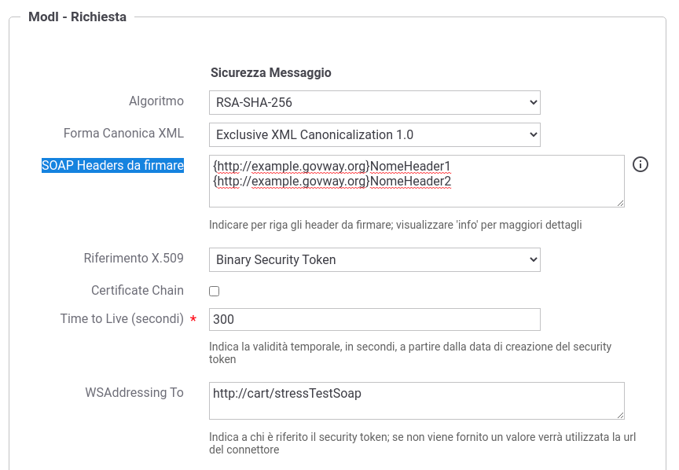

.. _modipa_sicurezza_avanzate_header_soap:

Header SOAP aggiunti nella WSSecurity Signature
-----------------------------------------------

Il pattern di sicurezza, su API di tipo SOAP, richiede la creazione una WSSecurity Signature dove all'interno vengono firmati gli elementi principali della richiesta (Timestamp, wsa:To) e gli altri elementi richiesti dai profili :ref:`modipa_idar02` (wsa:MessageId) e :ref:`modipa_idar03` (Body).

È possibile aggiungere, tra gli elementi firmati, ulteriori header SOAP oltre a quelli previsti dalla specifica ModI. Gli ulteriori header possono essere indicati nell'elemento 'SOAP Headers da firmare' presente nella sezione 'ModI - Richiesta' di una fruizione o nella sezione 'ModI - Risposta' di una erogazione, come mostrato nella figura :numref:`modipa_sicurezza_header_soap`. Gli header devono essere definiti su ogni riga tramite la sintassi: 

- {namespace}localName

Ad esempio:

- {http://example.govway.org}NomeHeader1
- {http://example.govway.org}NomeHeader2

.. note::

   L'elemento 'SOAP Headers da firmare' è disponibile solamente utilizzando la govwayConsole in modalità *avanzata* (sezione :ref:`modalitaAvanzata`).

 Configurazione Header SOAP aggiuntivi da aggiungere alla firma
