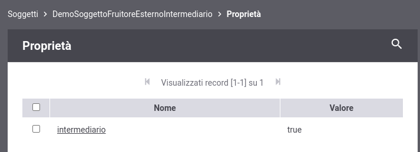

.. _modipa_sicurezza_avanzate_intermediario:

Intermediario
------------------------------------------------------------

È possibile indicare un soggetto identificato sul canale come intermediario registrando una proprietà '*intermediario*' valorizzata a '*true*' tra le proprietà del soggetto come mostrato in figura :numref:`modipa_sicurezza_soggetto_intermediario_fig`.

 Soggetto intermediario

Questo consente di autorizzare una richiesta proveniente da un soggetto identificato sul canale (l'intermediario), che risulta differente dal soggetto a cui appartiene l'applicativo identificato tramite token di sicurezza.

