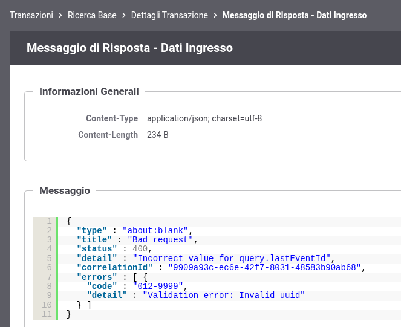
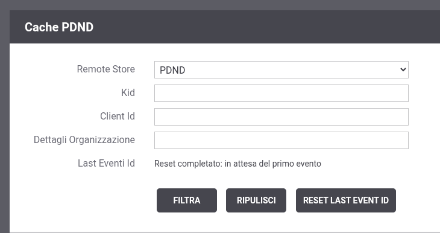

.. _modipa_sicurezza_avanzate_pdndConfAvanzata_api_verificaEventi:

Verifica della presenza di eventi
~~~~~~~~~~~~~~~~~~~~~~~~~~~~~~~~~~~~

Per ogni repository registrato viene verificata la presenza di eventi sulla PDND, che riportano operazioni di modifica o eliminazione di chiavi pubbliche, se risulta attiva la proprietà '*org.openspcoop2.pdd.gestoreChiaviPDND.enabled*' presente nel file "/etc/govway/govway_local.properties" come descritto nell'elenco puntato '*Pull sulla PDND per ottenere gli eventi relativi alle chiavi*' della sezione :ref:`modipa_passiPreliminari_api_pdnd`.

Tramite la console di Gestione è possibile visionare la cache delle chiavi PDND scaricate e l'id dell'ultimo evento acquisito come descritto nella sezione :ref:`configCachePDNDIntro`.

**Cambio di versione delle API PDND**

Tramite la configurazione descritta nella sezione :ref:`modipa_passiPreliminari_api_pdnd` è possibile indicare la versione delle API PDND che GovWay deve utilizzare. 

Il cambio di versione di un repository esistente per cui erano già stati raccolti eventi richiede un'operazione ulteriore una volta riavviato il sistema con la nuova versione indicata (es. passaggio da 1 a 2). 

Tramite la console di monitoraggio sarà possibile vedere come le transazioni relative alle invocazioni delle api-pdnd verso la risorsa che consente la raccolta di eventi falliscono per un errore nel formato del parametro 'lastEventId' (:numref:`cachePDNDRaccoltaEventiFallita` e :numref:`cachePDNDLastEventiIdNonCorretto`).

.. figure:: ../../../../_figure_console/govwayConsole_cachePDND_raccoltaEventiFallita.png
    :scale: 80%
    :align: center
    :name: cachePDNDRaccoltaEventiFallita
  
    Raccolta eventi PDND fallita

  
    Raccolta eventi PDND: formato 'lastEventId' non corretto
    
Per ripristinare il corretto funzionamento deve essere azzerato l'ultimo identificativo di evento scaricato come descritto nella sezione :ref:`configCachePDNDIntro` tramite il pulsante 'Reset Last Event ID' presente nei filtri di ricerca (:numref:`cachePDNDResetLastEventiID2`).

  
    GovWay Cache PDND: reset 'Last Event ID'
    
Alla prossima esecuzione del timer di raccolta eventi (default ogni ora) verrà re-inizializzata la base dati degli eventi per allinearsi con la nuova versione delle API di Interoperabilità e la consultazione degli eventi riprenderà normalmente utilizzando la nuova versione delle API.   

**Personalizzazione Repository PDND**

La configurazione di default prevede la verifica degli eventi per qualsiasi repository definito nel file "/etc/govway/modipa_local.properties" all'interno della proprietà 'org.openspcoop2.protocol.modipa.sicurezzaMessaggio.certificati.remoteStores'.

È possibile attivare una verifica degli eventi puntuale solamente su alcuni repository modificando il file di configurazione "/etc/govway/govway_local.properties" aggiungendo le seguenti proprietà:

- *org.openspcoop2.pdd.gestoreChiaviPDND.remoteStore.checkAllStores* (boolean, default:true): disabilitare la proprietà (false) per effettuare la verifica puntuale;
- *org.openspcoop2.pdd.gestoreChiaviPDND.remoteStore.name*: indicare i nomi dei repository che si desidera verificare puntualmente separandoli con la virgola. Il nome del repository corrisponde al valore associato alla proprietà '*org.openspcoop2.protocol.modipa.sicurezzaMessaggio.certificati.remoteStore.<identificativoRepositoryPDND>.name*' configurato nel file "/etc/govway/modipa_local.properties").
