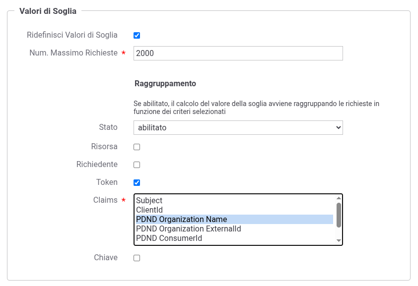
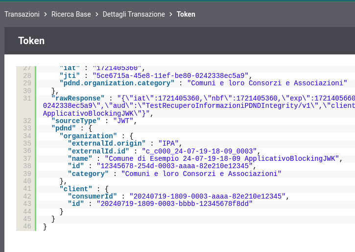
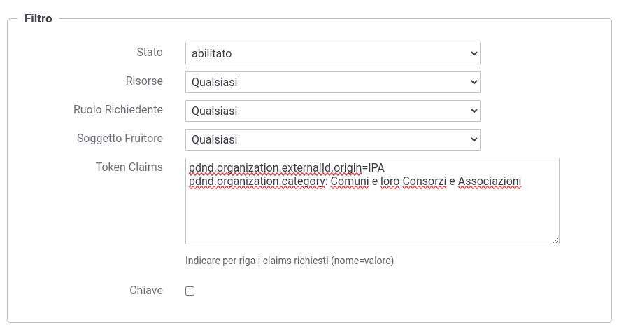

.. _modipa_sicurezza_avanzate_pdndRateLimiting:

Politiche di Rate Limiting basate su informazioni prelevate via API PDND
----------------------------------------------------------------------------

La figura :numref:`modiaRateLimitingPDNDorganization` mostra un esempio di politica di :ref:`rateLimiting` che conteggia le richieste rispetto all'informazione sull'organizzazione ottenuta interrogando le API della PDND.

    Rate Limiting: conteggio per organizzazione ottenuta tramite API PDND

Se viene attivato il conteggio per organizzazione e l'informazione non è disponibile la transazione termina con un errore di Rate Limiting 429 dovuto all'informazione mancante.
È possibile modificare il comportamento di default in modo da non far terminare con errore la transazione registrando la :ref:`configProprieta` *pdnd.rateLimitingByOrganization.infoNotAvailable.abortTransaction* valorizzata a *false*.

È inoltre possibile filtrare per informazioni prelevate dalla PDND, visualizzabili anche nel dettaglio di una transazione, nella voce 'token' all'interno della sezione 'Informazioni Mittente' di (:numref:`modiDatiTransazionePDNDorganization`). Nella figura :numref:`modiRateLimitingFiltroTramiteInfoPDND` viene mostrato un esempio.

    Informazioni ottenute tramite API PDND
    

    Rate Limiting: filtro per informazioni ottenute tramite API PDND
