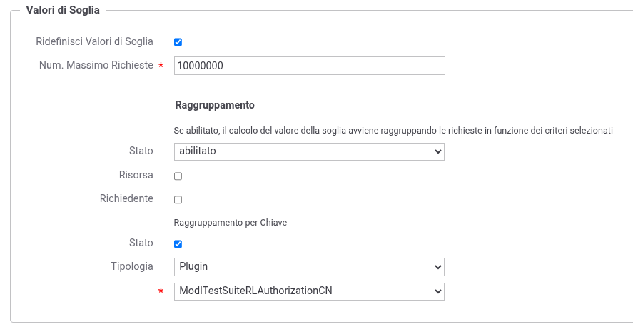

.. _modipa_sicurezza_avanzate_tokenRateLimiting:

Politiche di Rate Limiting basate su informazioni presenti nei token ModI
---------------------------------------------------------------------------

Negli scenari in cui il token di sicurezza ModI viene generato direttamente dal fruitore, senza l'intermediazione di un Authorization Server (es. PDND), è possibile definire politiche di :ref:`rateLimiting` che conteggiano o filtrano le richieste in base alle informazioni presenti nei token JWT (Authorization o Agid-JWT-Signature).

GovWay fornisce una serie di plugin che estraggono informazioni dai token ModI e le rendono disponibili come criteri di raggruppamento o filtro personalizzato nelle politiche di rate limiting.

I plugin disponibili sono elencati nella tabella seguente:

.. list-table:: Plugin ModI per Rate Limiting
   :widths: 50 25 25
   :header-rows: 1
   :name: tabellaPluginModIRateLimiting

   * - ClassName
     - Token
     - Informazione estratta
   * - ``org.openspcoop2.protocol.modipa.controllo_traffico.RateLimitingAuthorizationClientId``
     - Authorization
     - Claim 'client_id'
   * - ``org.openspcoop2.protocol.modipa.controllo_traffico.RateLimitingAuthorizationSub``
     - Authorization
     - Claim 'sub'
   * - ``org.openspcoop2.protocol.modipa.controllo_traffico.RateLimitingAuthorizationCertificateCN``
     - Authorization
     - CN del certificato (x5c)
   * - ``org.openspcoop2.protocol.modipa.controllo_traffico.RateLimitingAuthorizationCertificateSubject``
     - Authorization
     - Subject del certificato
   * - ``org.openspcoop2.protocol.modipa.controllo_traffico.RateLimitingIntegrityClientId``
     - Agid-JWT-Signature
     - Claim 'client_id'
   * - ``org.openspcoop2.protocol.modipa.controllo_traffico.RateLimitingIntegritySub``
     - Agid-JWT-Signature
     - Claim 'sub'
   * - ``org.openspcoop2.protocol.modipa.controllo_traffico.RateLimitingIntegrityCertificateCN``
     - Agid-JWT-Signature
     - CN del certificato (x5c)
   * - ``org.openspcoop2.protocol.modipa.controllo_traffico.RateLimitingIntegrityCertificateSubject``
     - Agid-JWT-Signature
     - Subject del certificato

**Registrazione dei Plugin**

Per poter utilizzare i plugin nelle politiche di rate limiting è necessario registrarli come descritto nella sezione :ref:`configAvanzataPluginsPlugin`. La tabella seguente riporta i valori da utilizzare durante la registrazione:

.. list-table:: Registrazione Plugin ModI per Rate Limiting
   :widths: 15 15 45 25
   :header-rows: 1
   :name: tabellaRegistrazionePluginModI

   * - Tipo Plugin
     - Tipo
     - ClassName
     - Label
   * - Rate Limiting
     - ModIRTAuthzCID
     - ``org.openspcoop2.protocol.modipa.controllo_traffico.RateLimitingAuthorizationClientId``
     - ModI Authorization ClientId
   * - Rate Limiting
     - ModIRTAuthzSub
     - ``org.openspcoop2.protocol.modipa.controllo_traffico.RateLimitingAuthorizationSub``
     - ModI Authorization Sub
   * - Rate Limiting
     - ModIRTAuthzCN
     - ``org.openspcoop2.protocol.modipa.controllo_traffico.RateLimitingAuthorizationCertificateCN``
     - ModI Authorization Certificate CN
   * - Rate Limiting
     - ModIRTAuthzSubj
     - ``org.openspcoop2.protocol.modipa.controllo_traffico.RateLimitingAuthorizationCertificateSubject``
     - ModI Authorization Certificate Subject
   * - Rate Limiting
     - ModIRTIntCID
     - ``org.openspcoop2.protocol.modipa.controllo_traffico.RateLimitingIntegrityClientId``
     - ModI Integrity ClientId
   * - Rate Limiting
     - ModIRTIntSub
     - ``org.openspcoop2.protocol.modipa.controllo_traffico.RateLimitingIntegritySub``
     - ModI Integrity Sub
   * - Rate Limiting
     - ModIRTIntCN
     - ``org.openspcoop2.protocol.modipa.controllo_traffico.RateLimitingIntegrityCertificateCN``
     - ModI Integrity Certificate CN
   * - Rate Limiting
     - ModIRTIntSubj
     - ``org.openspcoop2.protocol.modipa.controllo_traffico.RateLimitingIntegrityCertificateSubject``
     - ModI Integrity Certificate Subject

**Configurazione della politica di Rate Limiting**

Una volta registrati i plugin, è possibile attivarli nella configurazione di una politica di rate limiting, nella sezione 'Raggruppamento per Chiave' (:numref:`modiaRateLimitingTokenPlugin`):

1. Abilitare lo **Stato** del 'Raggruppamento per Chiave'.
2. Selezionare **Tipologia** 'Plugin'.
3. Scegliere dalla lista il plugin desiderato.

    Rate Limiting: raggruppamento per chiave tramite plugin ModI

Ad esempio, selezionando il plugin 'ModI Authorization ClientId', il conteggio delle richieste viene effettuato separatamente per ogni diverso valore del claim 'client_id' presente nel token di Authorization. Ciò consente di applicare soglie di rate limiting per singolo fruitore anche in assenza di un Authorization Server centralizzato e senza dover registrare i fruitori come applicativi su GovWay, operazione che sarebbe altrimenti necessaria per poter utilizzare il normale raggruppamento per 'Richiedente'.

Per ulteriori dettagli sulla configurazione di filtri e raggruppamenti personalizzati si rimanda alla sezione :ref:`configurazioneRateLimiting_filtriRaggruppamentiPersonalizzati`.
