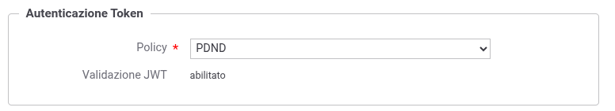

.. _modipa_dpop_erogazione:

Erogazione REST_JWS_2021_POP (DPoP)
-----------------------------------

Le richieste provenienti dal dominio esterno da parte di altre amministrazioni devono essere arricchite, insieme all'access token, della DPoP proof, un token JWT firmato che dimostra il possesso della chiave privata associata all'amministrazione fruitrice che ha negoziato l'access token. Il gateway valida automaticamente la DPoP proof, verificando che l'access token sia correttamente vincolato alla chiave pubblica del client.

Di seguito vengono descritti i passi di configurazione specifici per l'implementazione del pattern 'REST_JWS_2021_POP' lato erogazione.

**Token Policy di Validazione**

Durante la configurazione di un'erogazione di un'API con DPoP abilitato (:numref:`ModIErogazioneDPoP`), la sezione 'Autenticazione Token' richiede obbligatoriamente la selezione di una Token Policy di validazione che abbia il flag *DPoP* attivo (per la configurazione di una Token Policy di validazione con DPoP si rimanda alla sezione ':ref:`tokenValidazionePolicy_dpop`').

    Configurazione dell'autenticazione token per un'erogazione con DPoP

.. note::
   Quando l'API ha il DPoP abilitato, la selezione della Token Policy è limitata alle sole policy di validazione che hanno il flag *DPoP* attivo.

La Token Policy di validazione selezionata effettuerà automaticamente le seguenti verifiche sulla DPoP proof ricevuta:

- Validazione della firma della DPoP proof tramite la chiave pubblica contenuta nel claim 'jwk' dell'header;

- Verifica che l'hash della chiave pubblica corrisponda al claim 'jkt' (JWK Thumbprint) presente nell'access token;

- Validazione temporale della DPoP proof tramite il claim 'iat' e il TTL configurato;

- Verifica del metodo HTTP (claim 'htm') e dell'URI (claim 'htu');

- Validazione anti-replay tramite il claim 'jti', secondo la modalità configurata nella Token Policy.

Per maggiori dettagli si rimanda alla sezione ':ref:`tokenValidazionePolicy_dpop`'.
