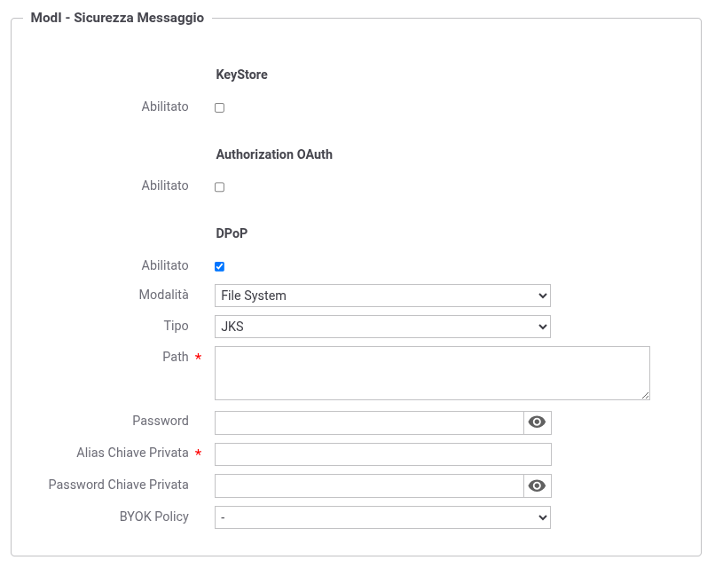

.. _modipa_dpop_fruizione_applicativo:

Keystore DPoP definito nell'applicativo
~~~~~~~~~~~~~~~~~~~~~~~~~~~~~~~~~~~~~~~

Nello scenario descritto in questa sezione il keystore utilizzato per firmare la DPoP proof viene associato all'applicativo client ModI. In questo scenario si assume che il materiale crittografico identifica l'applicativo, il quale lo riutilizzerà su ogni API che necessita di fruire con DPoP abilitato.

Nella Token Policy di negoziazione con DPoP deve essere selezionato come tipo di keystore 'Definito nell'applicativo ModI'.

Nell'applicativo client (:numref:`ModIApplicativoDPoP`), nella sezione "ModI - Sicurezza Messaggio", è possibile configurare una sottosezione *DPoP* dedicata:

- Se la sottosezione *DPoP* è abilitata, verrà utilizzato il keystore ivi definito per la firma della DPoP proof;

- Se la sottosezione *DPoP* non è abilitata, verrà utilizzato il keystore principale definito nella sezione *KeyStore* dell'applicativo.

    Configurazione del keystore DPoP nell'applicativo client ModI

I tipi di keystore supportati per la sezione DPoP sono gli stessi disponibili per il keystore principale dell'applicativo:

- *JKS* o *PKCS12*: deve essere fornito il path assoluto del keystore, la password, l'alias della chiave privata e la relativa password;

- *JWK Set*: deve essere definito il path del file JSON in formato JWK Set e l'identificativo 'kid' della chiave privata;

- *Key Pair*: deve essere definito il path delle chiavi privata e pubblica in formato PEM o DER;

- Tipi PKCS11: i tipi disponibili sono quelli corrispondenti ai tipi di keystore PKCS11 registrati (':ref:`pkcs11`').

È inoltre possibile selezionare una *BYOK Policy* per la decodifica di keystore cifrati (per maggiori dettagli si rimanda alla sezione ':ref:`console_informazioni_confidenziali_keystore`').

.. warning::
   Il RFC 9449 raccomanda l'utilizzo di una coppia di chiavi dedicata esclusivamente alla generazione delle DPoP proof, distinta da quella utilizzata per la firma dell'asserzione JWT nella negoziazione del token. È pertanto consigliato abilitare la sezione *DPoP* nell'applicativo e configurare un keystore dedicato, diverso da quello principale utilizzato per la sicurezza messaggio.
