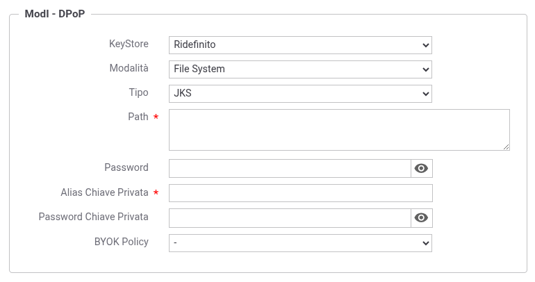

.. _modipa_dpop_fruizione_fruizione:

Keystore DPoP definito nella fruizione
~~~~~~~~~~~~~~~~~~~~~~~~~~~~~~~~~~~~~~

Nello scenario descritto in questa sezione il keystore utilizzato per firmare la DPoP proof viene associato alla fruizione. Questo consente a tutti gli applicativi che indirizzano la fruizione di uscire verso il dominio esterno utilizzando lo stesso keystore DPoP definito nella fruizione stessa. Lo scenario è utilizzabile in quei contesti in cui l'Ente utilizza un'unica coppia di chiavi DPoP per una specifica fruizione, indipendentemente dall'applicativo chiamante.

Nella Token Policy di negoziazione con DPoP deve essere selezionato come tipo di keystore 'Definito nella fruizione ModI'.

Nella fruizione (:numref:`ModIFruizioneDPoPKeystore`), nella sezione "ModI - Sicurezza Messaggio", è possibile configurare una sottosezione *DPoP* dedicata:

- Se la sottosezione *DPoP* è abilitata, verrà utilizzato il keystore ivi definito per la firma della DPoP proof;

- Se la sottosezione *DPoP* non è abilitata, verrà utilizzato il keystore principale definito nella sezione *KeyStore* della fruizione (se presente) o il keystore di default.

    Configurazione del keystore DPoP nella fruizione ModI

I tipi di keystore supportati per la sezione DPoP sono:

- *JKS* o *PKCS12*: deve essere fornito il path assoluto del keystore, la password, l'alias della chiave privata e la relativa password;

- *JWK Set*: deve essere definito il path del file JSON in formato JWK Set e l'identificativo 'kid' della chiave privata;

- *Key Pair*: deve essere definito il path delle chiavi privata e pubblica in formato PEM o DER;

- Tipi PKCS11: i tipi disponibili sono quelli corrispondenti ai tipi di keystore PKCS11 registrati (':ref:`pkcs11`').

È inoltre possibile selezionare una *BYOK Policy* per la decodifica di keystore cifrati (per maggiori dettagli si rimanda alla sezione ':ref:`console_informazioni_confidenziali_keystore`').

.. warning::
   Il RFC 9449 raccomanda l'utilizzo di una coppia di chiavi dedicata esclusivamente alla generazione delle DPoP proof, distinta da quella utilizzata per la firma dell'asserzione JWT nella negoziazione del token. È pertanto consigliato abilitare la sezione *DPoP* nella fruizione e configurare un keystore dedicato, diverso da quello principale utilizzato per la sicurezza messaggio.
