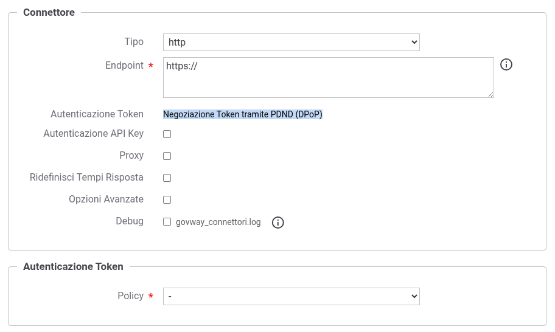

.. _modipa_dpop_fruizione:

Fruizione REST_JWS_2021_POP (DPoP)
----------------------------------

Le richieste che provengono dagli applicativi interni del dominio e sono dirette verso altre amministrazioni verranno arricchite della DPoP proof, un token JWT firmato che dimostra il possesso della chiave privata associata all'access token negoziato.

Di seguito vengono descritti tutti i passi di configurazione specifici per l'implementazione del pattern 'REST_JWS_2021_POP'.

**Token Policy di Negoziazione**

Per la configurazione delle fruizioni con DPoP è necessario registrare una Token Policy di Negoziazione con il flag *DPoP* abilitato, come descritto nella sezione ':ref:`tokenNegoziazionePolicy_dpop`'.

.. note::
   Quando si seleziona una Token Policy per il connettore di una fruizione con DPoP abilitato, la selezione è limitata alle sole policy di negoziazione che hanno il flag *DPoP* attivo.

Nella configurazione del connettore della fruizione (:numref:`ModIFruizioneDPoPConnettore`), la sezione 'Autenticazione Token' indica che verrà utilizzata una negoziazione con DPoP.

    Configurazione del connettore per una fruizione con DPoP

**Keystore DPoP**

Nella Token Policy di negoziazione con DPoP, il keystore utilizzato per firmare la DPoP proof può essere definito direttamente nella policy stessa (come descritto nella sezione ':ref:`tokenNegoziazionePolicy_dpop`') oppure può essere delegato all'applicativo o alla fruizione ModI selezionando una delle seguenti opzioni:

- *Definito nell'applicativo ModI*: il keystore viene recuperato dalla configurazione dell'applicativo client ModI richiedente, come descritto nella sezione ':ref:`modipa_dpop_fruizione_applicativo`';

- *Definito nella fruizione ModI*: il keystore viene recuperato dalla configurazione della fruizione, come descritto nella sezione ':ref:`modipa_dpop_fruizione_fruizione`'.

Le considerazioni sugli scenari di utilizzo del keystore definito nell'applicativo o nella fruizione, descritte nella sezione ':ref:`modipa_sicurezza_avanzate_fruizione_keystore_scenari`', si applicano anche al keystore utilizzato per la firma della DPoP proof.

.. toctree::
   :maxdepth: 2

    Keystore DPoP definito nell'applicativo <applicativo>
    Keystore DPoP definito nella fruizione <fruizione>
