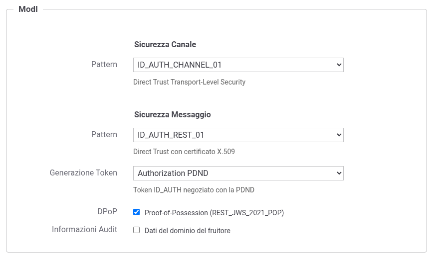

.. _modipa_sicurezzaMessaggio_dpop:

REST_JWS_2021_POP (DPoP)
~~~~~~~~~~~~~~~~~~~~~~~~

Il pattern REST_JWS_2021_POP consente di estendere i pattern di sicurezza messaggio con il supporto DPoP (Demonstrating Proof-of-Possession) come descritto nel RFC 9449. Questo meccanismo vincola l'access token ad una specifica coppia di chiavi crittografiche del client, prevenendo l'utilizzo del token da parte di soggetti non autorizzati che potrebbero averlo intercettato.

L'attivazione del pattern REST_JWS_2021_POP avviene nella configurazione dell'API, nella sezione "ModI - Sicurezza Messaggio", attraverso il campo *DPoP* che risulta disponibile solamente quando la *Generazione Token* è impostata su 'Authorization OAuth' o 'Authorization PDND' (:numref:`ModIApiDPoP`).

    Attivazione del pattern REST_JWS_2021_POP (DPoP) nell'API

L'abilitazione del DPoP a livello di API comporta differenze nella configurazione sia delle fruizioni che delle erogazioni, come descritto nelle sezioni seguenti.

.. toctree::
   :maxdepth: 2

    Passi per la configurazione di una fruizione <fruizione/index>
    Passi per la configurazione di una erogazione <erogazione>
