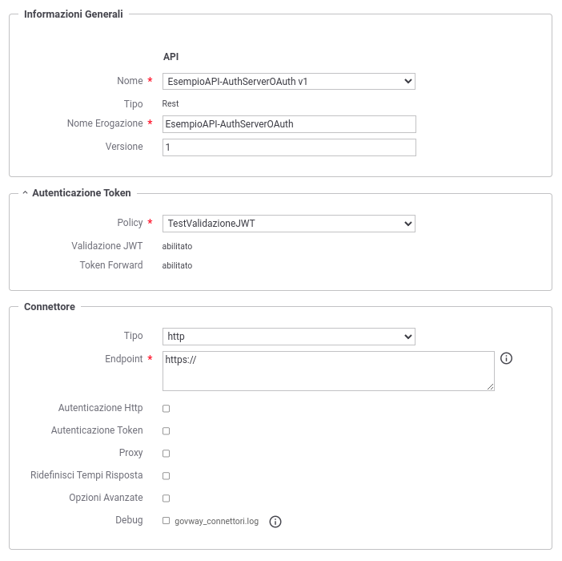
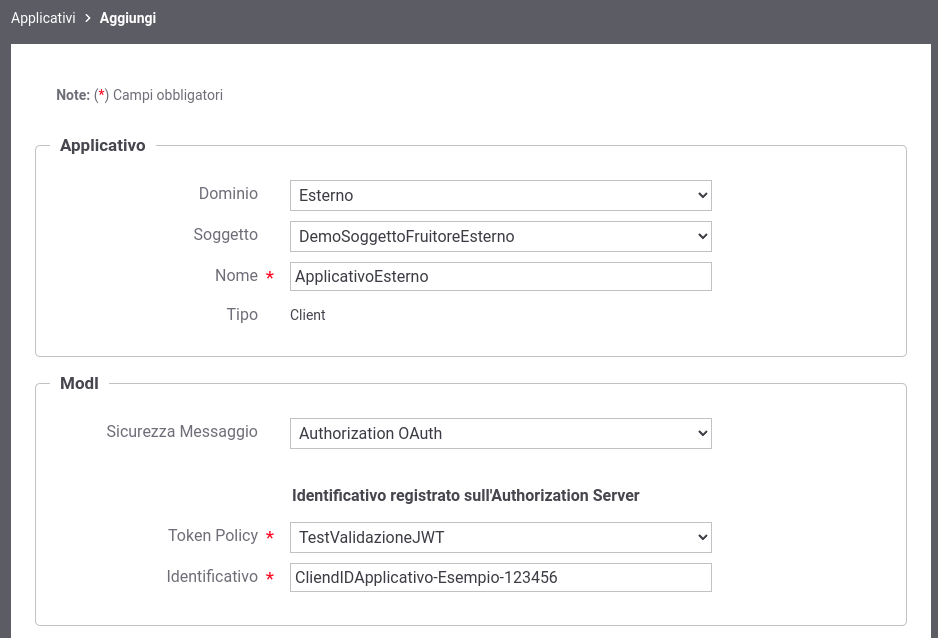
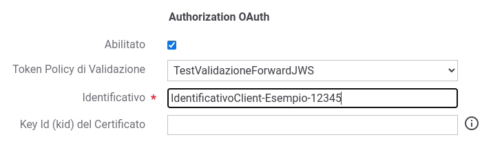

.. _modipa_oauth_erogazione:

Erogazione ID_AUTH_REST_01 (Authorization Server)
--------------------------------------------------

Di seguito vengono descritti tutti i passi di configurazione che differiscono da quando già descritto nella sezione ':ref:`modipa_pdnd_erogazione`'.

**API**

La registrazione della API deve essere effettuata agendo nella sezione "ModI - Sicurezza Messaggio", come indicato in :numref:`api_auth_rest_01_oauth2`:

- selezionare il 'Pattern' "ID_AUTH_REST_01";
- selezionare una 'Generazione Token' di tipo 'Authorization OAuth' per far si che il Token 'ID_AUTH' sia negoziato con un Authorization Server OAuth.
 

.. figure:: ../../../../_figure_console/modipa_api_auth_rest_01_oauth.png
    :scale: 50%
    :name: api_auth_rest_01_oauth2

    Selezione del pattern "ID_AUTH_REST_01" e 'Generazione Token' di tipo 'Authorization OAuth' per l'API

**Token Policy di Validazione**

Per la configurazione dell'erogazione è necessario registrare una Token Policy di Validazione descritta nella sezione ':ref:`tokenValidazionePolicy`'. 

**Erogazione**

Una volta effettuata la registrazione della Token Policy, per utilizzarla in un'erogazione è necessaria attivarla come policy di autenticazione token nel controllo degli accessi come descritto nella sezione :ref:`apiGwGestioneToken`. 

L'associazione avviene direttamente durante la creazione dell'erogazione come mostrato nella figura :numref:`erogazione_auth_rest_01_oauth`.

    Erogazione con pattern "ID_AUTH_REST_01" e 'Generazione Token' di tipo 'Authorization OAuth'

**Autorizzazioni ulteriori**

Per poter identificare gli applicativi chiamanti si dovranno fornire i dati relativi al token OAuth (:numref:`tokenFirmaModIAppOAuthNonPDND`)

    Dati ModI relativi ad un applicativo esterno con configurazione token OAuth

Una configurazione simile è attuabile anche sugli applicativi di dominio interno per poterli riconoscere su installazioni Multi-Tenant (':ref:`console_multitenant`') dove sia il tenant fruitore che quello erogatore viene gestito sullo stesso GovWay (:numref:`tokenFirmaModIAppOAuthFirmaMultiTenantNonPDND`).

    Dati ModI relativi ad un applicativo interno con configurazione token OAuth
