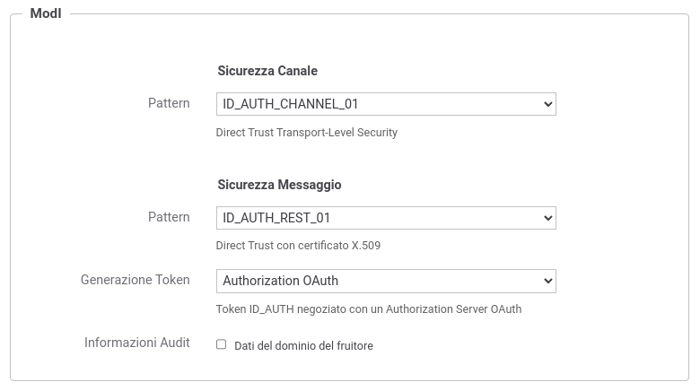
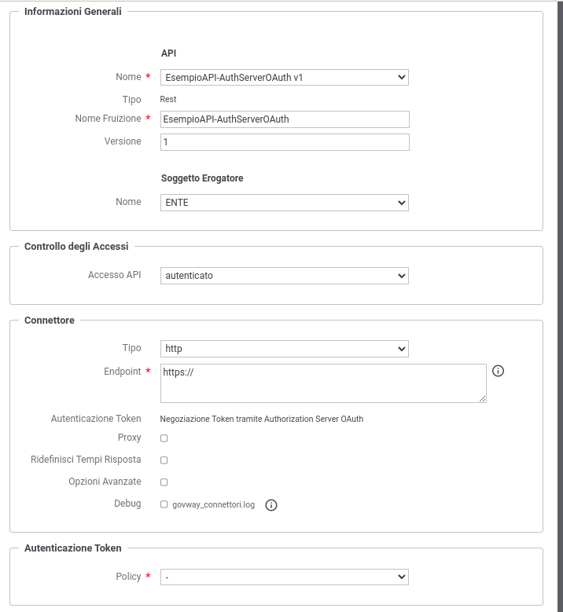

.. _modipa_oauth_fruizione:

Fruizione ID_AUTH_REST_01 (Authorization Server)
--------------------------------------------------

Di seguito vengono descritti tutti i passi di configurazione che differiscono da quando già descritto nella sezione ':ref:`modipa_pdnd_fruizione`'.

**API**

La registrazione della API deve essere effettuata agendo nella sezione "ModI - Sicurezza Messaggio", come indicato in :numref:`api_auth_rest_01_oauth`:

- selezionare il 'Pattern' "ID_AUTH_REST_01";
- selezionare una 'Generazione Token' di tipo 'Authorization OAuth' per far si che il Token 'ID_AUTH' sia negoziato con un Authorization Server OAuth.
 

    Selezione del pattern "ID_AUTH_REST_01" e 'Generazione Token' di tipo 'Authorization OAuth' per l'API

**Token Policy di Negoziazione**

Per la configurazione della fruizione è necessario registrare una Token Policy di Negoziazione con uno qualsiasi dei tipi descritti nella sezione ':ref:`tokenNegoziazionePolicy`'. 

**Fruizione**

Una volta effettuata la registrazione della Token Policy, per utilizzarla in una fruizione è sufficiente associarla al connettore della fruizione come descritto nella sezione :ref:`avanzate_connettori_tokenPolicy` e mostrato nella figura :numref:`fruizione_auth_rest_01_oauth`.

    Fruizione con pattern "ID_AUTH_REST_01" e 'Generazione Token' di tipo 'Authorization OAuth'
