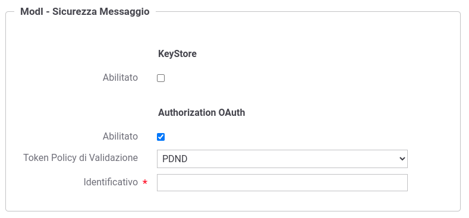

.. _modipa_pdnd_erogazione:

Erogazione ID_AUTH_REST_01 (PDND)
----------------------------------

In un'erogazione di una API le richieste provengono da amministrazioni esterne al dominio e sono dirette ad applicativi interni. Prima di procedere con l'inoltro della richiesta verso il backend interno, GovWay valida il token di sicurezza ricevuto rispetto al pattern associato all'operazione invocata: verifica firma, validazione temporale, filtro duplicati, verifica integrità del messaggio, verifica del token di audit etc.

Nella figura ':numref:`ErogazioneModIPA-PDND-IDAuth01`' viene raffigurato lo scenario di erogazione in cui il trust avviene tramite la PDND.

    Erogazione con Profilo di Interoperabilità 'ModI', pattern 'ID_AUTH_REST_01': trust tramite PDND

Di seguito vengono descritti tutti i passi di configurazione specifici per l'implementazione del pattern 'ID_AUTH_REST_01' mentre si rimanda alla sezione ':ref:`profiloAPIGW`' per la normale registrazione e configurazione di un'erogazione di API.

**API**

La registrazione della API deve essere effettuata agendo nella sezione "ModI - Sicurezza Messaggio", come indicato in :numref:`api_auth_rest_01_pdnd2`:

- selezionare il 'Pattern' "ID_AUTH_REST_01";
- selezionare una 'Generazione Token' di tipo 'Authorization PDND' per far si che il Token 'ID_AUTH' sia negoziato con la PDND.
 

.. figure:: ../../../../_figure_console/modipa_api_auth_rest_01_pdnd.png
    :scale: 50%
    :name: api_auth_rest_01_pdnd2

    Selezione del pattern "ID_AUTH_REST_01" e 'Generazione Token' di tipo 'Authorization PDND' per l'API

**Token Policy di Validazione**

Per la configurazione di una erogazione con un pattern di sicurezza via PDND viene fornita built-in la token policy 'PDND' di cui deve essere stata effettuata la configurazione come descritto nella sezione ':ref:`modipa_passiPreliminari_trustStore_pdnd`'.

**Erogazione**

Una volta effettuata la registrazione della Token Policy, per utilizzarla in un'erogazione è necessaria attivarla come policy di autenticazione token nel controllo degli accessi come descritto nella sezione :ref:`apiGwGestioneToken`. 

L'associazione avviene direttamente durante la creazione dell'erogazione come mostrato nella figura :numref:`erogazione_auth_rest_01_pdnd`.

    Erogazione con pattern "ID_AUTH_REST_01" e 'Generazione Token' di tipo 'Authorization PDND'

**Verifica Audience**

Per verificare l'audience presente nel token ricevuto dalla PDND deve essere utilizzata l':ref:`tokenClaims` definendo il claim 'aud' uguale al valore atteso (:numref:`erogazione_secMessaggio_pdnd_aud_fig`).

.. figure:: ../../../../_figure_console/modipa_erogazione_secMessaggio_audience.png
    :scale: 70%
    :name: erogazione_secMessaggio_pdnd_aud_fig

    Autorizzazione dell'audience presente nel token

**Identificazione ed Autorizzazione dei fruitori**

È possibile registrare gli applicativi dei domini esterni al fine di:

1. identificare puntualmente le componenti esterne coinvolte nella comunicazione abilitando le funzionalità di tracciamento e statistica per tali elementi.
2. abilitare le funzionalità di autorizzazione sugli applicativi identificando puntualmente chi autorizzare dopo il superamento del processo di validazione del token ricevuto (:numref:`erogazione_secMessaggio_pdnd_fig`).

Rispetto a quanto descritto nella sezione ':ref:`modipa_idar01`' il token ricevuto non è più firmato dall'applicativo mittente ma bensì dall'authorization server della PDND e l'identificazione dell'applicativo chiamante non è più attuabile tramite il certificato fornito nell'header del JWT tramite claim 'x5c/x5t/x5u' ma bensì tramite l'identificativo presente nel claim 'client_id'. 

Per poter identificare gli applicativi chiamanti la modalità di caricamento del certificato di firma, descritto nelle sezioni ':ref:`modipa_idar01_fruizione`' e ':ref:`modipa_idar01_erogazione`', non è più necessaria mentre si dovranno fornire i dati relativi al token OAuth (:numref:`tokenFirmaModIAppOAuth`) o in alternativa aggiungendo tali dati a quelli relativi al certificato (:numref:`tokenFirmaModIAppOAuthFirma`).

.. figure:: ../../../../_figure_console/modipa_applicativo_esterno_token.png
    :scale: 70%
    :name: tokenFirmaModIAppOAuth

    Dati ModI relativi ad un applicativo esterno con configurazione token PDND

.. figure:: ../../../../_figure_console/modipa_applicativo_esterno_token_cert.png
    :scale: 70%
    :name: tokenFirmaModIAppOAuthFirma

    Dati ModI relativi ad un applicativo esterno con configurazione sia del certificato di firma che del token PDND

Una configurazione simile è attuabile anche sugli applicativi di dominio interno per poterli riconoscere su installazioni Multi-Tenant (':ref:`console_multitenant`') dove sia il tenant fruitore che quello erogatore viene gestito sullo stesso GovWay (:numref:`tokenFirmaModIAppOAuthFirmaMultiTenant`).

    Dati ModI relativi ad un applicativo interno con configurazione token PDND

.. figure:: ../../../../_figure_console/modipa_applicativo_interno_token_cert.png
    :scale: 70%
    :name: tokenFirmaModIAppOAuthFirmaMultiTenantKeystore

    Dati ModI relativi ad un applicativo interno con configurazione sia del certificato di firma che del token PDND

Una volta registrati gli applicativi client è possibile attuare criteri di autorizzazione dei singoli applicativi accedendo alla configurazione della sezione "Controllo Accessi" e attivando la sicurezza messaggio. Sarà possibile specificare un elenco puntuale di applicativi autorizzati (:numref:`erogazione_secMessaggio_pdnd_fig`). In alternativa è possibile definire i ruoli che gli applicativi devono possedere.

.. figure:: ../../../../_figure_console/modipa_erogazione_secMessaggio.png
    :scale: 70%
    :name: erogazione_secMessaggio_pdnd_fig

    Autorizzazione di singoli applicativi token per l'accesso all'erogazione
