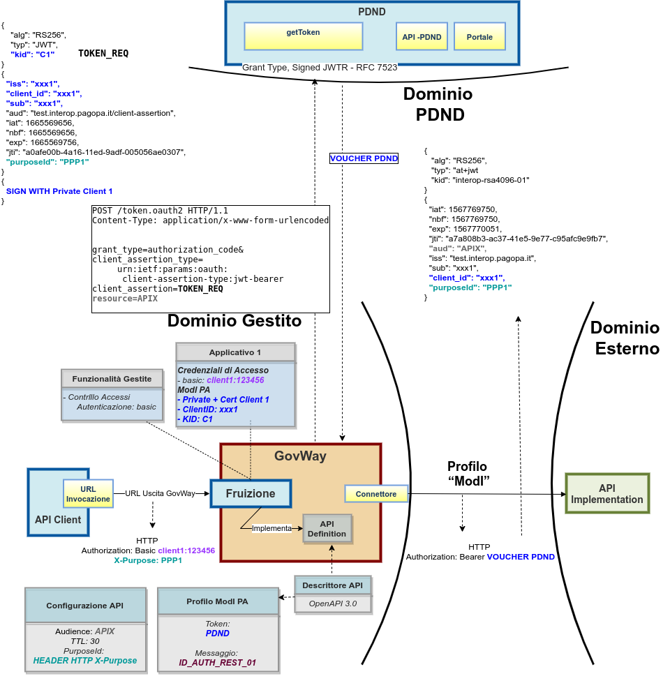
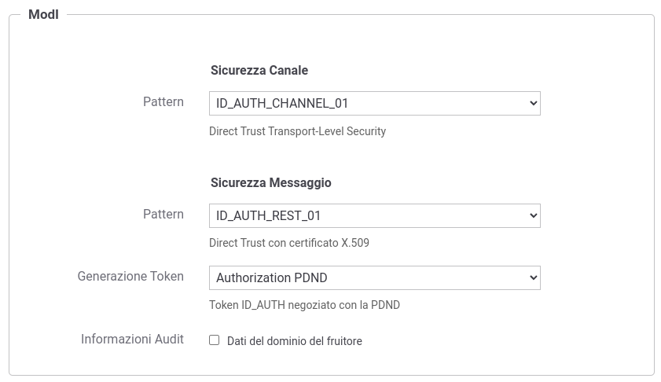
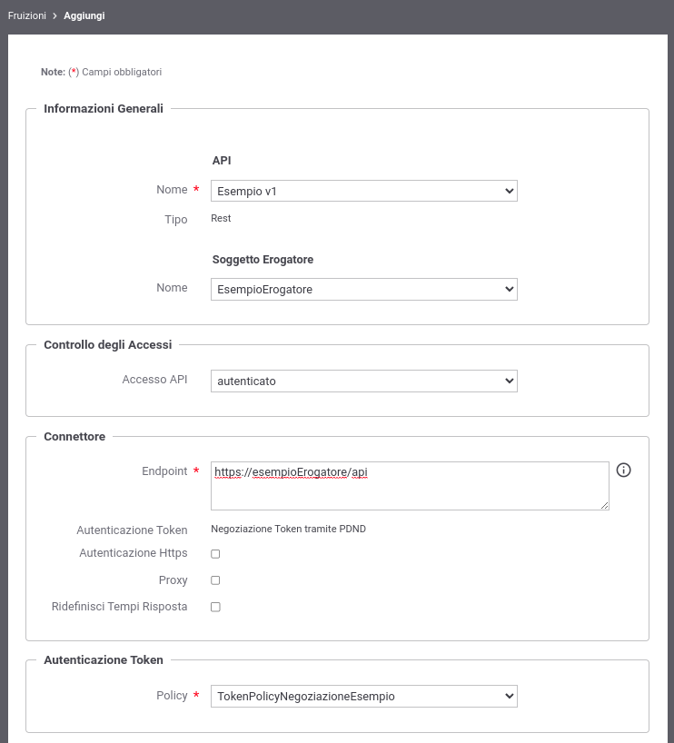
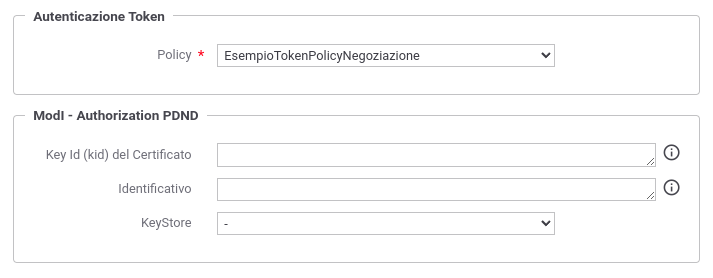
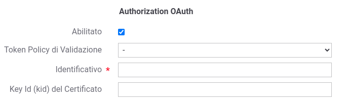

.. _modipa_pdnd_fruizione:

Fruizione (PDND)
----------------

Le richieste che provengono dagli applicativi interni del dominio e sono dirette verso altre amministrazioni verranno arricchite del token di sicurezza 'ModI' previsto dall'operazione invocata, come indicato precedentemente nella sezione :ref:`modipa_pdnd`. 

Nella figura ':numref:`FruizioneModIPA-PDND-IDAuth01`' viene raffigurato lo scenario di fruizione in cui il trust avviene tramite la PDND.

    Fruizione con Profilo di Interoperabilità 'ModI', pattern 'ID_AUTH_REST_01': trust tramite PDND

Di seguito vengono descritti tutti i passi di configurazione specifici per l'implementazione del pattern 'ID_AUTH_REST_01' mentre si rimanda alla sezione ':ref:`profiloAPIGW`' per la normale registrazione e configurazione di una fruizione di API.

**API**

La registrazione della API deve essere effettuata agendo nella sezione "ModI - Sicurezza Messaggio", come indicato in :numref:`api_auth_rest_01_pdnd`:

- selezionare il 'Pattern' "ID_AUTH_REST_01";
- selezionare una 'Generazione Token' di tipo 'Authorization PDND' per far si che il Token 'ID_AUTH' sia negoziato con la PDND.
 

    Selezione del pattern "ID_AUTH_REST_01" e 'Generazione Token' di tipo 'Authorization PDND' per l'API

**Token Policy di Negoziazione**

Per la configurazione delle fruizioni con un pattern di sicurezza via PDND è necessario registrare una Token Policy di Negoziazione del tipo descritto nella sezione ':ref:`tokenNegoziazionePolicy_pdnd`'. 

Di seguito vengono riportati tutte le informazioni da registrare nella policy:

- Tipo: SignedJWT;

- PDND: flag attivato;

- URL: endpoint esposto dalla PDND su cui è possibile richiedere lo stacco del voucher alla PDND (:numref:`TokenPDNDNegoziazione1`):

	- ambiente di collaudo: https://auth.uat.interop.pagopa.it/token.oauth2
	- ambiente di produzione: https://auth.interop.pagopa.it/token.oauth2

        .. note::
	
	      Le url indicate potrebbero variare; si raccomanda di ottenere sempre dalla PDND le url aggiornate come indicato nella sezione `Richiesta di un voucher spendibile presso un e-service del catalogo <https://docs.pagopa.it/interoperabilita-1/manuale-operativo/utilizzare-i-voucher#richiesta-di-un-voucher-spendibile-presso-un-e-service-del-catalogo>`_.

  .. figure:: ../../../../_figure_console/TokenPDNDNegoziazione1.png
    :scale: 50%
    :align: center
    :name: TokenPDNDNegoziazione1

    Token Policy di Negoziazione PDND (Endpoint)

- JWT Keystore: parametri di accesso al keystore contenente la chiave privata corrispondente alla chiave pubblica registrata sulla PDND durante la registrazione dell'applicativo client. I parametri variano in funzione del tipo di keystore selezionato:

	- 'JKS', 'PKCS12': deve essere definito il path su filesystem dove risiede il keystore, la password per l'accesso al keystore, l'alias con cui è riferita la chiave privata e la password (:numref:`TokenPDNDNegoziazioneKeystorePKCS12`);

          .. figure:: ../../../../_figure_console/TokenPDNDNegoziazioneKeystorePKCS12.png
            :scale: 60%
            :align: center
            :name: TokenPDNDNegoziazioneKeystorePKCS12

            Token Policy di Negoziazione PDND (Keystore 'PKCS12')

	- 'JWK Set': deve essere definito il path su filesystem dove risiede l'archivio json nel formato 'JWK Set' e l'identificativo 'kid' (alias) con cui è riferita la chiave privata (:numref:`TokenPDNDNegoziazioneKeystoreJWKSet`);

          .. figure:: ../../../../_figure_console/TokenPDNDNegoziazioneKeystoreJWKSet.png
            :scale: 60%
            :align: center
            :name: TokenPDNDNegoziazioneKeystoreJWKSet

            Token Policy di Negoziazione PDND (Keystore 'JWK Set')

	- 'Key Pair': deve essere definito il path su filesystem dove risiedono la chiave privata e pubblica in formato PEM o DER (sono supportati sia i formati pkcs1 che pkcs8) e la password della chiave privata se cifrata (:numref:`TokenPDNDNegoziazioneKeystoreKeyPair`);

          .. figure:: ../../../../_figure_console/TokenPDNDNegoziazioneKeystoreKeyPair.png
            :scale: 60%
            :align: center
            :name: TokenPDNDNegoziazioneKeystoreKeyPair

            Token Policy di Negoziazione PDND (Keystore 'Key Pair')

	- 'Definito nell'applicativo ModI': il keystore utilizzato per firmare l'asserzione JWT inviata alla PDND sarà quello definito nell'applicativo ModI richiedente (scenario descritto nel seguito di questa sezione);

          .. figure:: ../../../../_figure_console/TokenPDNDNegoziazioneKeystoreApplicativoModI.png
            :scale: 60%
            :align: center
            :name: TokenPDNDNegoziazioneKeystoreApplicativoModI

            Token Policy di Negoziazione PDND (Keystore definito nell'applicativo ModI)

	- 'Definito nella fruizione ModI': il keystore utilizzato per firmare l'asserzione JWT inviata alla PDND sarà quello definito nella fruizione ModI (scenario descritto nel seguito di questa sezione);

          .. figure:: ../../../../_figure_console/TokenPDNDNegoziazioneKeystoreFruizioneModI.png
            :scale: 60%
            :align: center
            :name: TokenPDNDNegoziazioneKeystoreFruizioneModI

            Token Policy di Negoziazione PDND (Keystore definito nella fruizione ModI)

	- Tipi PKCS11: gli altri tipi disponibili sono quelli corrispondenti ai tipi di keystore PKCS11 registrati (':ref:`pkcs11`').

- JWT Signature: algoritmo di firma

  .. figure:: ../../../../_figure_console/TokenPDNDNegoziazioneFirma.png
    :scale: 50%
    :align: center
    :name: TokenPDNDNegoziazioneFirma

    Token Policy di Negoziazione PDND (Algoritmo di Firma)

- JWT Header: 

	- Type (typ): lasciare il valore 'JWT';

	- Key Id (kid): deve essere indicato l'identificativo univoco (KID) ottenuto al termine della registrazione dell'applicativo client sulla PDND. Può essere fornito tramite una delle seguenti modalità:

		- 'Personalizzato': selezionando la modalità 'Personalizzato' è possibile indicarlo puntualmente. Il valore può essere definito come costante o contenere parti dinamiche risolte a runtime dal Gateway (':ref:`valoriDinamici`');

                  .. figure:: ../../../../_figure_console/TokenPDNDNegoziazioneKIDpersonalizzato.png
                    :scale: 60%
                    :align: center
                    :name: TokenPDNDNegoziazioneKIDpersonalizzato

                    Token Policy di Negoziazione PDND (KID personalizzato)

		- 'Definito nell'applicativo ModI': nel caso in cui è stato indicato un keystore definito nell'applicativo ModI, è possibile selezionare una modalità analoga anche per il KID (:numref:`TokenPDNDNegoziazioneKIDapplicativo`).

                  .. figure:: ../../../../_figure_console/TokenPDNDNegoziazioneKIDapplicativo.png
                    :scale: 60%
                    :align: center
                    :name: TokenPDNDNegoziazioneKIDapplicativo

                    Token Policy di Negoziazione PDND (KID definito nell'applicativo ModI)

                  Questa modalità richiede che oltre al keystore, nell'applicativo ModI richiedente venga abilitata anche la sezione 'Authorization OAuth' e venga indicato il KID nel campo 'Key Id del Certificato' (:numref:`ApplicativoInternoAutorizzazioneOAuth`).

		- 'Definito nella fruizione ModI': nel caso in cui è stato indicato un keystore definito nella fruizione ModI, è possibile selezionare una modalità analoga anche per il KID (:numref:`TokenPDNDNegoziazioneKIDfruizione`).

                  .. figure:: ../../../../_figure_console/TokenPDNDNegoziazioneKIDfruizione.png
                    :scale: 60%
                    :align: center
                    :name: TokenPDNDNegoziazioneKIDfruizione

                    Token Policy di Negoziazione PDND (KID definito nella fruizione ModI)

                  Questa modalità richiede che oltre al keystore, nella fruizione ModI venga abilitata anche la sezione 'Authorization PDND' e venga indicato il KID nel campo 'Key Id del Certificato' (:numref:`FruizioneAutorizzazioneOAuth`). 

- JWT Payload:

  - Client ID, Issuer e Subject: l'identificativo univoco dell'applicativo client ('*client_id*' o '*sub*') ottenuto al termine della registrazione dell'applicativo sulla PDND deve essere configurato nei tre campi indicati tramite una delle seguenti modalità:

	- indicati nella token policy:

          .. figure:: ../../../../_figure_console/TokenPDNDNegoziazioneClientId.png
            :scale: 60%
            :align: center
            :name: TokenPDNDNegoziazioneClientId

            Token Policy di Negoziazione PDND (ClientId)

	- in alternativa nel caso in cui sia stato indicato un keystore definito nell'applicativo ModI, è possibile selezionare una modalità analoga anche per la tripla clientId/issuer/subject (:numref:`TokenPDNDNegoziazioneClientIdApplicativoModI`).

          .. figure:: ../../../../_figure_console/TokenPDNDNegoziazioneClientIdApplicativoModI.png
            :scale: 60%
            :align: center
            :name: TokenPDNDNegoziazioneClientIdApplicativoModI

            Token Policy di Negoziazione PDND (ClientId definito nell'applicativo ModI)

          Questa modalità richiede che oltre al keystore, nell'applicativo ModI richiedente venga abilitata anche la sezione 'Authorization OAuth' e venga indicato il clientId nel campo 'Identificativo' (:numref:`ApplicativoInternoAutorizzazioneOAuth`).

	- infine nel caso in cui sia stato indicato un keystore definito nella fruizione ModI, è possibile selezionare una modalità analoga anche per la tripla clientId/issuer/subject (:numref:`TokenPDNDNegoziazioneClientIdFruizioneModI`).

          .. figure:: ../../../../_figure_console/TokenPDNDNegoziazioneClientIdFruizioneModI.png
            :scale: 60%
            :align: center
            :name: TokenPDNDNegoziazioneClientIdFruizioneModI

            Token Policy di Negoziazione PDND (ClientId definito nella fruizione ModI)

          Questa modalità richiede che oltre al keystore, nella fruizione ModI venga abilitata anche la sezione 'Authorization PDND' e venga indicato il clientId nel campo 'Identificativo' (:numref:`TokenPDNDNegoziazioneKIDfruizione`).

  - Gli altri campi presenti nella sezione 'JWT Payload' rappresentano (:numref:`TokenPDNDNegoziazioneJWTPayload`):

	- Audience: indica il servizio di stacco del voucher della PDND. Il valore, fornito dalla PDND, è indipendente dal servizio per cui si vuole richiedere un voucher e varia solamente in funzione dell'ambiente di validazione o produzione della PDND stessa:

		- ambiente di collaudo: auth.uat.interop.pagopa.it/client-assertion
		- ambiente di produzione: auth.interop.pagopa.it/client-assertion

	        .. note::
	
		      I valori indicati potrebbero variare; si raccomanda di ottenere sempre dalla PDND i valori aggiornati.

	- Identifier: consente di configurare la modalità di valorizzazione del claim 'jti' presente all'interno del token di richiesta inviato alla PDND. Si suggerisce di valorizzare il campo con la keyword '${transaction:id}' al fine di utilizzare l'identificativo di transazione della richiesta;

	- Time to Live (secondi): consente di indicare la durate del token di richiesta inviato alla PDND (es. 100 sec);

	- Purpose ID: identificativo univoco della finalità per cui si intende fruire di un servizio, ottenuto dalla PDND. Il valore può essere fornito staticamente o può contenere una keyword risolta a runtime in modo da valorizzare il claim purposeId con un valore prelevato dai dati della richiesta. Ad esempio se il censimento dei purposeId viene mantenuto a livello applicativo può essere indicato un header HTTP con cui il richiedente può fornire a GovWay il valore da utilizzare (es. ${header:NOME_HEADER_HTTP}). Se invece il purposeId viene registrato come proprietà di una fruizione può essere valorizzato con il valore '${config:NOME_PROPRIETA}'. Si rimanda alla sezione ':ref:`valoriDinamici`' per le varie modalità dinamiche utilizzabili.

	- Informazioni Sessione: consente di valorizzare il claim 'sessionInfo' previsto dalla PDND. La valorizzazione può essere statica o formata da parti dinamiche risolte a runtime dal Gateway (per maggiori dettagli :ref:`valoriDinamici`).

    .. figure:: ../../../../_figure_console/TokenPDNDNegoziazioneJWTPayload.png
      :scale: 60%
      :align: center
      :name: TokenPDNDNegoziazioneJWTPayload

      Token Policy di Negoziazione PDND (JWT Payload)

- Dati Richiesta:

	- Resource: indicare l'audience/url del servizio per cui si vuole richiedere un voucher;

	- Client ID: indicare il medesimo valore inserito nel campo 'Client ID' della sezione 'JWT Payload';

  .. figure:: ../../../../_figure_console/TokenPDNDNegoziazioneDatiRichiesta.png
    :scale: 60%
    :align: center
    :name: TokenPDNDNegoziazioneDatiRichiesta

    Token Policy di Negoziazione PDND (DatiRichiesta)

  Per quanto concerne il campo 'Client ID', nel caso in cui sia stato indicato un keystore definito nell'applicativo ModI, è possibile selezionare una modalità analoga anche per il campo 'Client ID' (:numref:`TokenPDNDNegoziazioneDatiRichiestaApplicativoModI`).

  .. figure:: ../../../../_figure_console/TokenPDNDNegoziazioneDatiRichiestaApplicativoModI.png
    :scale: 60%
    :align: center
    :name: TokenPDNDNegoziazioneDatiRichiestaApplicativoModI

    Token Policy di Negoziazione PDND (DatiRichiesta, ClientId definito nell'applicativo ModI)

  Nel caso invece in cui sia stato indicato un keystore definito nella fruizione ModI, è possibile selezionare una modalità analoga anche per il campo 'Client ID' (:numref:`TokenPDNDNegoziazioneDatiRichiestaFruizioneModI`).

  .. figure:: ../../../../_figure_console/TokenPDNDNegoziazioneDatiRichiestaFruizioneModI.png
    :scale: 60%
    :align: center
    :name: TokenPDNDNegoziazioneDatiRichiestaFruizioneModI

    Token Policy di Negoziazione PDND (DatiRichiesta, ClientId definito nella fruizione ModI)

**Fruizione**

Una volta effettuata la registrazione della Token Policy, per utilizzarla in una fruizione è sufficiente associarla al connettore della fruizione come descritto nella sezione :ref:`avanzate_connettori_tokenPolicy` e mostrato nella figura :numref:`fruizione_auth_rest_01_pdnd`.

    Fruizione con pattern "ID_AUTH_REST_01" e 'Generazione Token' di tipo 'Authorization PDND'

Nel caso sia stata configurata l'opzione 'definito nella fruizione ModI' per il keystore, il KID o l'identificativo client nella token policy di negoziazione selezionata è possibile configurare tali parametri nella sezione 'ModI - Authorization PDND' come mostrato nella figura :numref:`FruizioneAutorizzazioneOAuth`.

    Fruizione con pattern "ID_AUTH_REST_01" e 'Generazione Token' di tipo 'Authorization PDND'

Maggiori dettagli sulla configurazione del keystore nella fruizione vengono forniti nella sezione ':ref:`modipa_sicurezza_avanzate_fruizione_keystore`'.

**Applicativo Client**

La registrazione dell'applicativo avviene come già descritto nella sez. :ref:`applicativo`. 

Le ulteriori configurazioni descritte di seguito sono necessarie solamente se si intende associare all'applicativo richiedente il keystore utilizzato per la firma del token di sicurezza. Non sono invece necessari ulteriori passi di configurazione se il keystore viene definito nella fruizione e si rimanda alla sezione ':ref:`modipa_sicurezza_avanzate_fruizione_keystore`' per ulteriori dettagli di questo scenario.

In questo contesto sarà necessario specificare il dominio "Interno" dell'applicativo e procedere all'inserimento dei dati nel form "ModI - Sicurezza Messaggio - KeyStore" (:numref:`modi_applicativo_interno_fig`).

.. figure:: ../../../../_figure_console/modipa_applicativo_interno.png
 :scale: 60%
 :name: modi_applicativo_interno_fig

 Dati ModI relativi ad un applicativo interno

I dati da inserire definiscono il keystore contenente la coppia di chiavi utilizzata per firmare i token di sicurezza:

    + *Modalità*: il keystore può essere fornito tramite differenti modalità

	- 'File System': deve essere fornito il *Path* assoluto su file system del keystore;

	- 'Archivio': viene effettuato l'upload del keystore;

	- 'HSM': consente di selezionare uno dei tipi di keystore PKCS11 registrati (':ref:`pkcs11`');

    + *Tipo*: il formato del keystore:
	
	- 'JKS' o 'PKCS12' (disponibile con modalità 'File System' e 'Archivio'): viene richiesta la definizione della password per l'accesso al keystore nel campo *Password*, l'alias con cui è riferita la chiave privata nel keystore nel campo *Alias Chiave Privata* e la password della chiave privata nel campo *Password Chiave Privata*;

	- 'JWK Set' (disponibile con modalità 'File System'): deve essere definito il path su filesystem dove risiede l'archivio json nel formato 'JWK Set' e l'identificativo 'kid' (alias) con cui è riferita la chiave privata nel campo *Alias Chiave Privata*;

	- 'Key Pair' (disponibile con modalità 'File System'): deve essere definito il path su filesystem dove risiedono la chiave privata e pubblica in formato PEM o DER (sono supportati sia i formati pkcs1 che pkcs8) e la password della chiave privata se cifrata nel campo *Password Chiave Privata*;

	- Tipi PKCS11 (disponibile con modalità 'HSM'): i tipi disponibili sono quelli corrispondenti ai tipi di keystore PKCS11 registrati (':ref:`pkcs11`').

    + *Certificato*: nel caso di modalità 'File System', con tipi di keystore 'JKS' o 'PKCS12', o nel caso di modalità 'HSM' consente di caricare il certificato corrispondente alla chiave privata del keystore. Il Certificato, altrimenti disponibile solamente a runtime sui nodi run di GovWay, viene utilizzato sia per motivi di ricerche filtrate sulla console che per consentire l'identificazione dell'applicativo su API erogate da altri soggetti di dominio interno in un contesto MultiTenant (':ref:`console_multitenant`').

Oltre ai dati che definiscono il keystore, nella sezione 'Authorization OAuth', è possibile definire aspetti che riguardano il KID o l'identificativo client da inserire nella richiesta del voucher alla PDND nel caso sia stata configurata l'opzione 'definito nell'applicativo ModI' nella token policy di negoziazione per i suddetti campi, come mostrato nella figura :numref:`ApplicativoInternoAutorizzazioneOAuth`.

    Dati Autorizzazione OAuth relativi ad un applicativo interno

