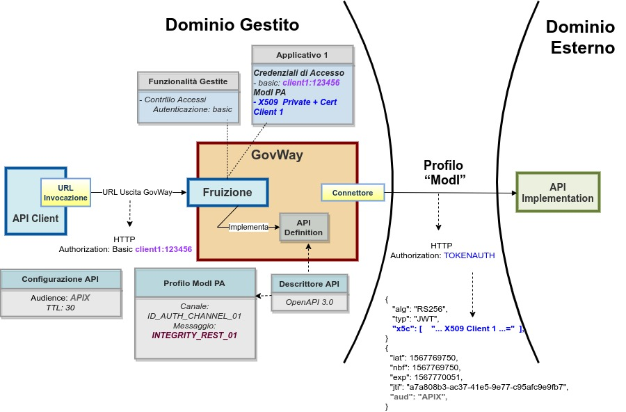
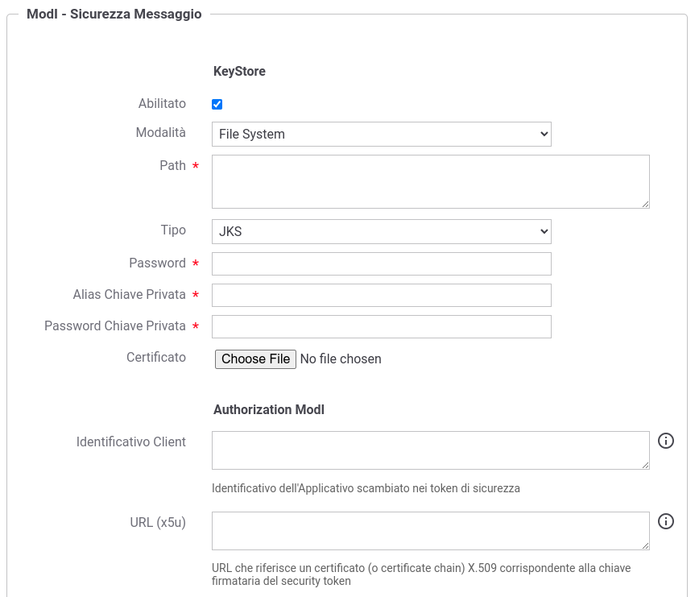

.. _modipa_idar01_fruizione:

Fruizione ID_AUTH_REST_01 / ID_AUTH_SOAP_01 (X509)
---------------------------------------------------

Le richieste che provengono dagli applicativi interni del dominio e sono dirette verso altre amministrazioni verranno arricchite del token di sicurezza 'ModI' previsto dall'operazione invocata, come indicato precedentemente nella sezione :ref:`modipa_idar01`. 

Per la configurazione delle fruizioni con i pattern di sicurezza messaggio è necessario registrare ciascun applicativo interno coinvolto al fine principale di associargli una chiave privata e un certificato X509 che GovWay utilizza per firmare il token di sicurezza 'ModI' prodotto. Gli applicativi vengono identificati da GovWay tramite una delle modalità di autenticazione supportate descritte nella sezione :ref:`apiGwAutenticazione` (:numref:`FruizioneModIPA2`).

Nella figura ':numref:`FruizioneModIPA`' viene raffigurato lo scenario di fruizione in cui il trust avviene tra fruitore ed erogatore tramite certificati x509.

 Fruizione con Profilo di Interoperabilità 'ModI', pattern 'ID_AUTH_REST_01': trust tra fruitore ed erogatore tramite certificati x509

**API**

La registrazione della API deve essere effettuata seguendo le indicazioni descritte nella sezione :ref:`modipa_idar01`

**Fruizione**

L'interfaccia per la creazione della fruizione, basata su una API con pattern "ID_AUTH_REST_01" (o "ID_AUTH_SOAP_01"), presenta le sezioni "ModI - Richiesta" e "ModI - Risposta":

- ModI - Richiesta (:numref:`fruizione_richiesta_fig`): la maschera relativa alla richiesta prevede la configurazione del meccanismo di firma digitale del messaggio, ad opera dell'applicativo mittente, e la produzione del relativo token di sicurezza:

    + Algoritmo: l'algoritmo che si vuole utilizzare per la firma digitale del messaggio
    + Riferimento X.509: il metodo da utilizzare per l'inserimento del certificato dell'applicativo nel token di sicurezza. I valori possibili sono (differenziati per il caso REST e SOAP) quelli previsti nelle Linee Guida di Interoperabilità.
    + Certificate Chain: se è stata selezionata la modalità 'x5c', è possibile indicare se nel token di sicurezza verrà incluso solo il certificato utilizzato per la firma o l'intera catena.
    + KeyStore: lo scenario descritto in questa sezione è relativo alla configurazione proposta di default con la voce 'Definito nell'applicativo'. Uno scenario differente è attuabile utilizzando la configurazione descritta in :ref:`modipa_sicurezza_avanzate_fruizione_keystore`.
    + Time to Live: tempo di validità del token prodotto (in secondi)
    + Audience: identificativo dell'applicativo destinatario da indicare come audience nel token di sicurezza; se non viene indicato alcun valore verrà utilizzato la url del connettore. Il valore fornito può contenere parti dinamiche risolte a runtime dal Gateway (per maggiori dettagli :ref:`valoriDinamici`).

  .. figure:: ../../../../_figure_console/modipa_fruizione_richiesta.png
   :scale: 70%
   :name: fruizione_richiesta_fig

   Dati per la configurazione della sicurezza messaggio sulla richiesta di una fruizione

- ModI - Risposta (:numref:`fruizione_risposta_fig`): la maschera relativa alla risposta prevede la configurazione del meccanismo di validazione del token ricevuto da parte dell'applicativo destinatario:

    - Riferimento X.509: il metodo per la localizzazione del certificato del destinatario nel messaggio di risposta. Si può mantenere la medesima impostazione prevista per il messaggio di richiesta o ridefinirla.
    - TrustStore Certificati: Riferimento al truststore che contiene le CA, i certificati, CRL e policy OCSP da utilizzare per poter verificare i token di sicurezza ricevuti nelle risposte. È possibile mantenere l'impostazione di default che è stata fornita al momento dell'installazione del prodotto, oppure definire un diverso riferimento (opzione "Ridefinito") fornendo Path, Tipo, Password del TrustStore e criteri di verifica tramite CRL o OCSP.
    - Time to Live (secondi): consente di modificare l'intervallo temporale di default (300 secondi) utilizzato per rifiutare i token creati precedentemente all'intervallo indicato. 
    - Verifica Audience: Se l'opzione è abilitata, viene effettuata la verifica che il campo Audience, presente nel token di sicurezza della risposta, corrisponda al valore presente nel campo successivo, se indicato, o altrimenti a quello configurato nell'applicativo mittente nella voce 'Identificativo Client'.

  .. figure:: ../../../../_figure_console/modipa_fruizione_risposta.png
   :scale: 70%
   :name: fruizione_risposta_fig

   Dati per la configurazione della sicurezza messaggio sulla risposta di una fruizione

**Applicativo Client**

La registrazione dell'applicativo avviene come già descritto nella sez. :ref:`applicativo`. 

In questo contesto sarà necessario specificare il dominio "Interno" dell'applicativo e procedere all'inserimento dei dati nel form "ModI" (:numref:`applicativo_interno_fig`).

 Dati ModI relativi ad un applicativo interno

I dati da inserire definiscono il keystore contenente la coppia di chiavi utilizzata per firmare i token di sicurezza:

    + *Modalità*: il keystore può essere fornito tramite differenti modalità

	- 'File System': deve essere fornito il *Path* assoluto su file system del keystore;

	- 'Archivio': viene effettuato l'upload del keystore;

	- 'HSM': consente di selezionare uno dei tipi di keystore PKCS11 registrati (':ref:`pkcs11`');

    + *Tipo*: il formato del keystore:
	
	- 'JKS' o 'PKCS12' (disponibile con modalità 'File System' e 'Archivio'): viene richiesta la definizione della password per l'accesso al keystore nel campo *Password*, l'alias con cui è riferita la chiave privata nel keystore nel campo *Alias Chiave Privata* e la password della chiave privata nel campo *Password Chiave Privata*;

	- 'JWK Set' o 'Key Pair' (disponibile con modalità 'File System'): questa modalità non è utilizzabile per fruire di API con una 'Generazione Token' di tipo 'Authorization ModI' ed utilizzando una applicativo con tale configurazione si otterrà un errore a runtime;

	- Tipi PKCS11 (disponibile con modalità 'HSM'): i tipi disponibili sono quelli corrispondenti ai tipi di keystore PKCS11 registrati (':ref:`pkcs11`').

    + *Certificato*: nel caso di modalità 'File System', con tipi di keystore 'JKS' o 'PKCS12', o nel caso di modalità 'HSM' consente di caricare il certificato corrispondente alla chiave privata del keystore. Il Certificato, altrimenti disponibile solamente a runtime sui nodi run di GovWay, viene utilizzato sia per motivi di ricerche filtrate sulla console che per consentire l'identificazione dell'applicativo su API erogate da altri soggetti di dominio interno in un contesto MultiTenant (':ref:`console_multitenant`').

Oltre ai dati che definiscono il keystore, nella sezione 'Authorization ModI', è possibile definire aspetti che riguardano la generazione del token di sicurezza ModI 'ID_AUTH' e 'INTEGRITY':

    + *Identificativo Client*: identificativo dell’applicativo utilizzato per valorizzare nel token di sicurezza di una richiesta il claim 'client_id' per API REST e l'header 'wsa:From' per API SOAP (**Attenzione**: se non definito viene utilizzato il nome dell'applicativo). Se è abilitata la funzionalità 'Verifica Audience / WSAddressing To' nella configurazione della sicurezza della risposta verrà inoltre verificato che nel token di sicurezza della risposta ricevuto vi sia un claim 'aud' per API REST o un header 'wsa:To' per API SOAP che possiede un valore identico all'identificato fornito.
    + *URL (x5u)*: URL che riferisce un certificato (o certificate chain) X.509 corrispondente alla chiave firmataria del security token. Deve essere obbligatoriamente definito se l'applicativo fruisce di API REST configurate per generare un token di sicurezza tramite il claim 'x5u'

