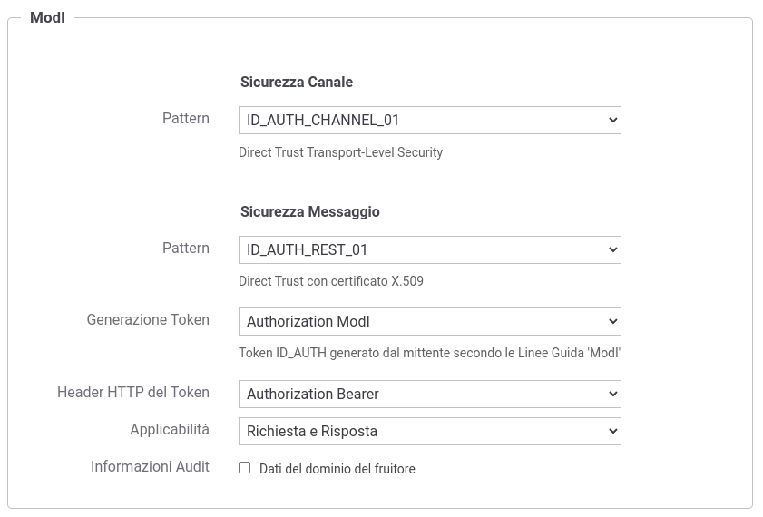

.. _modipa_idar01:

[ID_AUTH_SOAP_01 / ID_AUTH_REST_01] Direct Trust con certificato X.509
~~~~~~~~~~~~~~~~~~~~~~~~~~~~~~~~~~~~~~~~~~~~~~~~~~~~~~~~~~~~~~~~~~~~~~~

.. note::
    La sigla che identifica il pattern di sicurezza messaggio varia a seconda se l'API sia di tipo REST, per cui la sigla corrisponde a *ID_AUTH_REST_01*, o SOAP dove viene utilizzata la sigla *ID_AUTH_SOAP_01*.

L'adozione di questo pattern consente, alla ricezione di un messaggio, di validare il certificato fornito dall'applicativo mittente, la porzione di messaggio firmata, la validità temporale nonché la corrispondenza del destinatario della comunicazione.

**API**

La registrazione della API deve essere effettuata agendo nella sezione "ModI - Sicurezza Messaggio" come indicato rispettavamente per una API REST in :numref:`api_messaggio1_fig` e per una API SOAP in :numref:`api_messaggio1_soap_fig`

- selezionare il 'Pattern' "ID_AUTH_REST_01" su API REST o 'ID_AUTH_SOAP_01' su API SOAP;
- selezionare una 'Generazione Token' di tipo 'Authorization ModI' per far si che il Token 'ID_AUTH' sia generato dalla parte mittente.

  Pattern di sicurezza messaggio "ID_AUTH_REST_01" per l'API

  Pattern di sicurezza messaggio "ID_AUTH_SOAP_01" per l'API

Le voci 'Header HTTP del Token' (presente solamente su API di tipo REST) e 'Applicabilità' consentono di personalizzare l'header HTTP utilizzato e di indicare se il pattern di sicurezza verrà attuato sia sulla richiesta che sulla risposta. Maggiori informazioni vengono fornite rispettivamente nelle sezioni ':ref:`modipa_sicurezza_avanzate_header`' e ':ref:`modipa_sicurezza_avanzate_applicabilita`'.

Nel contesto della configurazione della specifica operation/risorsa è presente anche la sezione "Sicurezza Messaggio" che consente di intervenire sul pattern di sicurezza messaggio in modo puntuale. È quindi possibile lasciare l'impostazione del pattern al valore già stabilito a livello della API, oppure decidere di ridefinirlo andando a fornire una configurazione specifica per la singola operation/risorsa come descritto nella sezione ':ref:`modipa_sicurezza_avanzate_azioni`'.

Di seguito vengono forniti i dettagli di configurazione richiesti in uno scenario di fruizione o erogazione di un servizio.

.. toctree::
   :maxdepth: 2

    Passi per la configurazione di una fruizione <idar01_fruizione>
    Passi per la configurazione di una erogazione <idar01_erogazione>

