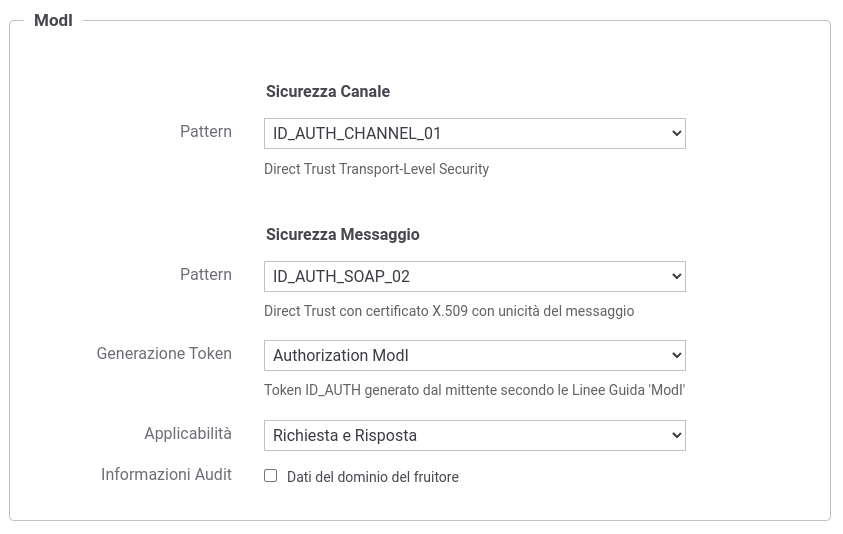

.. _modipa_idar02:

[ID_AUTH_SOAP_02 / ID_AUTH_REST_02] Direct Trust con certificato X.509 con unicità del messaggio/token
~~~~~~~~~~~~~~~~~~~~~~~~~~~~~~~~~~~~~~~~~~~~~~~~~~~~~~~~~~~~~~~~~~~~~~~~~~~~~~~~~~~~~~~~~~~~~~~~~~~~~~

.. note::
    La sigla che identifica il pattern di sicurezza messaggio varia a seconda se l'API sia di tipo REST, per cui la sigla corrisponde a *ID_AUTH_REST_02*, o SOAP dove viene utilizzata la sigla *ID_AUTH_SOAP_02*.

Questo pattern di sicurezza presenta le medesime caratteristiche di :ref:`modipa_idar01`, con l'unica differenza di prevedere un meccanismo di filtro che impedisce la ricezione di messaggi duplicati da parte di ciascun ricevente.

L'attivazione di questo pattern avviene a livello della relativa API, nella sezione "ModI", elemento "Sicurezza Messaggio", selezionando il pattern "ID_AUTH_REST_02" per API REST o "ID_AUTH_SOAP_02" per API SOAP come indicato in :numref:`api_messaggio2_fig` e :numref:`api_messaggio2_soap_fig`.

.. figure:: ../../_figure_console/modipa_api_messaggio2.png
  :scale: 50%
  :align: center
  :name: api_messaggio2_fig

  Pattern di sicurezza messaggio "ID_AUTH_REST_02" per l'API

  Pattern di sicurezza messaggio "ID_AUTH_SOAP_02" per l'API

Le voci 'Header HTTP del Token' (presente solamente su API di tipo REST) e 'Applicabilità' consentono di personalizzare l'header HTTP utilizzato e di indicare se il pattern di sicurezza verrà attuato sia sulla richiesta che sulla risposta. Maggiori informazioni vengono fornite nella sezione ':ref:`modipa_sicurezza_avanzate`'.

Per le configurazioni successive procedere come già descritto in precedenza per il pattern :ref:`modipa_idar01`.
